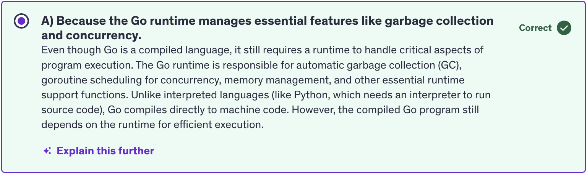
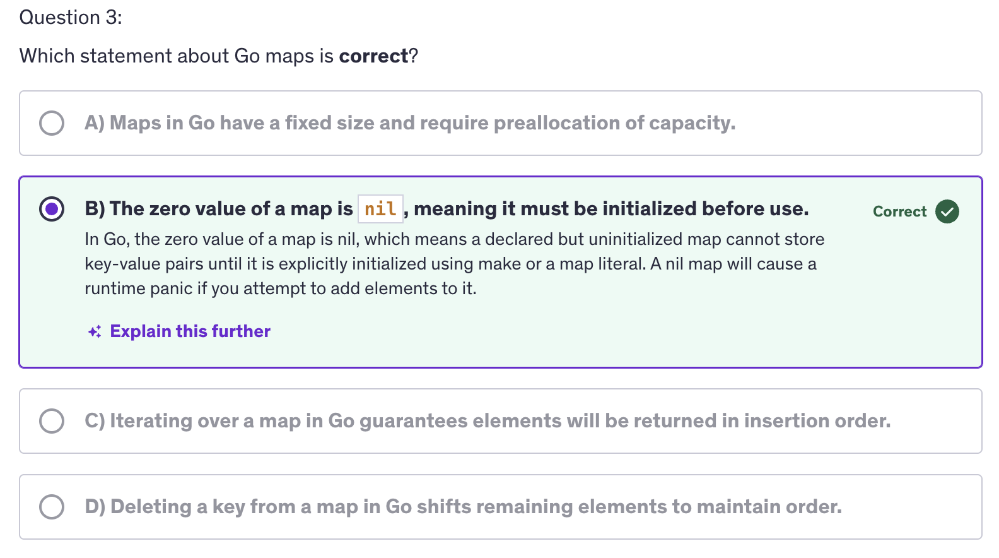
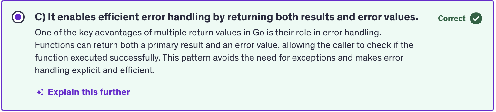
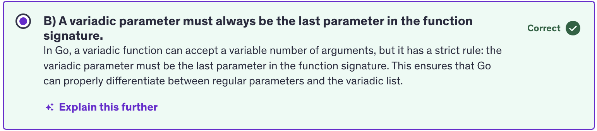

# GO Programming Basics

## Import

- Tree Shaking and it's application
    - Tree shaking
    - Static Analysis
    - Dead Code Elimination

- Example in Popular Frameworks
    - React
    - Angular

- Benefits of Tree Shaking
    - Reduced Bundle size
    - Improved Performance
    - Efficient Dependency Management


### Named import

If you want to name your import to something, write the name just before the double quotes of that import.

```go
import (
    foo "net/http"
)
```

- Notes: Go compiler and linker are smart enough to import only the required parts, i.e. only the parts that we have used in our program from those imported packages into the final executable and how that happens is through *Tree Shaking*.

- **Tree Shaking** : Technique used to eliminate the dead or unused code from the final executable or the final bundle, thereby reducing it's size and improving performance of the final bundle or executable.


- During the build process, tree shaking statically analyzes the code base to determine which modules and functions are directly imported and used. Unused modules and functions identified during static analysis are labelled as `dead code`. Tree Shaking then removes these unused segments from the final output optimizing the bundle or executable size.

- eg: React coupled with tools like Webpack and Roll-up employs tree shaking to remove unused components and utility functions from the Javascript bundle. And this optimization is crucial for large scale react applications.

- Tree shaking minimizes the size of executables binaries or the final bundles which is critical for optimizing load times and improving runtime performance of our executable files. Smaller executables lead to faster load times and enhanced runtime efficiency benefitting both developers and end-users. 

- Developers can import the entire library without worry about overhead of unused code because tree-shaking trims the unnecessary parts during the build process.

- The import statement in go plays a pivotal in integrating external functionalities while ensuring that only the necessary parts contribute to the executable.

<br/>
<br/>

## Data Types

- Integers
- Floating Point Numbers
- Complex Numbers
- Booleans
- Strings
- Constants
- Arrays
- Structs
- Pointers
- Maps
- Slices
- Functions
- Channels
- JSON
- Text and HTML Templates
<br/>

- Variables declared without an explicit initialization are assigned a default zero value based on their type.
    - Numeric types are given a value of zero
    - boolean types are defaulted to False
    - String type is an empty string by default
    - pointers, slices, maps, functions and structs are initialized with `nil` value.


## Variables

- the `type` of the is optional if we are initializing the variable otherwise we have to declare the variable with a particular type.

- we can use the gofer symbol (`:=`) to initialize the variable.
    ```go
    count := 10
    lastName := "Smith"
    ```

- This is called type inference in go, allowing the variables to be initalized without explicitly specifying the type. The type is inferred from the assigned value.

- Variables in go have `block scope` meaning that they are accessible only within the block they are declared.

- It's kind of a rule in Go that : `gofer` notation can only be used within functions to declare and initialize variables locally. It is intented for local variables initialization within functions only.

- If we are making a package level variable (global variable) then we cannot use the gopher notation.

- global variable is only limited to the package scope. Outside the package we cannot use that variable.

- variables live within their scope.

- Variables in go provide a flexible and powerful way to manage data within programs.


## Constants

- Constants must be initialized with values that can be determined at compile time. This typically includes literals and expressions that can be evaluated without runtime computations.

- Go supports both `typed` and `untyped` constants.
- Untyped constants are constants without a specified type until they are assigned to a value. They can be used in contexts that require a specific type, and go will automatically infer the approproate type.

- NOTE: There is no short declaration for constants.

- `const block` : We can group related constants together using this const block to make our life easier.

- constants in go provide a mechanism for defining immutable values that remain consistent throughout the execution of the program.


<br />

## Arithmetic Operators

- Basic Arithmetic Operators
    - Addition +
    - Subtraction -
    - Multiplication *
    - Division /
    - Remainder (Modulus) %

- Operator Precedence
    1. Parentheses ()
    2. Multiplication *, Division /, Remainder %
    3. Addition +, Subtraction -

- Overflow
- Underflow

- Why be mindful of overflow and underflow ?
    - Program Stability
    - Data Integrity
    - Type Safety

- Mitigation Strategies
    - Range Checking
    - Type Conversion
    - Error Handling

- Be mindful of potential overflow and underflow issues, especially when dealing with large numbers.

- Overflow occurs when the result of a computation exceeds the maximum value that can be stored in a given numeric data-type. Overflow results in the value wrapping around to the minimum value for signed integers or causing unexpected behaviour for unsigned integers. eg: if you add two large integers and the result exceeds the maximum value represented by that integer type, overflow occurs.

- Similarly, Underflow occurs when the result of a compilation is smaller than the minimum value that can be stored in a given numeric data type. This is more relevant for floating point numbers, where underflow can lead to loss of precision or significant digits in calculations involving very small values.

- This needs to be taken care of when we are working on applications that are involved in scientific calculations, and where calculated values are big numbers.

<br/>

## For Loop

- For loop is a fundamental control structure that allows you to repeatedly execute a block of code based on a condition.

- Syntax
    ```go
    for initialization; conditon; post {
        // Codeblock to be executed repeatedly
    }
    ```

- Initialization: Executed before the first iteration. Typically used to initalize loop variables.

- Conditon: Evaluate before each iteration. If false the loop terminates

- Post: Executed after each iteration. Usally increments or updates loop variables.

    ```go
    for i=1; i<=5; i++ {
        // Code block to be executed repeatedly
    }
    ```
- Break: Terminates the loop immediately, transferring control to the next statement after the loop.

- Continue: Skips the current iteration and moves to the next iteration of the loop.

-   `%v` -> general value
    `%d` -> specific integers


<br/>

## Operators

- Logical Operators
    - ! : logical NOT
    - || : logical OR
    - && : logical AND

- Bitwise Operator
    - & : bitwise AND
    - | : bitwise OR
    - ^ : bitwise XOR
    - &^ : bitwise AND NOT
    - << : left shift
    - >> : right shift

- Comparison Operators:
    - == : equal
    - != : not equal
    - <  : less than
    - <= : less than or equal to
    - >  : greater than
    - >= : greater than or equal to

## Conditions: if else

- If else condition are essential for controlling the flow of execution based on different conditions. They allow you to create decision making logic within your programs, enabling you to execute specific block of code based on whether certain conditions evaluate to true or false.

## Conditons: switch

- The switch statement provides a concise way to evaluate multiple possible conditions against a single expression. It simplifies the syntax compared to using multiple if and else if statements, making the code more readable and maintainable when dealing with multiple branching conditions.

- Syntax : Switch case in case (switch case default) (fallthrough) : no break statements are needed in switch cases.
    ```go
    switch expression {
        case value1:
            // Code to be exceuted if expression equals value1
            fallthrough  -> goes to the next case after evaluating this case.
        case value2:
            // Code to be exceuted if expression equals value2
        case value3, value4, value5:
            // Code to be exceuted if expression equals value3
            // mutliple conditions
        default:
            // Code to be exceuted if expression does not match any values
    }
    ```

- In Go, switch case can also be used with type assertions to switch on the type of an interface value.

- `x interface{}` means x can be of any data-type.
- As per Go compiler, we cannot use `fallthrough` when we are using a `type` switch.

<br/>

## Arrays

- Arrays are fundamental data structures that allow you to store multiple values under a single variable. Understanding array is crucial as they provide a way to manage and manipulate ordered data efficiently.

- Syntax : 
    ```go
    var arrayName [size][elementType]
    ```
- size is the number of elements that the array can hold. It's a fixed size, it's not variable. That's why we have to declare it beforehand.

- elementType is the type of elements that the array can store.

- In Go, arrays are value types means when you assign an array to a new variable or pass an array as an a rgument to a function, a copy of the original array is created and modifications to the copy do not affect the original array. So if we modify the copied array, it does not affect the original array.

- We can iterate through an array using a `range` based iteration. `range` is a keyword in go, and any collection that we have, we can iterate over that using the `range` keyword.

- If we want to discard the index, we can use `_` (underscore). Underscore means that we are discarding that value. Underscore in Go is known as `blank identifer`.

    ```go
    numbers := [5]int{10,11,12,13,14}
    for _ , value := range numbers {
        fmt.Printf("Value : %d\n",value)
    }
    ```

- Underscore is a `Blank Identifier`, used to store unused values. Underscore in Go has several important uses. 
    - Just as we saw above, if we don't want to use any value that is being returned from anywhere be it a range or a function that returns a value, but we don't want to use one value from multiple values being returned by the function. So in that case we can assign underscore to that value so that we will not have to use that and we will not get anerror that even if we let's say store in `i` but not used `i` later.

    - We can also do underscore to avoid compiler errors of a variable not being used for temporary testings.
        ```go
        b := 2
        _ = b
        ```

- We can determine the length of an array using the `len()` function with the arrayName as an argument .
    `len(arrayName)`

- Go supports multi-dimensional arrays which are array of arrays. They are useful for representing matrices and other structured data.

- If we were to use the original array in copied array, we would have to use pointers and addresses.

    ```go
    originalArray := [3]int{1,2,3}
    var copiedArray *[3]int
    
    copiedArray = &orginalArray
    ```

- So copiedArray carries the address where an array of three integers exists and if we have not initialized the array, it contains three zero values.  `var copiedArray *[3]int`

- Assign the copied array the address where the original array is by using the ampersand sign (`&`) with the originalArray.

<br/>

## Slices

- Slices are dynamic flexible views into arrays. They provide a more powerful and convinient interface to sequences of data compared to arrays.
- Slices are references to underlying arrays. They do not store any data themselves but provide a window into the array's elements. Slices can grow and shrink dynamically.
- We have the same function `len()` which can check the length of the slice.
- We also have a `cap()` function which can check the capacity of the slice. It will check the number of elements in the underlying array, starting from the slices' first element.

- we can also initialize slices using `make`.
    ```go
    slice := make([]int, 5)  // slice of capacity 5
    ```

- We convert an array into a slice.
    ```go
    a := [5]int{1,2,3,4,5}
    slice = a[1:4]      // element of index 1 to index 4 but not including 4 -> [2,3,4]
    ```

- We can also append more elements to a slice.
    ```go
    slice1 := []int{1,2,3,4}
    slice1 = append(slice, 5,6,7,8)
    ```

- We can also copy a slice.
    ```go
    sliceCopy := make([]int, len(slice))
    copy(sliceCopy, slice)
    ```

- Slices also have a concept of `nil` slices. A nil slice has a zero value and does not reference any underlying array. It is actually blank.

- we can also iterate over slices using range based loops.

- The slices package also contains many utility functions which are useful for our day to day programming.

- using `Equal()` to compare two slices for equality.
    ```go
    if slices.Equal(slice1, sliceCopy){
        fmt.Println("slice1 is equal to sliceCopy")
    }
    ```

- slices also support slice operator. Syntax : 
    ```go
    slice[low:high]

    slice2 := slice1[2:4]
    ```

- A slice once initialized is always assosciated with an underlying array that holds it's elements. A slice is a reference to an underlying array that holds the actual elements. A slice therefore shares storage with it's array and with slices of the same array. By contrast distinct arrays always represent distinct storage.

- The array underlying a slice may extend past the end of the slice and the capacity is a measure of that extent. So the capacity of a slice is the sum of the length of the slice and the length of the array beyond the slice.

- So it's not the capacity of the underlying array. It is the capacity of the slice that it can hold. And because the slice is started at a later point, it started at a different index, not at the index zero but at a different index, it may have a capacity which is lesser than the original array. But if we are truncating the slice before the end of the array, it will still count the elements that are past the end of the slice. That's we have the capacity of out `slice2` as 6.

- In conclusion, slices in Go provide a powerful mechanism for working with collections of data, offering flexibility, efficiency, and ease of use compared to traditional arrays. They allow dynamix resizing and provide a powerful operations for manipulating sequences of elements.


<br/>

## Maps

- Maps are a built in data-structure that assosciate keys with values. They are like dictionaries in other programming languages, and provide an efficient way to look-up data by a key.
- Maps provide an efficient way to store and retrieve key value pairs. Each key must be unique within the maps and the keys are typically of a comparable type, like strings, integers.

- Maps are unordered collections of key-value pairs, meaning that there is not guaranteed order when iterating over them.

- 3 ways to create a map
    ```go
    1. var mapVariable map[keyType]valueType
    2. mapVariable := make(map[keyTpe]valueType)
    3. // Using a Map Literal
        mapVariable := map[keyType]valueType {
            key1: value1,
            key2: value2,
            key3: value3
        }
    ```
- In case of a non-existent key, we get a zero value. If the key doesn't exist the zero value of the value type is returned.

- If we want to delete a key-value pair, use the `delete()` function. 
    ```go
    delete(myMap, key)
    ```

- If we want to completely remove all the key-value pairs then we use the `clear()` method.

- We get two values when accesing maps my keys. the first one is the `value` associated with that `key` and the second is an optional usable value is `bool` which indicates whether the key is present or not. use `ok` to represent the 2nd optional value i.e. true or false, it's a convention.

    ```go
    myMap := make(map[string]int)
    myMap["key1"] = 9
    myMap["key2"] = 20

    value, ok := myMap["key1"]
    fmt.Println(value)
    fmt.Println(ok)  // returns true
    ```

- Maps also have an equality check.
    ```go
    if maps.Equal(myMap1,myMap2) {
        // Code block to be executed when both maps are same
    }
    ```

- If we want to iterate over the map, we use a for loop with `range`.
    ```go
    for key, value := range myMap{
        fmt.Println(key, value)
    }
    ```

- In real world scenarios, you may be required to only use the values and discard the keys present in the map. So in that case we can use underscore(_) to discard keys.

- If we have a map that hasn't been initialized but only declared, then it is initialized to a nil value. The zero value of a map is `nil`.

- Similar to arrays and slices we have `len()` function to get the length of the map.

- We have the concept of nested maps where an outer map can have maps embedded inside it.
    ```go
    myMap5 := make(map[string]map[string]string)
    myMap5["map1"] = myMap4
    ```

<br/>

## Range

- The `range` keyword in go provides a conventional way to iterate over various data structuress like arrays, slices, strings, maps and channels. It simplifies the process of iterating and accessing the elements without needing to deal directly with indices or iterators.

- characters are called `runes` in Go.

- Few things to keep in mind while using range : 
- `range` keyword operates on a copy of the data structure it iterates over. Therefore modifying index or value inside the loop does not affect the original data structure.

- For arrays, slices and strings, range iterates in order from the first element to the last.

- For maps, range iterates over the key-value pairs but in an un-specified order.

- For channels, range iterates until the channel is closed. So if the channel is not closed, range will keep iterating over that channel.

- If we are not using any value, then we can use underscore, the blank identifier to prevent memory leaks by allowing Go's garbage collector to reclaim the memory.


<br/>

## Functions

- Functions are fundamental building blocks in go, encapsulating reusable code blocks that can be invoked multiple times with different inputs. They play a crucial role in structuring go programs by promoting modularity and code reusability.

    ```go
    func <name> (parameters list) returnType {
        // Code Block to be executed
        return value
    }
    ```

- A function name should be a valid identifier and should follow go naming conventions. When we are making a public function, it should start with an uppercase letter and if it's a private function, then it needs to start with a lowercase.

- example of public function : 
    ```go
    Println()  // -> under the fmt package
    ```

- returnType specifies the type of the values returned by the function. We also have an option of returning multiple values and it is one of the unique aspects of Go language and a very very useful feature to make highly efficient code base.

- Arguments that are passed to afunction are copied into the function's parameters. Modification to the parameters inside the function do not affect the original arguments, so never expect the original argument to be updated if the parameters are updated inside the function.

- Another type of functions is `Anonymous Functions`. We can call them `closures` or `function literals`. These are functions defined without a name directly in line where they are used.

    ```go
    func(){
        fmt.Println("Hello, Anonymous Function")
    }
    ```
    or,
    
    ```go
    greet := func(){
        fmt.Println("Hello, Anonymous Function")
    }
    greet()     // Now greet becomes the function, so we can execute it like a function.
    ```

- We can use functions as types and functions in Go can be assigned to variables passed as arguments to other functions and returned from functions, making them a first class object or a first class citizen.

- So the concept of first class objects/citizens in programming refers to entities that have no restrictions on their use and can be treated uniformly throughout the language. When an entity is a first class citizen, it means you can perform a wide range of operations on it, just as you would with basic data types like integers or strings. These operations typically include passing as arguments, returning from functions, assigning to variables or storing the data structures. 

- So you can pass the entity as an argument to functions. That means, if the functions are first class objects/ citizens, they can be returned from another functions.

- Similary we can assign the entity to a variable. A first class citizen can be assigned to a variable.

- And you can also store the entity in data-structures like arrays, lists or maps. 

- We can use functions in any capacity that we want.

<br/>

## Multiple Return Values

- In Go, functions can declare multiple return values by listing them in parentheses after the parameter.

- The biggest benefit of having mutlitple return values is error handling because one of the values can be an error. Useful in bigger projects like making an API.

- We can use named returns also. Eg:
    ```go
    func divide(a,b int)(quotient int, remainder int){
        quotient = a/b
        remainder = a%b
        return 
        // We don't to specify quotient and remainder 
        // in the return statement coz go compiler is 
        // smart enough to understand that. Now that 
        // you have mentioned quotient and remainder in 
        // the return parentheses section, it will know 
        // that it have to return these variables.
    }
    ```


<br/>

## Variadic Functions

- Variadic functions in Go allow you to create functions that can accept a variable number of arguments. This flexibility is particularly useful when you want to design functions that can handle a varying number of inputs without specifying them individually.

- In Go, variadic functions are defined by prefixing the type of the last parameter with an ellipsis (`...`).

- Syntax: 
    ```go
    // ... Ellipsis
    func functionName(param1 type1, param2 type2, param3 ...type3) returnType {
        // function body
    }
    ```

    param3 with ellipsis type is called a variadic parameter.

- variadic parameter is a list, so when we are iterating over a list it will have an index and a value.

- Variadic function is something that you will be using a lot in real-world scenario.

- Variadic parameter must be the last parameter in the function signature. They cannot come before any other parameter. Regular parameters will be taking precedence over variadic parameters while declaring them in the parameter list.

- To unpack a slice we use ellipsis(...) operator which destructures the slice into individual elements.
    ```go
    numbers := []int{1,2,3,4,5,9}
    total := sum(numbers...)    // passes sum(1,2,3,4,5,9) to the function sum
    ```

- In conclusion, variadic functions provide a flexible way to define functions that can accept a variable number of arguments of a specific type. They are particularly useful when dealing with functions that need to handle different numbers of inputs dynamically.

<br/>

## Defer

- In go differ is a mechanism that allows you to postpone the execution of a function until the surrounding functino returns. It's a useful feature for ensuring that certain cleanup actions or finalizing tasks are performed.

- A defer statement is a function whose execution is deferred to the moment the surrounding function returns, either because the surrounding function executed a return statement reached the end of it's function body or because the corresponding go routine is panicking.

- Go routines are functions which run in the background, which are running concurrently in the background and they are not the part of the main thread. So it is a little like async / await in NodeJS.

- Any function which is a go-routine is thrown to the back so that it finished of it's work, not in main thread, not blocking the main thread but in the background, and then comes back and joins the main thread once it's finished.

- So anything with defer, any statement or any function which has a defer keyword as it's prefix will be deferred till the end of that function. 

- We can also have multiple deferred statements in a function, and they will be executed in a last in - first out order when the function returns.

- arguments to differed functions are evaluated immediately when the differ statement is encountered. So just because the defer statement gets executed at the end doesn't mean that it is getting evaluated at the end. 

- Defer Practical use cases : 
    - Resource cleanup
    - Unlocking Mutexes
    - Logging and Tracing

- Best Practices
    - Keep Deferred Actions Short
    - Understand Evaluation Timing
    - Avoid Complex Control Flow

- Defer is commonly used to ensure that resources like files or database connections are closed after they are opened.
- When using Mutexes to synchronize GoRoutines, defer can be used to ensure that a mutex is unlocked even if a function panics.
- Defer functions are also useful for logging and tracing entry and exit points of functions.

- Defered functions should be short and simple to avoid unexpected behaviour and to keep the function's logic clear. Be aware of when arguments to defered functions are evaluated to prevent unintented consequences. And using defer in loops or nested functions can lead to subte bugs if not handled carefully.

- defer is something like finally block in try-catch-finally in other languages. There are certain cleanup activities that we delegate to defer and finally as well. Defer ensures that critical actions are performed in a predictable manner regardless of how functions exit which is especially important for maintaining code realibility and readability.


<br/>

## Panic

- In Go panic is a builtin function that stops the normal execution of a function immediately. When a function encounters a panic, it stops executing it's current activities, unwinds the stack and then executes any deferred functions. This process continues up the stack until all functions have returned, at which point the program terminates.

- A panic is typically used to signal an unexpected error condition where the program cannot proceed safely.

- The syntax of a panic function is called with an optional argument of any type, which represents the value associated with the panic.

    ```go
    panic(interface{})
    ```

- Interface means you can input any value of any type as an argument for this function.

- If a function gives flexibility to input any value of any type then the argument type would be interface.

- Defer will execute when the function returns a value, but it will also execute even when the function is panicking.

- As soon as we encounter panic, anything after that will not be executed. As soon as we panic we are exiting out of the function. So all the statements after panic will not be executed. Anything after panic will not be reached by the runtime.

- Panicked only after running the defer functions. Once all defer functions are executed the program terminates with the panic message.

- Misuse of panic can lead to unpredictable behavious and it should be avoided in scenarios where regular error handling suffices. 


<br/>

## Recover 

- recover is a built in function that is used to regain control of a panicking go routine. It's only useful inside the defer functions and is used to manage the behaviour of a panicking go-routine to avoid abrupt termination.

- A panic is a built-in function that stops the ordinary flow of control and begins panicking. When the function panic is called, the current function stops execution and any defered functions in that function are executed and then the control returns to the calling function. This process continues up the stack untill all the functions in the current go routine have returned at which point the program crashes and prints the panic message.

- Recover is a built-in function that stops the propagation of a panic and returns the value passed to the panic call. When used in combination with defer, recover can be used to handle or log error gracefully and allow and allow the program to continue executing. SO when we use recover, we will continue to execute our program. It will not crash. However we will be able to log any error that happened when the program panicked. 

- The recover function is called inside the defer function.

- The defer keyword schedules a function to be executed just before the surrounding function. The `process()` function in our code returns regardless of whether it returns normally or due to an error. But defer function will be executed just before this function. The `process()` function returns.

- If there is no panic, recover returns `nil`. So if recover is not returning nil that means a panic happened. So as soon as there is panic, recover returns the panic value.

- So if it was an API then it would continue to run and it would not shut down abruptly. If we are using recovery mechanism, then our API, our gRPC API or our rest API will not shut down.

- So what we actually do in recover is that instead of printing this to the console, so we will pass this error message to our error event handling mechanism. Or we will log this into a logger and we will log these messages along with more details like on which API endpoint was the error made, which user was logged in when this error was made, timestamp of the error, etc.

- Practical Use Cases : 
    - Graceful recovery
    - Cleanup
    - Logging and Reporting

- Best Practices
    - Always Use with Defer
    - Avoid Silent Recovery
    - Avoid Overuse

- We use recover to perform cleanup operations like closing files, releasing resources in a defer function that uses recover to handle panics and most importantly logging and reporting. Log and report panics to understand and diagnose unexpected errors in production systems without halting the application.

- Panics and recover should be used sparingly and only for exceptional unrecoverable errors. Normal error handling with return values or errors should be used for expected error, so do not overuse panics and recover.

<br/>

## Exit

- In Go programming language, `os.exit()` is a function that terminates the programming immediately with the given status code. It's useful for situations where you need to halt the execution of the program completely, without defering any functions or performing any cleanup operations. That means the exit will be done in a hastly fashion without doing any cleanup or without running any deferred functions or any deferred statments.

- The function takes an integer argument which represents the status code returned to the OS. Conventionally a status code of 0 indicates successful completion, while any non-zero status code indicates an error or abnormal termination. Calling os.exit() will not invoke deferred functions, including those registered using defer.

- It by-passes the normal defer, panic and recover mechanisms.

- Practical use cases : 
    - Error Handling
    - Termination Conditions
    - Exit Codes

- Best Practices :
    - Avoid Deferred Actions
    - Status Code
    - Avoid Abusive use

- We need to avoid deferred actions. Since os.Exit() bypasses deferred actions, to ensure that all necessaru cleanup operations are performed explicitly before calling `os.Exit()`.

<br/>

## Init function

- In Go, the `init()` function is a special function that can be declared in any package. It's used to perform initialization tasks for the package before it is used.

- Go execute `init()` functions automatically when the package is initialized. This happens before the main function is executed.

- init function always gets executed before the main function and it occurs exactly once per package even if the package is imported multiple times. So if we are importing the package in multiple files, it will only happen once.

- Order of execution : Within a single package, go executes the init functions in the order in which they are declared. If there are multiple init functions, they execute sequentially following their textual order in the package file.

- Usage: Init function is commonly used for tasks such as initializing variables, performing setup operations, registering components or configurations and initializing state required for the package to function correctly. That's why it's called init function because it is initializing different things.

- go automatically calls the init() function before executing the main function.

- Practical Use Cases : 
    - Setup Tasks
    - Configuration
    - Registering Components
    - Database Initialization

- Best Practices:
    - Avoid Side Effects
    - Initialization Order
    - Documentation

## Quiz Questions

#### 1. Why does Go reuire a runtime though it compiles to machine code ?

Ans:  

#### 2. How does Go Optimized imported packages to reduce the final executable size ?

Ans: 

#### 3. Which statment about Go maps is correct ?

Ans: 

#### 4. What is a key advanatge of using multiple return values in Go ?

Ans: 


#### 5. What is a key rule when defining a variadic function in Go ?

Ans: 