# Go Programming: Intermediate

## Closures

- A closure is a function value that references variables from outside it's body. The function may access and assign to the captured variables, and these variables persist as long as closure itself is referenced.

- Closures work with lexical scoping, meaning they capture variables from their surrounding context where they are defined. This allows closure to access variables even after the outer function has finished execution.

- Closures leverage the first class objects property of functions by allowing functions to capture and manipulate their surrounding state.

- Code Summary : 
    - i and the gofer assignment zero line and the fmt.Println("Previous values of i:") run everytime you call the adder function, but they only affect the initial state of i. When you create a new closure by calling sequence but they only affect the initial state of i when you create a new closure by calling adder function.

    - Once the closure is created, the subsequent calls to the closure that is, the returned function use and modify the captured value of i.

- Practical Use Cases
    - Stateful functions
    - Encapsulation
    - Callbacks

- Usefulness of Closures
    - Encapsulation
    - Flexibility
    - Readability

- Considerations
    - Memory Usage
    - Concurrency

- Best Practices
    - Limit Scope
    - Avoid Overuse

- Closures are useful for creating functions that maintain state accross multiple calls without exposing the state directly.

- They help encapsulate functionality and data, allowing for cleaner and more modular code.

- Closures are commonly used in callback functions, where they capture cariables to provide context or maintain state during asynchronous operations.

- Closures can keep variables alive longer than expected if they hold references to large objects or resources.

- Care must be taken when using closures in concurrent programs to avoid race conditions and unintended side effects. That's why it's better to limit the scope. Keep the scope of captured variables enclosures as narrow as possible to minimize unintended side effects.

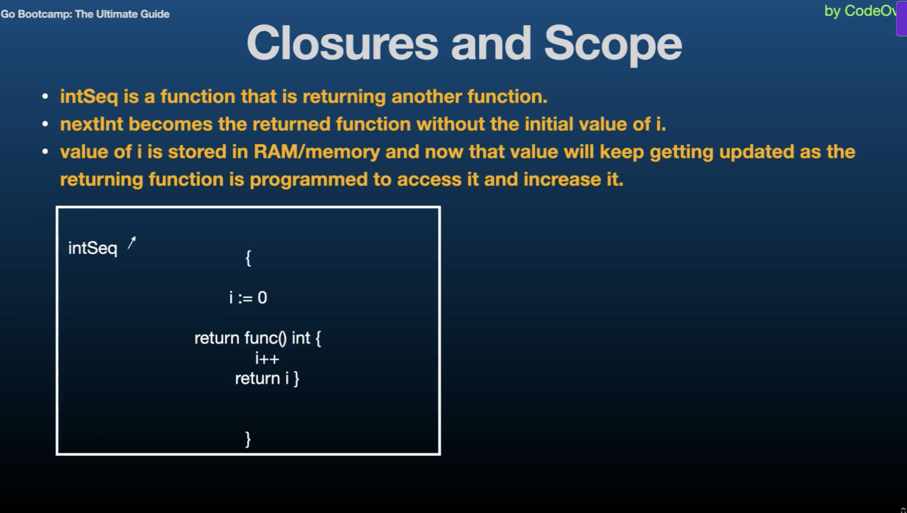


## Recursion

- Recursion is the process of a function calling itself. It breaks down a problem into smaller sub-problems of the same type until they become simple enough to solve directly.

- In every recursive function, there is a base case which is a condition where the function stops calling itself and returns a value. Without a base case, the recursion would continue indefinitely, leading to a stack overflow. And apart from the base case we have a recursive case. This is where the function calls itself with a smaller or simpler input to make progress towards the base case.

- Practical Use cases : 
    - Mathematical Algorithms
    - Tree and Graph Traversal
    - Divide and Conquer Algorithms

- Benefits of Recursion
    - Simplicity
    - Clarity
    - Flexibility

- Considerations
    - Performance
    - Base Case

- Best Practices
    - Testing 
    - Optimization
    - Recursive Case

- Sometimes a recursive solution can be optimized using techniques like memoization. Memoization is caching results of expensive function calls.


## Pointers

- A pointer is a variable that stores the memory address of another variable. 

- Everytime we execute go run, a new executable is made. So Go Run makes a temporary executable each time we execute `go run`.

- The zero value of a pointer is `nil`

- When we are using pointers, the actual memory address of the variable is passed on to the function. And now the function is accessing the memory address where the number ten is stored by a.

- Use cases : 
    - Modify the value of a variable indirectly
    - Pass large data structures efficiently between functions
    - Manage memory directly for performance reasons.
- Pointer Declaration and Intialization
    - Declaration Syntax :
        ```go
        var ptr *int
        ```
        `ptr` is a pointer to an integer
    
    - Initialization :
        ```go
        var a int = 10
        ptr = &a
        ```
        `ptr` now points to a's memory address

- Pointer Operations: Limited to referencing(`&`) and dereferencing(`*`)

- Nil Pointers
- Go does not support pointer arithmetic like C or C++
- Passing Pointers to functions
- Pointers to Structs
- Use pointers when a function needs to modify an argument's value
- `unsafe.Pointer(&x)` converts the address of `x` to `unsafe.Pointer`

- We will be taking up gRPC and Protocol Buffers and we will be using pointer a lot in Protocol Buffers and gRPC.

- Go also have an `unsafe` package and go's unsafe package allows low level operations like direct memory access and typecasting useful in certain advanced scenarios.

- In conclusion, understanding and mastering pointers in Go opens doors to more efficient memory management, enhanced control over data structures and access to low level operations when necessary.


## String and Runes

- A string is a sequence of bytes. Bytes are unsigned int8 (`uint8`) values. They often represent text. A sequence of bytes represent text.

- Strings are immutable meaning, once created, their values cannot be changed.

- Strings can be created with double quotes `" "` or backticks "`". Backticks are used for raw string literals. In raw string literals the escape sequences will be discarded and everything will be treated like a character and it will print everthing out the way it was written.

    ```go
    message := "Hello\nWorld"  // Hello and World on different line
    rawMessage := `Hello\nWorld`  // Hello\nWorld as output

    message2 := "Hello, \rGo!"  // Go!lo,
    ```
- `\r` takes the cursor to the first position in the line.

- Strings are an array of unicode characters. And these unicode characters i.e. each alphabet that we see, in Go it is called `rune`.

- Rune is an integer value that represents a character.
- Since strings is an array of characters, it also has a length. We can get the length of the string using the same `len()` function for arrays, slices.

- All escape sequences are treated as 1 character.

- When we are using concatenation, we are joining two strings. And when Go is joining two strings, it will not autmatically insert a space between them. It only happens when we are using a print statement and we are using thode different variables seperated by a commas. So it knows, that these are different variables with different content and they could mean different, so that's why it automatically inserts a space between them. But when it comes to concatenation, it knows that we want to join two strings and that's why it doesn't apply any space in between.

- Lexicographic Comparison : It is a method of comparing sequences such as strings based on the alphabetical order of their components. In Go, lexicographic comparison is used to compare strings. This comparison is essential for sorting, searching and other operations that involve ordering strings.

- If one string is a prefix of another, the shorter string is considered smaller.

- The compiler is comparing the ASCII value of the characters.

- When it comes to string iteration, it's just like iterating over a slice or an array. It will have an index and a value.

- `%x` placeholder/format verb is used to get the hexadecimal value of a character.

- `RuneCountInString()` -> counts the utf-8 characters in a string.

- Strings a immutable that means, operations like appending, replacing or modifying, require creating new strings. So we have to manipulate strings by creating new strings.

- We cannot append append more runes, more characters at the end or in the middle or in the begining using any method. So for that we have to create a new string and then perform a concatenation or whatever that we want to manipulate those string variables.

- A `rune` is an alias for int32 and it represents a Unicode code point, a Unicode value. So it is not a character, it is an integer value. A rune is an integer value and that value represents a Unicode code point and that will be converted into a character.

- So runes are used to represent individual characters in a string, and they facilitate working with Unicode characters efficiently. 

- Using Unicde, Go encopassess characters from a lot of languages accross the globe and that makes the jobs of the programmers much easier because we have characters from many, many languages that are used accross the world.

- A rune is declared with the type as `rune`. Runes are declared using single quotes. Double quotes and backticks are for strings.
    ```go
    var ch rune = 'a'
    ```

- Rune literals are single quoted characters representing Unicde code points.

- Runes facilitate handling of Unicode characters, supporting internationalization and mutilingual text processing.

- We have support for Smileys in Go language. We can use smileys directly in go as chacters.

- Strings provide a convenient abstraction for working with textual data, while runes enable precise handling of individual characters and support for diverse languages.

- Runes and Characters
    - Similarities
        - Representing Characters
        - Storage Size
    - Differences
        - Unicode Support
        - Type and Size
        - Encoding and Handling

- Both runes and characters typically occupy a fixed amount of memory. Runes in Go are represented by int32 and represent 4 bytes of memory, allowing them to represent any unicode code point characters. But characters are usually represented by `char` which typically occupy one byte of memory.

- Runes can represent any unicode code points from ASCII to more complex characters like emojis and non-latin scripts as well. While C also supports characters beyond ASCII through multibyte encodings like utf-8, handling unicode characters directly is not as straightforward as in Go. C libraries and implementations may vary in their support for Unicode.

- Go natively supports Unicode and provides built-in support for handling runes through it's `rune` type and unicode utf-8 package as well. This makes it straight forward to iterate over and manipulate Unicode strings.

- So Go's native support for Unicode and runes make it easier to develop applications that need to handle diverse character sets and languages. So if we are making an appplication where we need to generate text in different languages. Go has a native support for all the languages world-wide.

- Runes provide a more modern and robust approach for handling Unicode and international text representing Go's design philosophy of simplicity and efficiency in text processing.


## Formatting Verbs

- Go offers many formatting verbs to be used with `printf` statement.

- **General Formatting verbs**:
    - %v  -> Prints the value in the default format
    - %#v -> Prints the  value in Go-syntax format
    - %T  -> Prints the type of the value
    - %%  -> Prints the % sign

- **Integer Formatting Verbs**:
    - %b    -> Base 2
    - %d    -> base 10
    - %+d   -> Base 10 and always show sign
    - %o    -> Base 8
    - %O    -> Base 8 with leading 0o
    - %x    -> Base 16, lowercase
    - %X    -> Base 16, uppercase
    - %#x   -> Base 16 with leading 0x
    - %4d   -> Pad with spaces (width 4, right justified)
    - %-4d  -> Pad with spaces (width 4, left justified)
    - %04d  -> Pad with zeroes (Pads an integer with zeroes to ensure it has minimum width of 4 digits)

- **String Formatting Verbs**:
    - %s    -> Prints the value as plain string
    - %q    -> Prints the value as a double-quoted string
    - %8s   -> Prints the value as a plain string (width 8, right justified)
    - %-8s  -> Prints the value as a plain string (width 8, left justified)
    - %x    -> Prints the value as hex dump of byte values
    - % x   -> Prints the value as hex dump of byte values with spaces

- **Boolean Formatting Verbs**:
    - %t    -> Value of the boolean operator in true or false format (same as using %v)


- **Float Formatting Verbs**:
    - %e    -> Scientific notation with 'e' as experiment
    - %f    -> Decimal point, no exponent
    - %.2f  -> Default width, precision 2
    - %6.2f -> Width 6, precision 2
    - %g    -> Exponent as needed, only necessary digits


- Go syntax format refers to format in which values are represented in Go code. For example, strings are enclosed in double quotes.


## `fmt` Package

- The `fmt` package includes functions for printing to standard output, returning formatted strings and snaning input.

- Some Key Functions of fmt package : 
    - Printing functions
        - Print()
        - Println()
        - Printf()
    - Formatting Functions
        - Sprint()
        - Sprintf()
        - Sprintln()
    - Scanning Functions
        - Scan()
        - Scanf()
        - Scanln()
    - Error Formatting functions
        - Error()

- We hace the `Sprint()` function which formats using the default formats for it's operands and returns the resulting string. It doesn't print anything to the console. It only returns the resulting string.

- The formatting functions that we have in Go like Sprint(), Sprintln(), etc., these quite evidently can also be used to concatenate strings. 

- Sprint() does not add a space in between the different values.

- Sprintln() is a little advanced method which adds spaces in between the arguments and also adds a new line character at the end.

- Sprintf() function formates according to a format specifier and results the resulting string.

- fmt pacakge also brings us some functions that can help us take input from the user through the console.

- The `Scan()` function scans the text from the standard input and stores it into the provided variables. So we have to provide a variable for the input to be stored into.

- We have to the direct memory address to scan the input and store it inside the variables passed in the scan function. Because if we pass variables as arguments, the actual variable will not be passes to the function, instead a copy of that variable will be passed, so all the modifications will be done on the copy of the variable and not the actual variable. In order for us to modify the actual variables we give the memory address to `fmt.Scan()`.

- Moreover, Scan() has three dots that means it can accept `Variadic Parameters`. That means it can be multiple parameters or none.

- `Scanln()` function is similar to Scan() but it stops scanning at a new line and requires that there be exactly one item per input.

- Scan() does not accepts a blank input

- `Scanf()` function scans text from standard input, storing successive space separated values into successive arguments as determined by the format specifier.

- We have to enter our inputs in the exact format that we have declared in the `Scanf()` function.

- The `Errorf()` function formats according to a format specifier and returns the string as a value that satisfies the error interface.

- If there's an error, first we declare a code block to handle the error and then we move on to handling the value, whatever we want to do with the value.

- In conclusion, the fmt package is an essential tool for Go developers providing robust functions for formatting and printing text, scanning input and handling errors.

- In APIs `Sprint()` functions are used extensively.


## Structs

- Structs in Go are composite data types that allow you to group together different types of variables under a single name. They are similar to classes in Object Oriented Languages, but they are more lightweight and do not support inheritance.

- Structs are defined using the `type` and `struct` keywords followed by curly braces `{}` containing a list of fields. 
- Fields are defined with a name and a type.
- Anonymous Structs
- Anonymous Fields

- Methods : 
    ```go
    func (value/pointer receiver) methodName(arguments, if any ...) <return type, if any> {
        // Method implementation
    }
    ```

- Method Declaration
    - Value receiver method
        ```go
        func (t Type) methodName() {
            // Method Implementation
        }
        ```
    - Pointer receiver method
        ```go
        func (t *Type) methodName(){
            // Method Implementation
        }
        ```

- Comparing Structs

- Structs can be initialized using a struct literal. We can provide values for individual filed during initialization. As with any variable, if we omit any field in a struct, it will be initialized with it's zero value.

- Fields are accessed using a dot notation.

- Similar to functions we also have anonymous structs. These anonymous structs are structs without a predefined type name. They are useful for temporary data structures.

- Go supports attaching methods to structs. Methods are functions associated with a specific type. Methods are defined with a receiver, which is the struct type upon which the method operates.

- Always define methods and structs outside the main function. Defining alone a struct inside main is fine but when there are methods associated with that struct inside the program, we cannot define the methods inside main function. 

- Structs and methods must be defined at the package level, not within the functions. It is by design in Go and that is because Go requires types and their associated methods to be declared in the global scope which is accessible throughout the package.

- Another reason why structs and methods cannot be inside main is because of separation of concerns. Keeping type definitions and methods outside the main function ensures clear separation between data definitions and execution logic. This makes code more readable and more maintainable.

- We can create instances of structs and we can call methods on those instances inside the main function. And other thing that we can do inside main function is implement our application logic and interact with our structs and their methods.

- We do not configure the methods inside the structs. So why are methods not inside struct declarations ?
    - the first reason is design philosophy. Go emphasizes simplicity and clear separation between data types and methods. Methods are defined outside of the struct declaration to maintain a clear distinction between data and behaviour. The behaviour is dependent on the methods and data is the data types, the properties of the classes and the structs.

    - However in classes, we have class properties and methods inside the same class. The class properties of classes are like data types and the methods are similar to the methods declared in Go langauge.

    - Another reason is flexibility. Now this approach that we are defining the methods separately from structs, this approach allows methods to be defined for any type, not just structs and facilitates code organization and modularity.

- To modify struct fields within a method, we use a pointer receiver instead of a value receiver. Pointer receivers allow the method to modify the original struct instance.

- Pointers make the actual memory address available to the function. But if we are using value receiver it means we are passing the value to a function and it will not modify the original value. So in order to access the original value and modify that, we have to use a pointer.

- Go supports embedding structs within other structs. This allows for creating a composition of structs.

- We can define structs with anonymous fields as well. It simplifies the structure definition by promoting the fields of the anonymous struct to the outer struct. In Go, anonymous fieds in struct must be a type. If you declare a field like phone it needs to be of a specific type.

- Anonymous fields simplify the structure definition by promoting the fields of the anonymous struct to the outer struct.

- Structs are comparable if all their fields are comparable. You can compare two structs of the same type using the equality operator.


## Methods

- We make methods by declaring a receiver. The receiver will be a struct and that receiver will be associated with that method. So these methods are functions associated with a particular type not necessarily with struct. 

- So methods are not just associated with structs. They can be associated with any specific type. Methods enable us to define behaviors and we define behaviours by using functions. So we define these behaviors that operate on instances of that type.

- Methods are essential in Go for encapsulating behavior specific to a type and promoting code reuse through structured and organized code. 

- Methods are declared with a receiver which specifies the type that the method operates on and there are two type of receivers in Go : value receivers and pointer receivers.

- We use a value receiver if the method does not modify the receiver instance. We use a pointer receiver if the methos needs to modify the receiver instance, or if you want to avoid copying large structs because copying large structs means you are occupying a bing chunk in the memory.

- It's not a thumb rule that you have to create an instance. You can use the type to associate the function with that type to make it a method of that type.
    ```go
    type MyType int

    func (MyType) welcomeMessage() string{
        return "Welcome to MyType"
    }
    ```
    - We don't need an instance because we are not accessing any data inside this type. So we need to use instance only if we are using the instance for extracting or modifying the value.

- Struct embedding allows methods of an embedded structs to be promoted to the outer struct.


## Interfaces

- Interfaces promote code reuse, decoupling and polymorphism without relying on explicit inheritance.

- An interface is declared using the `type` keyword followed by a name and keyword `interface` and a list of method signatures.

- Interfaces are also declared outside the main function.

- A type implicitly satisfies an interface if it implements all the methods defined by that interface.

- Any method or any function that needs to be exported should start with an uppercase letter. So in order for us to export any method, struct or any type we have to name that type with an uppercase alphabet.

- All a struct needs to do is implement all the methods defined in that interface. All the methods that are defined in an interface should be implemented by that struct to be able to get associated with that interface type.

- An interface in Go is a way to define a set of methods that other types must implement in order for them to be considered the type that, which the interface if of.

- `any` is an alias of interfaces.

- We can use interface when we are ready to accept any type of value in our function. So if I use a vairadic parameter that means we can accept any number of values of different types.

- Interface means that you are flexible to any kind of value.

- Use empty interfaces judiciously typically for scenarios requiring dynamic types or unknown types.

- Interfaces in Go facilitate Polymorphism and enable writing modular, testable and maintainable by promoting loose coupling between types.


## Struct Embedding

- Struct embedding allows a struct to inherit fields and methods from another struct type. It's a powerful mechanism for code re-use and structuring data.

- Methods can be overridden by redefining them in the outer struct.

- Anonymous fields promote all fields and methods of the embedded struct while named fields require accessing fields with their explicit names.

- Best Practices and Considerations
    - Composition over inheritance
    - Avoid Diamonf Problem
    - Clarity and Readability
    - Initialization


## Generics

- Generics in programming languages provide a way to write functions, data structures and algorithm that can handle various types without specifying each type explicitly. This promotes code re-use, type safety and enhances the flexibility of programs.

- Generics in go are declared using type parameters, which are placeholders for types that can be specified when using the generic function or data structure.

- `any` is just an alias for interface and interface means that it can be of any type.

- Benefits of Generics :
    - Code Reusability
    - Type Safety
    - Performance

- Considerations
    - Type Constraints
    - Documentation
    - Testing


## Intermediate Quiz 1

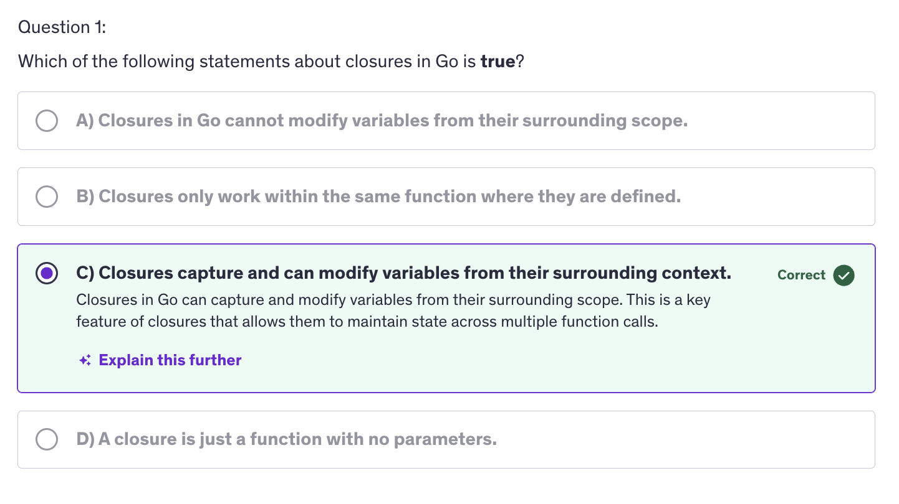
<br/>

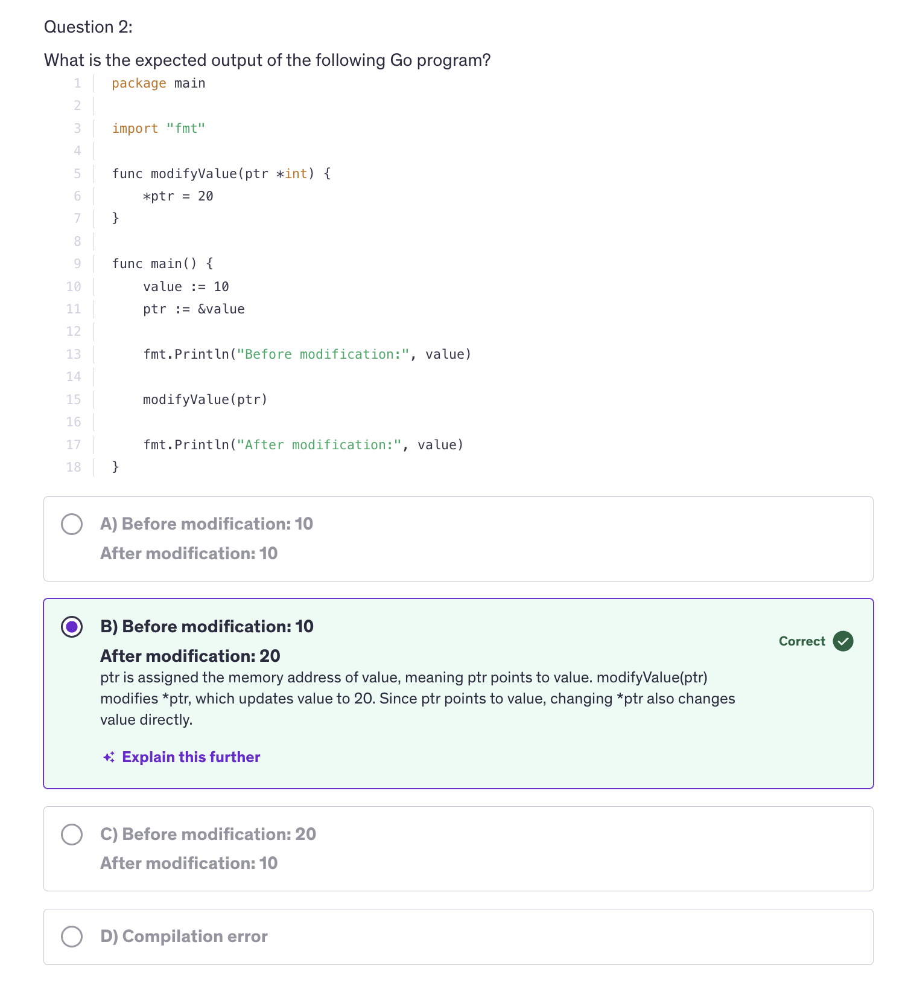
<br/>

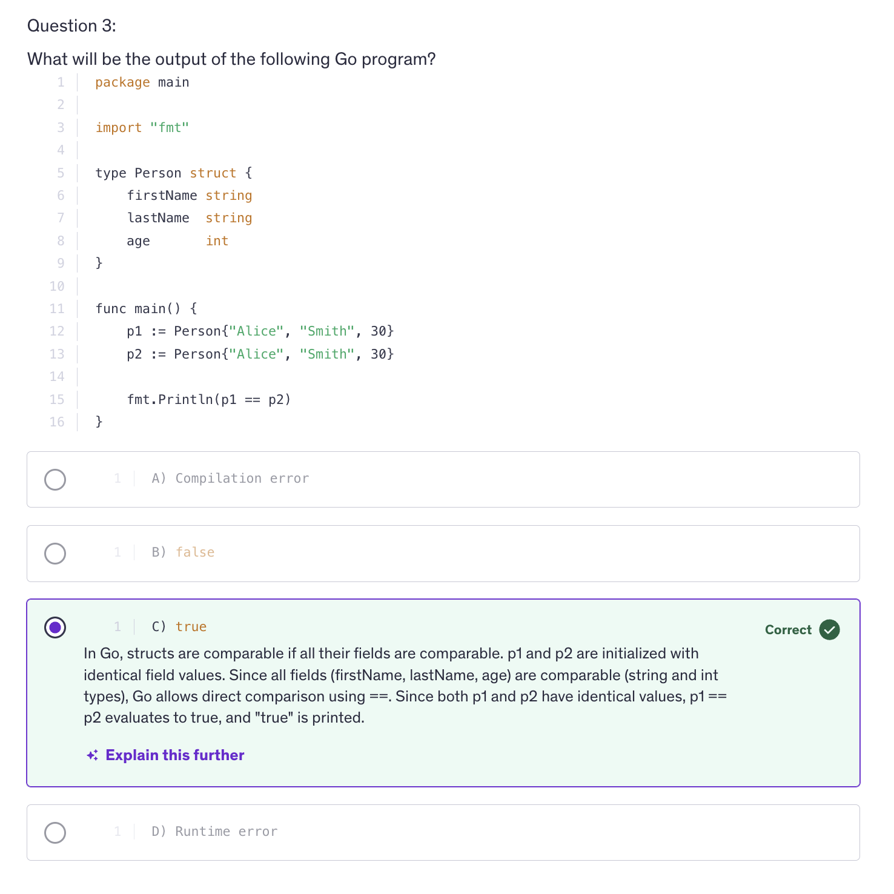
<br/>

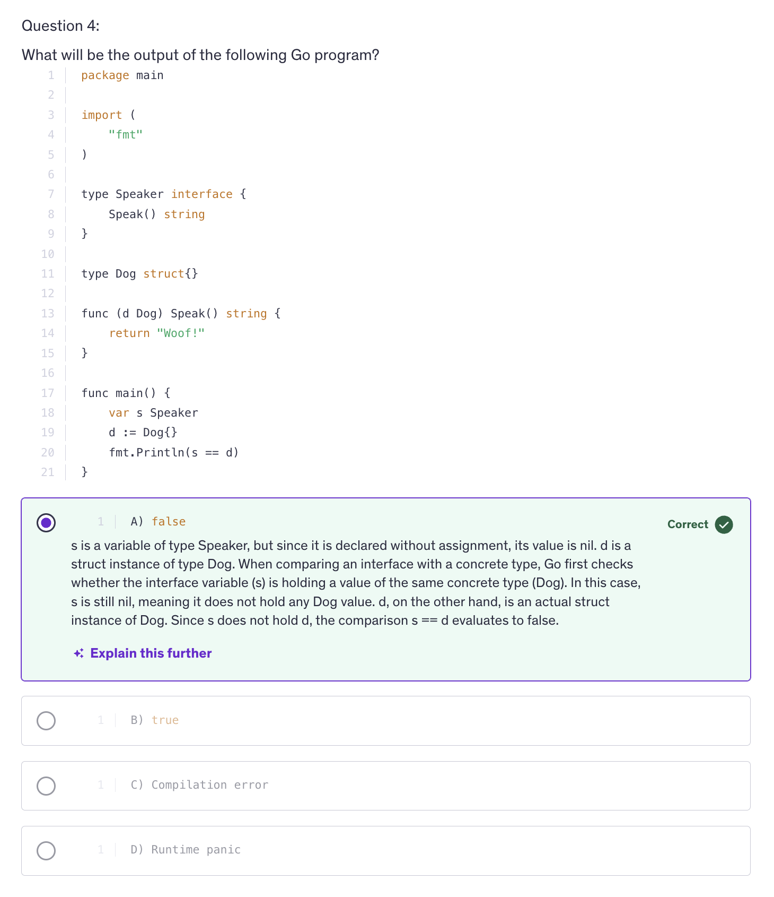
<br/>

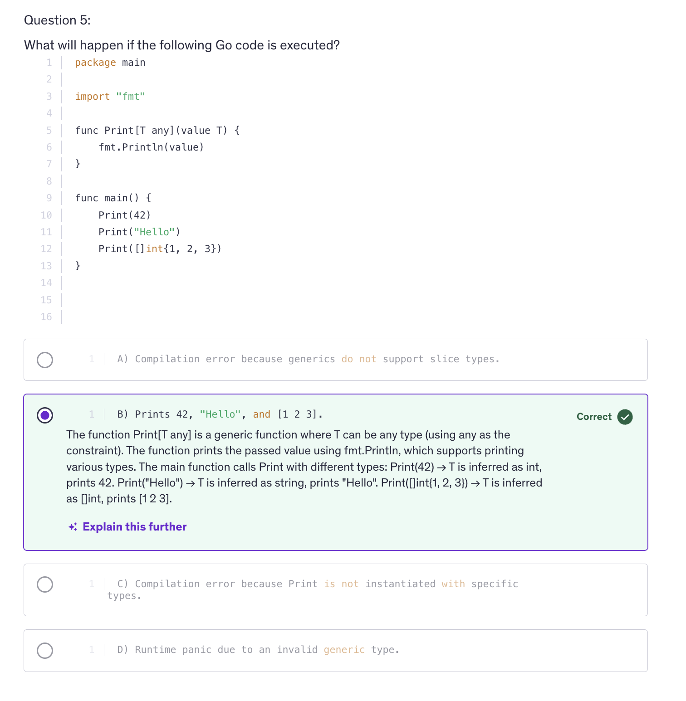
<br/>


## Errors

- Errors are a funcdamental part of any programming language, allowing programs to handle exceptional conditions gracefully.

- In Go, Errors are represented by the error interface, which is a built-in type used to indicate the presence of an error condition. 

- Errors are typically created by using the `errors` package or by implementing the error interface.

- Do not unnecessarily use uppercase when naming structs or any other type, always make sure that you use uppercase only when you are exporting your type, your struct or anything else outside the package.

- Example:
    ```go
    func main() {
        if err1 := eprocess(); err1 != nil {
		fmt.Println(err1)
		return
	    }
    }
    type myError struct{
	message string
    }

    func (m *myError) Error() string{
        return fmt.Sprintf("Error: %s", m.message)
    }

    func eprocess() error {
        return &myError{"Custom Error Message"}
    }
    ```
- We are using Error() because Go has a built-in package. The Go's built in package have an interface which is the error interface. The error interface has a single method which is `Error()`. An in Go an error is represented by the error interface, and this error method returns a string that describes the error.

- So by utilizing this interface, we can propagate our custom error messages as we please. Because it is an interface, we can modify it according to our requirements. We can use multiple lines, multiple kinds of data. We can use different kinds of formatting whatever we want because it is an interface. And interfaces are completely blank, all you need to do is implement the methode.

- Official error interface implementation of Go
    - [Offical Go Builtin Package github](https://github.com/golang/go/blob/master/src/builtin/builtin.go)

    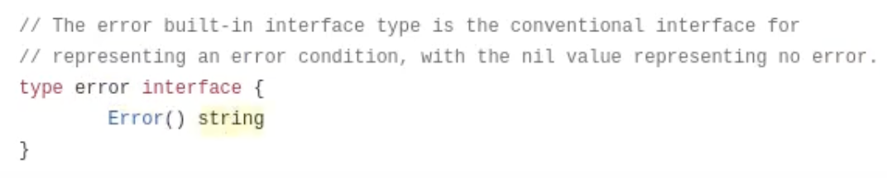

- Error method needs to return a string and that's why our Error() method returned a string. 

- When we are using any function from the built in package it is available to us by default. The built-in pacakage is part of the Go runtime and is special in that it provides the foundations for the language itself. Therefore you can use fundamental types and functions directly in your code.

- In conclusion, error handling in go revolves around the error interface and idiomatic practices like checking errors, propagating errors and custom error types. Proper error handling ensures that programs are robust and reliable, providing clear feedback on exceptional conditions.


## Custom Errors

- Custom Errors can encapsulate specific details about what went wrong, making it easier to debug and understand the root cause of errors. It provides an enhanced error context.

- Context and custom errors allow us to distinguish between different types of errors and handle them differently in our application logic.

- Custom errors also ensures consistency in error handling accross our code base, promoting maintainability.

- In Go, custom errors are nothing but types that implement the error interface. It requires the implementation of errxor method that returns a string.

- When we are handling errors, we have to return so that the rest of the statements do not get executed. That's the point of handling the error, right ?

- **Wrapped Errors** : Wrapped Errors were introduced after Go version 1.13. `%w` formatting verb stands for wrapped error.

- Our custom error helps us to pass on the error message much more efficiently and much better error description from multiple functions that we are executing in a nested way.

- In conclusion, custom errors in go enhance our error handling by providing more context and differentiation in error reporting.


## String Functions

- Strings in go are a sequence of bytes and Go provides a rich set of built-in functions and methods to manipulate and work with strings effectively.

- Functions
    - integer to string : 
        ```go
        num := 18
        str := strconv.Itoa(num)
        ```

    - string splitting
        ```go
        fruits := "apple,orange,banana"
        parts = strings.Split(fruits, ",") // ["apple", "orange", "banana"]
        ```
        - `strings.Split()` converts your original string into an array and it divides that string based on the seperator value that you give it.

    - `strings.Join()` -> concatenates elements of a slice into a single string with a separator.
        ```go
        countries := []string{"Germany", "France", "Italy"}
        joined := strings.Join(countries, ", ")
        ```

        Go is smart enough to add separator only between the consecutive words and not after the last word.

    - Function to check if a string contains a subset characters, it could be one character or multiple characters combined.
        ```go
        strings.Contains(str, "test") // returns true or false.
        ```

    - `strings.Replace()` -> Replaces the occurances of a substring within a string with another substring.
        ```go
        strings.Replace(str, <string to be replaced>, <string by which it is replaced>, <no. of occurances to be replaced>)

        strings.Replace(str, "Go", "World")
        ```

    - We can also trim leading and trailing whitespace from our string. 
        ```go
        strwspace := " Hello Everyone! "
        fmt.Println(strwspace.TrimSpace(strwspace)) // "Hello Everyone!"

    - We can change the case of our strings to lower or to upper during the runtime.
        ```go
        fmt.Println(strings.ToLower(strwspace))
        fmt.Println(strings.ToUpper(strwspace))
        ```

    - `strings.Repeat()` -> repeat something for a fixed number of times.
        ```go
        fmt.Println(strings.Repeat("foo", 3))  // foofoofoo
        ```
    - We can also count the occurance of an alphabet or a substring inside another string.
        ```go
        strings.Count("Hello", "l")   // 2
        ```

    - We can also check for prefix and suffix. 
        ```go
        fmt.Println(strings.HasPrefix("Hello", "He")) // true
        ```

        ```go
        fmt.Println(strings.HasSuffix("Hello", "la")) // false
        ```
 
- Go offers us a regular expression package which allows pattern matching and manipulation of strings based on complex rules.

- `regexp` is a package in Go and `MustCompile()` is a method defined in `regexp` package.

- MustCompile() -> is a function that compiles a regular expression. A regular expression is something yes which needs to be compiled. 

- The pattern needs to be inside Backticks. Regular Expressions needs to be enclosed in backticks to be considered a raw string literals. When we are using regular expressions we are defining a pattern and that pattern needs to be matched. So regular expression matches the pattern that we define with different values.

-  d -> digits
    +   -> it has to be one or more
    eg: `\d+`   -> It has to be one or more digits
                -> check for multiple digits
    
    ```go
    str5 := "Hello, 123 Go! 78"
    re := regexp.MustCompile(`\d+`)
    matches := re.FindAllString(str5, -1)
    fmt.Println(matches)
    ```

    -1 indicates that we are looking for all the matches for that regular expression inside the source string.

    `FindAllStrings()` -> returns an array of strings. It's going to extract all the matches and store them successively in a slice. So it returns a slice of strings. So we have to store the slice in a variable.

- We have another package which let's us work on Unicode characters and strings and that is called the unicode `utf8` package. `utf8.RuneCountInString` returns the number of runes present in the string.

- Since strings are immutable in Go, we have something called `strings.Builder()` for efficient string concatenation in performance critical scenarios.

- `strings.Builder()` is a type in Go's standard library specifically in the strings package that provides efficient strings building. It's designed to help you concatenate strings in a memory efficient wat instead of creating many intermediate strings, which can be expensive in terms of memory and processing time. `strings.Builder()` allows you to build your final string incrementally.

- strings.Builder() is more efficient than using the concatenation (`+`) operator or even when using `fmt.Sprintf()` fo concatenating multiple strings. strings.Builder is still much better than these options because it minimizes memory allocations and copies.

- Builder provides several ways for adding content such as write, writeString, writeRune and writeByte. and builder can be used immediately after declaration without initialization.

- A builder can be reused by calling the reset method which clears it's internal buffer. The final string can be retrieved using the string method.

- We can keep on building that string. And this builder is memory efficient and prevents memory leaks. It does not make copies. It keeps on building the string in a memory efficient way and in a memory secure way.

- we have to include character in `builder.WriteRune()` and characters are stored in single quotes.

- builder keeps on writing to the existing string that it has stored in its memory. So everything that we write a rune, a string or anything, it will keep on adding to the existing data that it has.

- So in order for us to start a new string, we need to reset the builder.

- When it comes to memory efficiency, prefer strings.Builder or bytes.Buffer for building large strings to avoid unnecessary memory allocations.


## String Formatting

- String formatting in Go refers to the techniques used to create formatted output from variables or constants. Go provides several mechanisms for formatting strings, including the fmt package, string interpolation or format specifiers.

- When it comes to format specifiers, we can use flags or string alignment as well to format our strings in a desired way.

- Go supports string interpolation using backticks.
- BAckticks makes a string raw, a raw string literal, which means that it is going to consider everything as a string literal and it's not going to let any escape sequence execute.

- When you need to embed special characters or multiple lines of text without interpreting escape sequences, backticks are very useful. This is particularly handy when dealing with regular expressions. This improves readability and reduces the chances of errors due to missed escape sequences.

- Another use case would be when we are using SQL query. So in SQL queries using backticks ensures that the query remains intact without needing to escape special characters or worry about line breaks. It enhances readability and reduces the cognitive load when writing or maintaining such code.


## Text Templates

- Text templates in go are a powerful feature that allow you to define and execute templates for generating text output. They are particulary used when you need to generated structured texts wuch as HTML, JSON, SQL Queries or any other formatted text output.

- A template is a string or a file that contains one or more action sequences. These actions control the template execution, such as inserting values, iterating over data or executing conditionals.

- Concept of Actions: These actions are enclosed in double curly braces. There are several types of actions like variable insertion.

    - Variable Insertion: [{.FieldName}]
    - Pipelines: {{functionName .FieldName}}
    - Control Structures: {{if .Condition}} ... {{else}} ... {{end}}
    - Iteration: {{range .Slice}} ... {{end}}

- Advanced Features
    - Nested Templates: {{template "name" .}}
    - Functions
    - Custom Delimiters
    - Error Handling: template.Must()

- Use Cases
    - HTML Generation
    - Email Templates
    - Code Generation
    - Document Generation

- Best Practices
    - Separation of Concerns
    - Efficiency
    - Security

- Templates are executed by applying them to data structures known as Template Data. These data structures can be simple values, structs, slices, maps or any custom types that you define.

- Templates are a part of 2 packages:
    - We have text template as well as html template package. HTML template package has some advanced features that text template package does not have. Text template package has basic features of templating. 

- Once we have create a template, we have to parse the template, we have to process that template. We use `.Parse()` method. It takes an argument which is a string, but this string is not a usual string. This is actually a string that we want to be processed as a template.

- Template is something that we can reuse repeatedly for different values, and the name is going to be changing everytime we use this template. 

- To output the message from the template use `.Execute()` function on that template. It will return an error if there is one so make sure to handle the error in a variable.
    ```go
    err := tmpl.Execute(os.Stdout, data)
    ```

- Execute takes the first argument as the target, the destination where it needs to send the output to. So we are sending our output to the standard output device of our computer which is the console. And the next argument is the data.

- There's another way of using template via using `template.Must()` where we don't have to handle the errors ourselves and template.Must() will automatically panic if we have an error while parsing our template.

    ```go
    tmpl := template.Must(template.New("example").Parse("Welcome, {{.name}}! How are you doing?\n"))
    ```

    this code is equivalent to :
    ```go
    tmpl, err := template.New("example").Parse("Welcome, {{.name}}! How are you doing?\n")
    if err != nil {
        panic(err)
    }
    ```
- .Must() is used to handle the error from the parse. And we'll not have to handle the error ourselves, which will save us some more typing and which will make our code mmore readable.

- template.New() -> creates a new template and it takes the name of the template as an argument.

- template.Parse() -> parses the template definition. So it takes a string and that string is in the format of template that we want. And then template.Parse will process the string and convert it into a template that we will use further in our program. So `template.Parse()` helps us to parse the template string and it turns the string into a reusable template object that can be executed with custom data.

- `template.Execute()` -> used to apply a parsed template to a data structure and write the result to an output destination. It could be a file or it could be a console or something else.

- `bufio` -> Buffered input output package.
- `bufio.NewReader(os.Stdin)` -> to read from the console. Console is the standard input device.
- to get the input from the user :
    ```go
    reader := bufio.NewReader(os.Stdin)
    ```

- .ReadString() -> takes an argument as a delimeter. So that means it is going to accept the input from the console until it reads the delimeter from the console. It takes a `bytes` type as an argument, that's why we have to use single quotes.
    ```go
    reader.ReadString('\n')
    ```
- `ReadString()` -> generates a string and an error so handle both of them by storing them in the variable. Always read strings from the console and then convert them to whatever you want.

- Best Practices
    - Separation Of Concerns: Keep your templates focused on presentation logic avoiding business logic.
    - Precompile you templates for re-use if performance is critical to your application.
    - Also sanitize inputs to prevent injection attacks, especially when generating HTML because there are a lot of attacks which happen using the user input.

- Overall, text templates in Go are a powerful tool for generating textual output based on structured templates and dynamic data. They offer flexibility, ease of use and support for complex scenarios like conditional logic, iteration and function invocation within templates whether for web applications, system administration scrips or data processing tasks.


## Regular Expressions

- Regular expressions provide a powerful way to search, manipulate and validate text strings based on patterns. They are widely used in text processing, searching and data extraction tasks where patterns of characters need to be matched or manipulated.

- In Go, the regular expression package provides support for working with regular expressions.

- To work with the regex pattern in Go, you first compile it using the `regexp.Compile()` or `regexp.MustCompile()`.

- regular expression to match email address
    ```go
    re := regexp.MustCompile(`[a-zA-Z0-9._+%-]+@[a-zA-Z0-9.-]+\.[a-zA-Z]{2,}`)

    ```

    - The `+` means that anything inside the bracket is going to have multiple notable occurances.
    - A period is declared with a backslash because it is outside the square brackets. `\.`
    - To limit the occurances use `{}`. eg: `{2,}` means two or more occurances. 
    - The hyphen `-` has a special meaning. And meaning is a range. So if we are not using hyphen as a range, it needs to come as the last character to let the compiler know that we are not using hyphen as a range, but as a symbol, as an acceptable character. that's why `[+-%]` is invalid and `[+%-]` is valid regexp.

- Regular expressions allow capturing parts of the matched strings using parentheses. Parentheses create capturing groups which allow us to extract parts of the complete matched string.

- Regex to capture dates
    ```go
    re := regex.MustCompile(`(\d{4})-(\d{2})-(\d{2})`)
    ```

- There are many regular expression generators online for such tasks.

- We can also replace characters in our target string.

- Flags and Options:
    - `i` -> case insensitive. we are accepting characters in all cases.
    - `m` -> multi-line model.
    - `s` -> dot matches all

- `?i` -> Flag which makes the regular expression case insensitive. WHen we are using Flags we need to make sure that those flags start with a question mark. This is how regular expressions accept flags.

- When using regular expressions, be careful about complex patterns or large input strings, because regular expressions sometimes take up a lot of processing power and they can impact the overall performance of our application or API in a way that we didn't even anticipate.

- So benchmark your regular expression pattern if performance is critical.


## Time

- Time handling in Go is essential for dealing with dates, times, durations and time zones. It provides functionalities to create, manipulate, format and compare times. 

- In Go, time values are represented by the `time.TimeStruct()`. You can create time values using various methods like `time.Now()`, `time.Date()` or `time.Parse()`.

- `time.Parse()` -> accepts a layout string and a value string. Now this layout it's for a very specific date.

- In Go, when we are using time.Parse() we need to use a reference time. We can use it in any format but that date and time has to be specific. It's actually in a format like this: `Mon Jan 2 15:04:05 MST 2006`

- So we have to convert our date into any format that we want and then get our input to be used as a date, to be processed as a date.

- The first argument in out time.Parse is a reference layout. So this will be the layout of the value that we are passing to this argument because it is going to check this layout against it's default value and it is going to understand the format YYYY-MM-DD

- The reference time for the Go compiler or Go runtime is `Mon Jan 2 15:04:05 MST 2006`. So they are going to reference your layout with this value.

- If we already have a time and we need to format it according to our need then we will use `time.Format()`.

- time.Parse() takes string and time.Format() works on a time type of value, a value which is already of type time.

- We can add and subtract durations. We can also round or we can truncate time. We use `time.Add()` for addition and we use `time.Round()` and `time.Truncate()` for rounding out or truncating time to the nearest or previous duration.

- So what truncation does is, it rounds down the time. So time.Truncate() is similar to time.Round() but time.Round() can go up and it can round off the time to the next hour. But truncate will always round down the time, so it will always go doen when giving the output.

- In conclusion, time handling in Go provides powerful functionalities for creating, manipulating, formatting and comparing time values. And by understanding these concepts, these methods you can effectively manage date and time operation in your applications, ensuring accurate and reliable time based functionality.

- Understanding time zones, durations and arithmetic operations is crucial for comprehensive time management in your go programs.


## Epoch

- Epoch refers to a specific point in time that serves as a reference for timestamps and calculations. It's often used in computing and programming to represent time as a single number of count of seconds or milliseconds since a defined starting point.

- The epoch time is usually defined as a unix epoch, which is zero hours, zero minutes and zero seconds UTC on January 1st, 1970. `00:00:00 UTC on Jan 1, UTC`. This point was chosen because it precedes most modern computer systems and allows for a simple representation.

- In many programming languages including Go, time is often represented as the number of seconds or milliseconds elapsed since the Unix epoch. So this representation is convenient for storing, comparing and manipulating time related data. 

- So epoch time units are seconds. Unix time in seconds which is a timestamp. Milliseconds are used for more precise calculations and to capture smaller time intervals and epoch time values are positive values or negative values. Positive value represent times after the unix epoch which is a mentioned here Jan 1, 1970 and negative values represent times before the Unix epoch, which is the midnight of Jan 1, 1970.

- Go's time package provides a roust support for handling time related operations including time formatting, time calculations, time zones and it also has dome Unix time functions like 
    - time.Now() which retrieves the current time. 
    - time.Unix() which converts Unix time to a `time.Time` object
    - time.Since, time.Until() calculate durations since or until a specified time.

- Epoch Applications in Programming : 
    - Storing timestamps in databases using Unix like time simplifies sorting and querying data based on time intervals. 
    - many OS and file systems record file creationg, modification times as Unix timestamps.

    - Epoch time is Universal accross platforms and programming languages, facilitating interoperatbility.

- Considerations : 
    - Unix time does not account for leap seconds which are adjustments made to keep time synchronized with Earth's rotation and this can lead to slight inaccuracies over long periods.
    - Depending on requirements, Unix time in miliseconds might be necessary for finer granularity.

- Unix time traditionally count seconds but modern systems and applications often require higher precision and nanoseconds provide this higher precision allowing for more accurate timestamps. Including nanoseconds allows the time.Time objects to represent a specific point in time more precisely than just using seconds alone.


## Time Formatting / Parsing

- Time Formatting and Parsing are crucial for converting time values between human readable formats and machine friendly representations like Unix timestamps. In Go, the time package provides robust support for these operations offering a variety of layout patterns to format time and methods to parse time strings into time.Time objects.

- Some consideration when using time is that always consider time zones when formatting and parsing time to avoid discrepancies. Because we live in an age where our applications are accessed from many countries accross the globe and each country has it's own different time zone and we want the time to be shown to each user depending on their location. So always consider time-zone when you are making your application.

- Handle errors returned by time.Parse() when parsing time strings to ensure robustness.


## Random Numbers

- Random numbers play a crucial role in many applications from simulations and games to cryptography and statictical sampling.

- In Go, generating random number involves `math/rand` package which provides functions for generating pseudo random and cryptographically secure random numbers.

- A `seed` is a starting point for generating a sequence of random numbers. In Go, default pseudo random number generator provided by math/rand uses a seed to initialize the sequence.

- By default Go's `math/rand` uses a deteministic algorithm to generate pseudo random numbers based on the seed. To initialize the generator with a specific seed, we use a specific function, a specific method from the rand package. 

- True random numbers vs pseudo random numbers. True random numbers are truly random. They are actually random. But pseudo random numbers are generated by algorithms that produce sequences of numbers that appear random but are determed by an initial value known as seed. Most software applications use Pesudo Random Number Generators (PRNGs)

- The seed acts as the starting point for the sequence and determines the sequence of numbers that the generator will produce. The purpose of seeding is reproducibility. By setting the same seed, you can generate the same sequence of random numbers each time you run your program and this is useful for debugging and testing where you need consistent results. And similarly we can use different seeds to generate different numbers. SO that's why in earlier programming, we used to use the current time as the seed to generate a different number each time the program is run. So the current time will be entered as the seed in a program and then the program will run.

- `rand.NewSource()` -> it returns a new pseudo random source seeded with the given value. example snippet for seeding:
    ```go
    val := rand.New(rand.NewSource(50))
    fmt.Println(val.Intn(6) + 5)    // a particular random number between 5 and 10
    ```

- when we are using `rand.Intn(n)`, it automatically has a seed. The internal method is automatically seeded by the rand package.

- Considerations:
    - Deterministic Nature
    - Thread Safety
    - Cryptographic Security

- `math/rand` package is not safe for concurrent use. SO we need to use sync.Mutex() or sync.RWMutex() to synchronize access if needed.

- When we are using random numbers for cryptographic purposes, always use `crypto/rand` package to generate random numbers. If we want to generate random bytes, hexadecimal number or a 64bit integer. So depending on your usage, use the `crypto/rand` package to generate random numbers for cryptographic use.


## Number Parsing

- Number parsing is the process of converting textual representations of numbers into their corresponding number values.

- In Go, Number Parsing is typically done using functions from the string conversion package for basic types and specialized functions for specific needs. The string conversion package is denoted by `strconv`.

- `strconv.ParseInt()` -> converts a string to an integer with specified base and bit size. Takes 3 argument : string, base, bitSize

- `strconv.Atoi()` -> it converts to an integer and that integer is of type int.

- But let's way if we want an integer of a specific size, maybe int64, so in that case we are going to use strconv.PaseInt().

- `strconv.ParseFloat()` -> takes 2 arguments: string, bitSize.

- When working with parsing, always be careful about handling errors because maybe we actually pass incorrect values.

- In conclusion number parsing in Go is essential for converting textual representations of numbers into usable numeric values in applications. The `strconv` package provides robust functions for parsing integers and floating point numbers with various bases and error handling capabilities. And understanding these functions and their usage ensures reliable handling of numeric input in our Go program.


## Intermediate Quiz 2

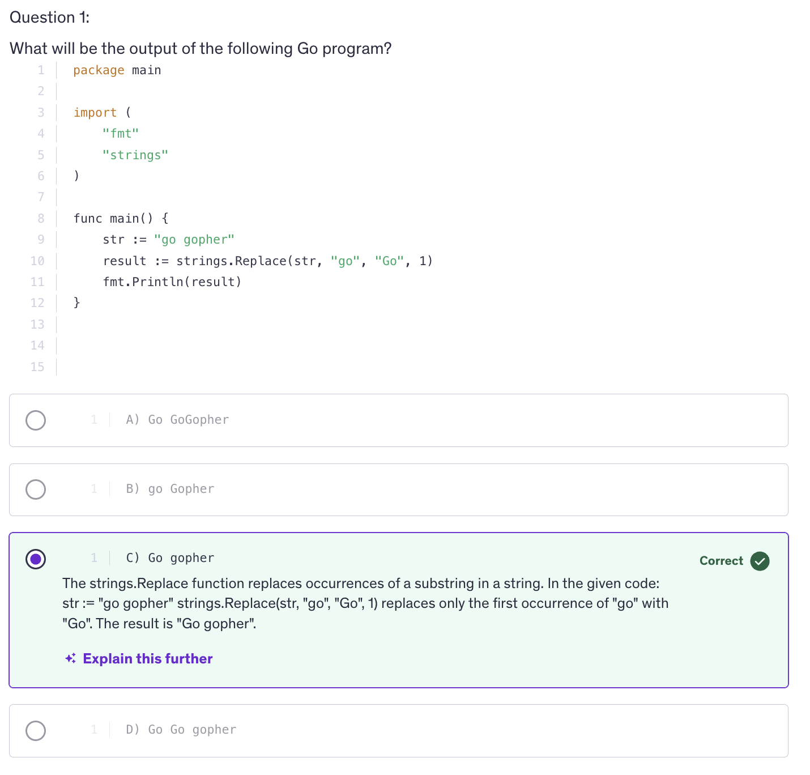
<br/>


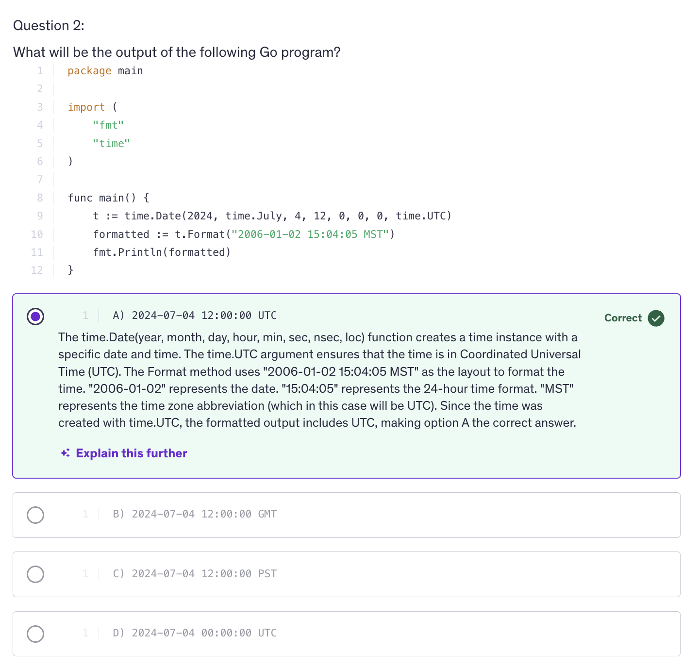
<br/>

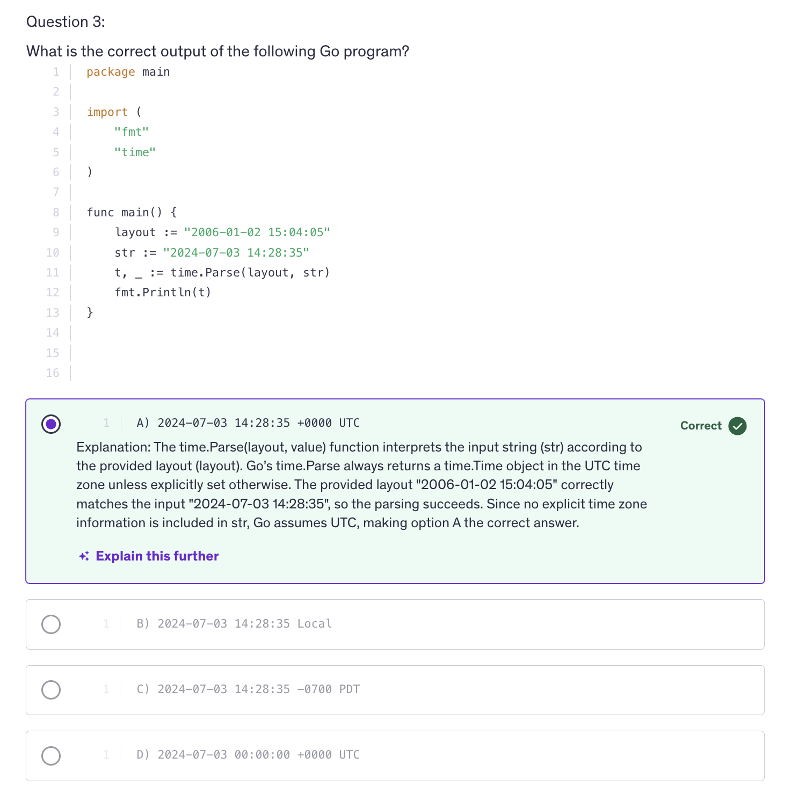
<br/>

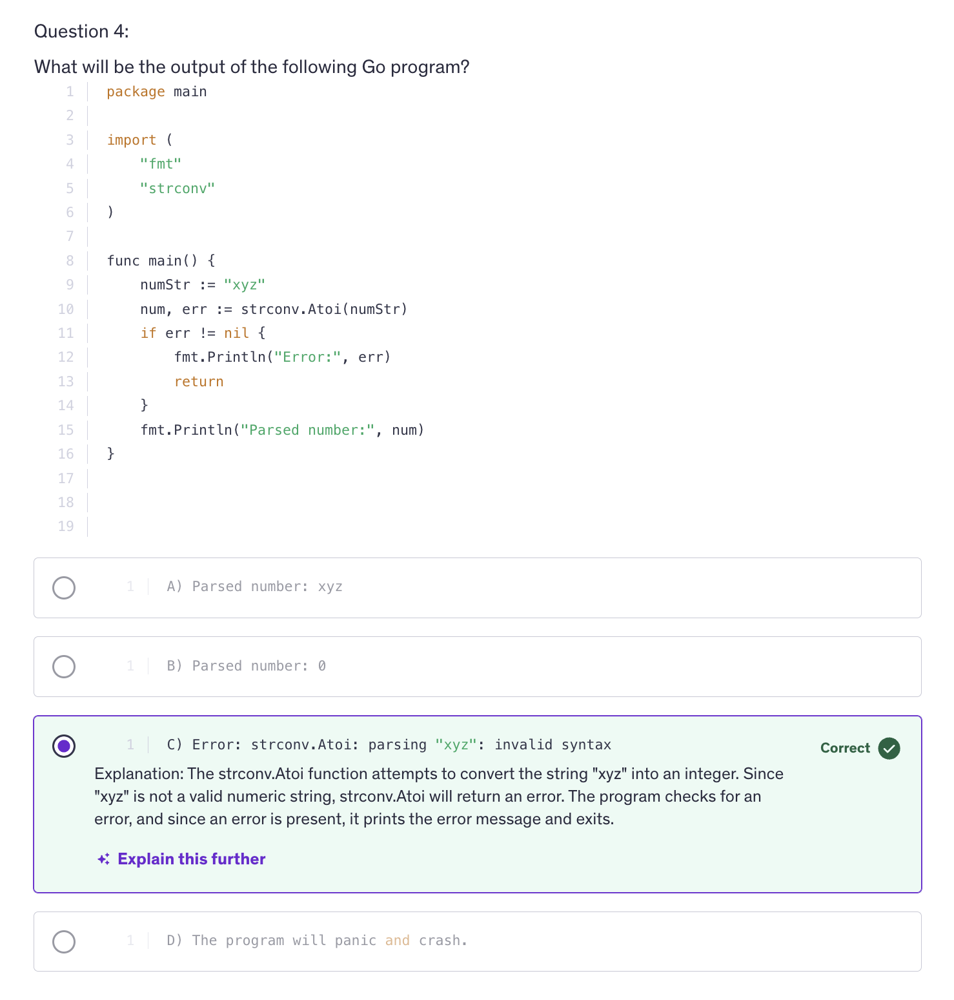
<br/>

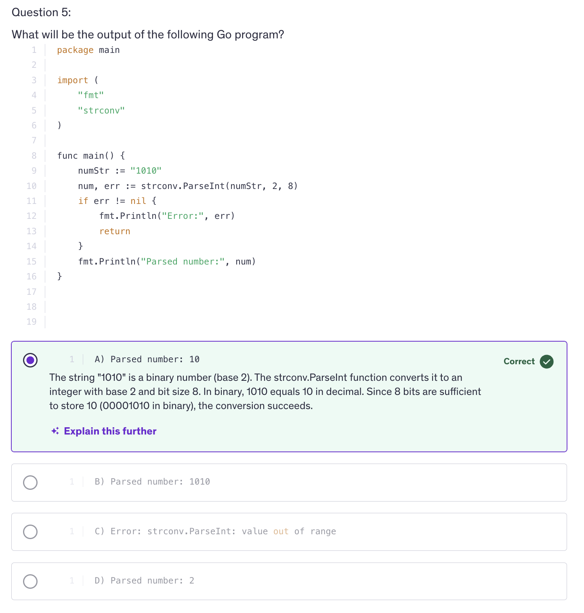
<br/>


## URL Parsing

- URL parsing in Go involves extracting various components like scheme, host path, query parameters, etc from a URL string. This is crucial for tasks like building web applications, API endpoints, or processing URLs in general.

- A URL which is acronym for Uniform Resource Locator has the following structure :
    ```txt
    [scheme://][userinfo@]host[:port][/path][?query][#fragment]
    ```
- `scheme` is also called the protocol. The protocol can be http, https, ftp.

- `userinfo` contains username and password which is optional. 
- Next we have `host` which is the domain name or the IP address.
- After that we have a `port` number which is optional.
- After the port we have `path`, path to the resource on the server.
- next to that we have `query` parameters. Query parameters are in key value pairs.
- Next we have `fragment` identifier. These are optional and used for specifying a location withing the resource.

- Go's standard library `net/url` provides a comprehensice package for parsing URLs and manipulating their components.

- In Programming, Parsing means we are processing some data and we are manipulating or we are extracting something out of that data. We make different methods using parse and they all do different things.

- In conclusion, `net/url` package is essential for extracting and manipulating various components of URLs and understanding how to parse, build and handle URLs ensures robust handling of web related tasks in Go applications.


## `bufio` package

- `bufio` package in GO provides buffered input output operations which can significantly improve performance when reading or writing data, especially for large volumes of data. 
- It wraps an `io.Reader()` or `io.Wirter()` and provides buffering with additional methods for more efficient reading and writing. 

- the `bufio.Reader()` struct wraps an io.Reader and provides buffering for efficient reading of data.

- What does buffering actually mean ?
    **Ans**: 
    - What buffering does is, it reads and writes data in chunks and we can decline these chunks according to our own will. So if we want the data to be sent to the user with five seconds or 10s of the movies, then we are sending the movie in those chunks and that is a faster way of communicating, a faster way of transfering data. So if you are sending smaller chunks they get transferred easily and there is a seamless user experience of utlizing that data, using that data.

    - It can be used in chat software or streaming platform or an audio playing platform where you play music, songs, so buffering gets used over there as well. 

    - And buffering is also used in uploading as well. So when we are uploading a file, instead of uploading the complete chunk of data, it uses buffering to send the data to upload the data in chunks.

    - Buffering is transfering data, communicating between two ends in chunks. So we are transfering data between two ends utlizing small chunks of that data.

- Key Components : 
    - `bufio.Reader()`
        - `func NewReader(rd io.Reader) *Reader` : creates a Reader instance and it reads from a source. 
        
        - `func (r *Reader) Read(p []byte) (n int, err error)` : The above `Reader` instance will execute a `Read()` method, that will read data from a source into a byte slice. So `Read()` method will read a finite amount of data from source into a byte slice and that finite amount of data, we choose how much to limit that data, how much we want to read from the source and transfer into our target.


        - `func (r *Reader) ReadString(delim byte) (line string, err error)`: Similarly we have a `ReadString()` method that the reader instance can use and reader instance will ReadString when we are reading a line string. When we want to read lines and we want to stop reading when we encounter a delimeter like a new line. So we can use ReadString and give it a delimeter character so that it will stop reading when it encounters that delimeter character. So we are not limiting the ReadString using the number of bytes, but we are limiting the ReadString method by using a delimeter character.
    
    - `bufio.Writer()`:
        - func NewWriter(wr io.Writer) *Writer
        - func (w *Writer) Write(p []byte) (n int, err error)
        - fun (w *Writer) WriteString(s string) (n int, err error)


- Sample code to read a string:
    ```go
    reader := bufio.NewReader(strings.NewReader("Hello World with bufio package!\n"))
    ```

    - The Reader object is an interface that allows you to read data from the string, just like you would read from a file or network connection. Imagine you have a book and that book has the content of the string above. So this the content of that book and you want to read this book. `strings.NewReader()` turns that book into a special tool that allows you to read from it in a controlled way. it's a tool that lets us read a book. A book in a way here is the string that has been passed to it.

    - So `bufio.NewReader()` is a wrapper around the exisiting reader from the previous step. So, bufio.NewReader() creates a new `Reader` object and it wraps around an existing reader. It takes an existing reader and returns above `io.Reader` object.

    - This `io.Reader` object provides additional functionality on top of basic reader like buffering the data and offering more methods to read data in various ways.

    - Continuing with the book analogy, bufio.NewReader is like adding a special feature to your book reading tool. This feature allows you to read the book more efficiently and provides extra capabilities such as reading entire lines or chunks of data more easily in an efficient way.

    - So this complete line creates a new bufio.Reader object which is ready to read the string. So we now have a tool which is reader, the reader variable and it lets us read the string in a more flexible and efficient way. This tool can read byte by byte or line by line or in other ways as needed.


- Example Reading data in bytes
    ```go
    reader := bufio.NewReader(strings.NewReader("Hello World! bufio package tutorial\n"))

	// Reading the byte slice
	data := make([]byte, 20)
	n, err := reader.Read(data)
	if err != nil {
		fmt.Println("error reading the string:", err)
		return
	}
	fmt.Printf("Read %d bytes: %s\n",n,data[:n])
    ```

    - So when we are reading data, it is reading and then transfering the data that it read into byte slice called the `data`. It's not keeping the read data with itself. It needs to transfer the data. And `Read()` is a method, a function to tranfer data from one point to another. So we are transfering the data from the source (string input) to a target (`data`). So when we read data we are either getting uploaded data from somewhere of we are transfering data to be downloaded.

    - When we are reading data, we are receiving data from somewhere, so we need to store that data into something at some place.

- Example using `ReadString()`
    ```go
    // Reading the string with delimeters
	line, err := reader.ReadString('\n')
	if err != nil {
		fmt.Println("error eading the string:", err)
	}
	fmt.Println("Read String:", line)
    ```

    - Previously we are reading the data in bytes and we stopped. And reading when it stops and then after stopping when it again starts, it starts from the point where it left.

- `bufio.Writer()` is a struct that wraps around an `io.Writer` object and provides buffering for efficient writing of data.

- Similar to the reader, the syntax goes like this : 
    - We initiate a new instance of writer by calling the `NewWriter()` method. 
    - This instance of NewWriter is going to wrap around an existing writer or an output device.
    - The instance of the NewWriter is going to have methods like `Write()`, `WriteString()`and many more.
    - `Write()` will be limited by the number of bytes.
    - `WriteString()` will be writing complete string to the output.

- `os.Stdout` is an acceptable Writer. To confirm we can visit the os.file and see that it implements the write method with the same function definiton that the `io` package defines for a `write()` method. And the io.Writer interface tells us that any struct that implements the `write` method will be considered as the same type as `io.Writer`.

- Example writing a byte slice :
    ```go
	data := []byte("Hello, bufio package!\n")
	n, err := writer.Write(data)
	if err != nil {
		fmt.Println("error writing:", err)
		return
	}
	fmt.Printf("Wrote %d bytes\n", n)
    ```
    - but we will not see any output, that's because we haven't flushed the buffer.

    - So what happens with bufio.Writer is that all the data that is written to the writer is stored in an internal buffer and it's not immediately written to the os.Stdout or any other writer that we pass as an argument.

    - the `Write()` methods writes the data into the buffer, but does not automatically flush the buffer to the underlying writer. So any writer that we pass to the above NewWriter, it will not automatically receive the data. We have to flush the buffer to the underlying writer.

    ```go
    err = writer.Flush()
    if err != nil {
        fmt.Println("error flushing writer:", err)
        return
    }
    ```

- Difference between `Write()` and `WriteString()` : We are using byte slice for Write() and string for WriteString().

- And similarly, there's a difference between using io and bufio packages. bufio provides efficient buffering of data, reducing the number of system calls which can improve performance. Moreover, bufio wraps around the io.Reader and io.Writer, so errors are propagated from the underlying io.Reader and io.Writer, making it easy to handle errors consistently.

- Use Cases and Benefits:
    - Buffering
    - Convenience Methods
    - Error Handling

- Best Practices
    - Check Error
    - Wrap Reader and Writer instances for efficient buffered I/O operations
    - Don't forget to call Flush

- Always check errors returned by buffio.Reader and bufio.Writer methods. Always do that because it can happen sometimes and with buffering, yes there might be errors occasionally. So we must be handling these errors. We cannot discard these error.

- And it is a good idea to use bufio.Reader and bufio.Writer to wrap io.Reader and io.Writer instances for efficient buffered IO operations. So even when you are using io.Reader and io.Writer, it's a good idea to use bufio as a wrapper on them for efficient operations. 

- And when you are using bufio.Writer don't forget to call `Flush()` otherwise the buffered data will not be written to the underlying io.Writer.

- In conclusion, the bufio package in Go provides essential utilities for efficient buffered input output operations. Understanding and leveraging it's capabilities can lead to significant improvements in the performance and reliability of file and network input output operations.


## Base64 Coding

- Encoding is essentially the methode used to translate data from it's orignal format into a specific format that can be used by other systems, applications or protocols. This translation allows for data to be correctly interpreted and utilized accross different environments. So, in simpler terms what encoding means is the process of converting data from one format to another so it can be stored, transmitter or processed effectively.

- Encoding is used for data storage, different systems might use different formats for storing data. Encoding ensures that data can be correctly stored and retrieved.

- Encoding is also important for data transmission. Data sent over networks or between different systems must often be encoded to ensure that it is transmitted correctly and can be understood by the receiving system.

- Encoding is also important in terms of data interoperability. Encoding helps in ensuring that the data can be understood and processed by various systems or software regardless of their internal data formats.

- Why Base64 ?
    - text transmission
    - storage
    - urls and data urls

- Why is Encoding Important ?
    - Data storage
    - Data transmission
    - Data interoperability

- Common examples of encoding
    - Text encoding
        - ASCII
        - utf8
        - utf16
    - Data Encoding
        - Base64 : method for encoding binary data into a text format. Commonly used in email and url encoding.
        - URL encoding : converts characters into a format that can be transmitted over the internet. eg: spaces are encoded as `%20`
    - File encoding
        - binary encoding : data is encoded in binary format which is suitable for files such as images or executable files.
        - text encoding : converts text into a specific format such as utf8 for use in text files.

- Base64 is a binary to text encoding scheme that converts binary data into a textual representation using a set of 64 ASCII characters. It is commonly used for transmitting binary data over text based protocols such as emails or storing binary data as text in databases or files, so the encoding process of base64 involves converting binary into a textual format using a fixed set of 64 characters and these 64 characters comprise of uppercase, lowercase, digits from 0 to 9, plus sign and forward slash and optionally an equal sign as well.

- Equal sign is used for padding at the end of the encoded data. 

- Base64 enables binary data to be stored as text in databases or files that do not support binary formats. Apart from that, Base64 encoding is used in URLs, especially url safe variants and in data urls for embedding small resources directly into HTML or CSS.

- Apart from that Base64 is used for text transmission as well, which allows binary data to be transmitted as text, which is useful for protocols that only support text data and in Go language, we use Base64 by utilizing the encoding base64 package.

- Usually URLs may require special handling due to characters like forward slash and plus symbol being used in standard base64 encoding. So how do we make an encoded value URL safe ? So when we are trying to generate a URL safe encoding we are trying to avoid the forward slash and plus sign.

- So base64 encoding is useful in embedding small images or files directly into html or css using data urls. And similarly, we can also store binary data in text based formats such as JSON, XML and while using base64 encoding there are some security considerations that we need to be careful about. 

- Use Cases:
    - Binary Data transfer
    - Data Storage
    - Embedding Resources

- Security Considerations
    - It is not Encryption
    - Proper handling of padding
    - Use appropriate variants.

- Base64 encoding is a reversible encoding scheme and we need to ensure proper handling of padding. We should use appropriate variants of encoding. If we need standard encoding and we are okay with the special symbols, then we should use the standard encoding. Otherwise if we want an encoding that is URL safe, then we use URL encoding and it is based on the context that is standard versus URL safe.


## SHA256 / 512 Hashes / Hashing / Cryptography


### Hashing

- Hashing is a process used in computing to transform data into a fixed size string of characters, which typically appears random, and this transformation is done using a special algorithm called a hash function.

- Key Components
    - Deterministic
    - Fast Computation
    - Pre-Image Resistance
    - Collision Resistance
    - SHA-256
    - SHA-512
    - Salting

- Best Practices
    - Use of Standard Libraries
    - Algorithm Updates

- Hashing results in a unique output. So that means even a small change in the input will produce a completely different hash. This property is known as the `avanlanche effect`.

- Salting adds an extra layer of security by combining the password with a unique random value so that it can be random, or you can store a string as a salt and use that with every password that you are hashing. The practice of salting helps you protect against dictionary attacks and rainbow table attacks. So, salt is a value added to the password before hashing and it's purpose is that it ensures that even if two users have the same password, their hashed values will be different due to different salts. 

- So what happens is we are going to generate a random byte slice and then we are going to store that in our database with the user information in the salt column and in the password hash column we are going to store the hashed password. Now that hashed password has been hashed using the password as well as the salt string.

- `io.ReadFull()` is a function from io package and it will read exactly the length of the byte slice from the give reader into the salt slice.

    ```go
    salt := make([]byte, 16)
    _, err := io.ReadFull(rand.Reader, salt)
    if err != nil {
        return nil, error
    }
    return salt, err
    ```

    - `rand.Reader()` -> generates cryptographically secure random numbers. 
    - So, its going to read the cryptographic random numbers equal to the length of salt slice which is 16.

- Cryptographically secure random numbers are different from the general random numbers because these numbers are generated in a way that makes them unpredictable and resistant to reverse engineering. General random numbers however are predictable if enough information about the internal state is known. For example, a common pseudo random number generator might have patterns or weaknesses that make it less secure. However in case of cryptographically secure random numbers, the algorithms used to generate these ensures that even if part of the data is known, predicting the rest is computationally infeasible.


## Writing Files

- Writing to files involves creating or opening a file, writing data to it and handling any errors that may occur during these operations.

- We have `os` packages that provide convenient methods for handling file operations.

- The os package in Go provides functions for operating system functionality including file operations. We have functions like create that will create or truncate a file with the given name and returns a file descriptor or the created file.

- OpenFile method -> opens a file with the specified name, flags and permissions and it's also going to return a descriptor.

- Write() -> method of file struct os.FileStruct().

- Key Components :
    - `os` package functions :
        - Create(name string) (*File, error)
        - OpenFile(name string, flag int, perm FileMode) (*File, error) 
        - Write(b []byte) (n int, err error)
        - WriteString (s string) (n int, err error)

- Best Practices 
    - Error Handling
    - Deferred Closing
    - Permissions
    - Buffering

- We can use `defer` for cleanup actions and closing a file, closing a database, closing connections are cleanup actions.

- Best practices:
    - error handling
    - deferred closing
    - permissions
    - buffering


## Reading Files

- Reading Files is a common operation in programming for tasks such as configuration loading, data parsing, or processing large datasets.

- `os` package is useed for file operations including files.

- to create a scanner to read the file line by line use the `bufio` package.

- ALong with the newline character we also have the EOF character. There's no way to go after the EOF.

- Scanner reads from a file and if we want to read a file line by line we use scanner.Scan(). It loops over tokens and those tokens are lines. It keeps on overwritting the text with the new line that it scans and we are saving th output of scanner.Text() into a line variable and we print that afterwards.

- EOF is signified by absence of data. So if there's no more data, that means that's the end of file.

- make sure that you always check errors returned by file operations like os.Open, file.Read, scanner.Error.

- Reading files in Go involves opening a file, reading it's content using methods such as reading byte slices or lines and handling errors effectively. Go's `os` and `bufio` packages provide efficient and straightforward APIs for file input output operations, making it easy to work with file data in various applications.


## Line Filters

- Line filtering refers to the process of processing or modifying lines of text based on specific criteria. It involves reading text line by line and applying certain operations or conditions to each line. This is a common task in text processing, data cleaning and file manipulation.

- Some examples of line filtering are filtering lines based on content that means we only print lines that contain a specific keyword. Another example is removing empty lines, so we can exclude blank or empty lines from the output. We can also tranform the line content. We can convert all text in lines to uppercase or lowercase and we can also apply filters lines by any criteria.

- Some best practices
    - Use buffered input output for efficient reading of input especially when dealing with large volumes of data.
    - 

- Best Practices
    - Efficiency
    - Error Handling
    - Input Sources
    - Flexibility

- Practical Applications
    - Data Transformation
    - Text Processing
    - Data Analysis


## File Paths

- Absolute path specifies the complete path from the root directory.

- Relative path specifies the path relative to the current working directory.

- Go provides `path/filepath` package for working with File Paths which handles platform specific path issues and provides utilities for path manipulation.

- Some useful functions:
    - filepath.Join() -> contructs a path by joining individual components with the appropriate seperator.
    - filepath.Split() -> splits the path into directory and file name components.
    - filepath.Clean() -> normalizes a path, cleaning up redundant separators and resolving dot and double references.
    - filepath.Abs() -> returns the absolute path of a given relative path. 
    - filepath.Base() -> retrieves the last element of the path which is the file or maybe a directory name.
    - filepath.Dir() -> retrieves the directory part of the path.

- we can use `os` package to make directories.

- filepath offers us platform independence. So when we use filepath package functions it ensures portability accross different operating systems.

- When it comes to filepath or url paths, always validate and sanitize user provided file paths to avoid security vulnerabilities such as directory traversal attacks and we sanitize our user input by trimming unwanted symbols or unwanted characters from that user input.

- Best Practices
    - Platform Independence
    - Handling Errors
    - Security

- Practical Applications
    - File I/O operations
    - Directory Navigation
    - Path Normalization

- In conclusion, file paths in Go provide a standardized way to reference files and directories accross various operating systems.


## Directories

- Directories or folders are containers used to organize files on computer's file system. In software development, understanding how to work with directories programmatically is essential for tasks such as creating, reading, navigating and deleting directories.

- In Go, the `os` package provides functions for interacting with directories and performing file system operations.

- Key Concepts:
    - `os.Mkdir`
    - `os.MkdirAll`
    - `os.ReadDir`
    - `os.Chdir`
    - `os.Remove`
    - `os.RemoveAll`

- second argument of os.Mkdir is permission and  permissions are of type os.FileMode so they are in a numerical format. In Linux, the numerical format of a file that I own is 0755.

- WalkDir is often preferred for performance reasons as compared to Walk() because WalkDir avoids some internal allocations by working directly with directory entities. WalkDir uses os.DirEntries under the hood which is more efficient while filepath.Walk() uses os.FileInfo which provides more details but may be less efficient.

- Best Practices
    - Error Handling
    - Permissions
    - Cross Platform Compatibility

- Practical Algorithms
    - Organizing files
    - File System Navigation
    - Batch Processing

- We use these directory operations in many practical applications like organizing files, creating and managing structures file systems and also for the file system navigation meaning navigating to directories to access specific files or directories and also for batch processing, like performing operations on multiple files withing directories.


## Temporary Files and Directories

- Temporary files and directories are essentials in many programming scenarios where temporary storage is needed for data processing, caching or other transient operations.

- Go provides mechanisms to create, manage and cleanup temporary files and directories efficiently. 

- Why Use Temporary files and directories ?
    - Temporary Storage
    - Isolation
    - Automatic Cleanup
    - Default Values and Usage.

- Best Practices
    - Security
    - Naming

- Practical Applications
    - File processing
    - Testing
    - Caching

- Considerations
    - Platform Differences
    - Concurrency


## Embed Directive

- Embed Directive is a feature introduced in Go 1.16 to embed static files or directories into GO binaries at build time. This directive provide a convenient and efficient way to include assets directly withing your Go programs eliminating the need to manage these assets separately. 

- The reason we use embed directive is for simplicity. Embedding files simplifies deployment as it reduces the number od separate files to manage. And also for efficicieny. Embedding files into binaries makes distribution and execution straightforwards without worrying about file paths or external dependencies because all our dependencies, all our assets, all the extra files that we needed are combined into our executable.

- Embedded files are bundled within the binary, reducing exposure to external manipulation or unauthorized access.

- The embed directive support files, the individual files that we have and their directories. Entire directories and their contents can be embedded recursively. And that means that we can embed almost anything into our executables.

- To embed a directory, it's a little different in Go, we have to use special comments. Go Embed directive should be before a var declaration. 
    ```go
    import  _ "embed"
    
    //go:embed example.txt
    var content string
    ```

- We are importing `embed` package only for the sole purpose of using it's side effects. The underscore before the embed tells the compiler that it's okay, we are using the embed package for it's side effects and we are not importing it to use any of it's assosciated functions, any of it's exported names. Technically this is called a `blank import`. A lank import prevents the compiler from complaining about an unused import.

- When we are embedding a folder, we need to specify the type of the variable that succeeds the embed directory of the folder as `embed.FS`.

- embed offers us a read only file system and that's why we can use our `embed.FS` in place of `fs.FS`. One advantage of using `fs` package is that, it is cross platform compatible.

- The embed directive finds it's use in web-servers for embedding static html, css and javascript files for serving web content and also in configuration files. Embedding configuration files or templates directly into CLI tools or services.

- Supported Types:
    - Files
    - Directories

- Use Cases:
    - Web Servers
    - Configuration files
    - Testing

- Considerations
    - File Size
    - Update Strategy
    - Compatibility

- Embedded files cannot be modified at runtime and we may need to rebuild the binary for any updates.


## Intermediate Quiz 3

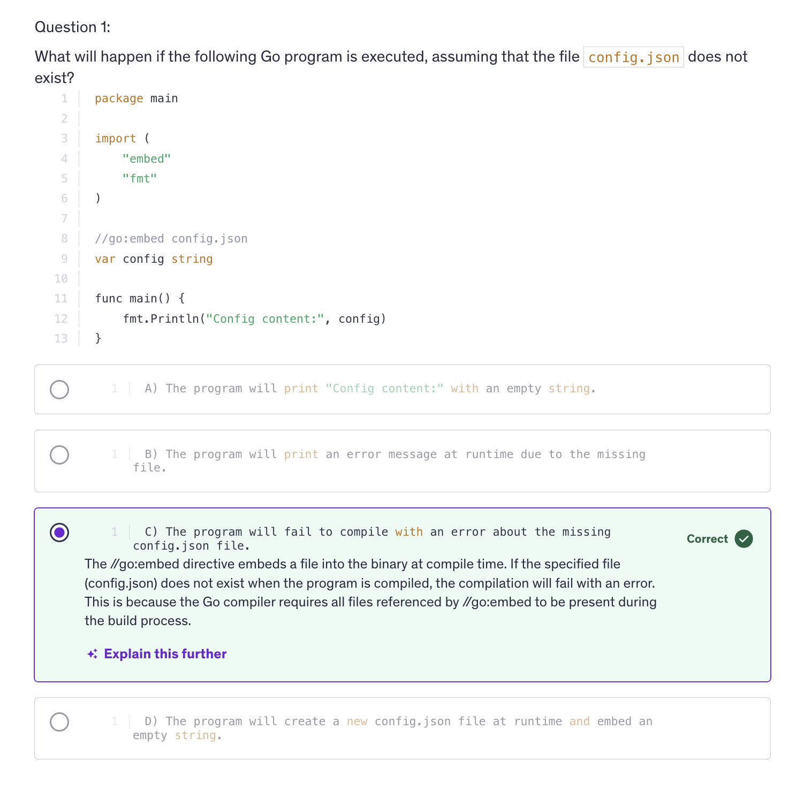
<br/>

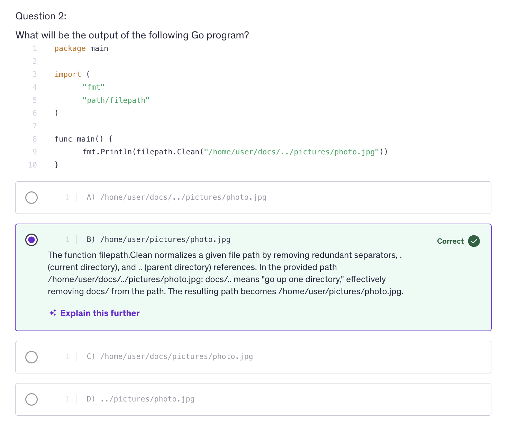
<br/>

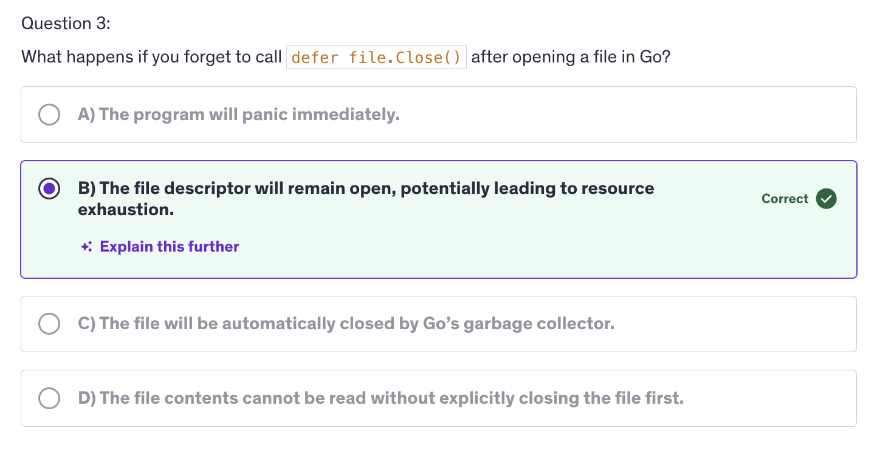
<br/>


<br/>

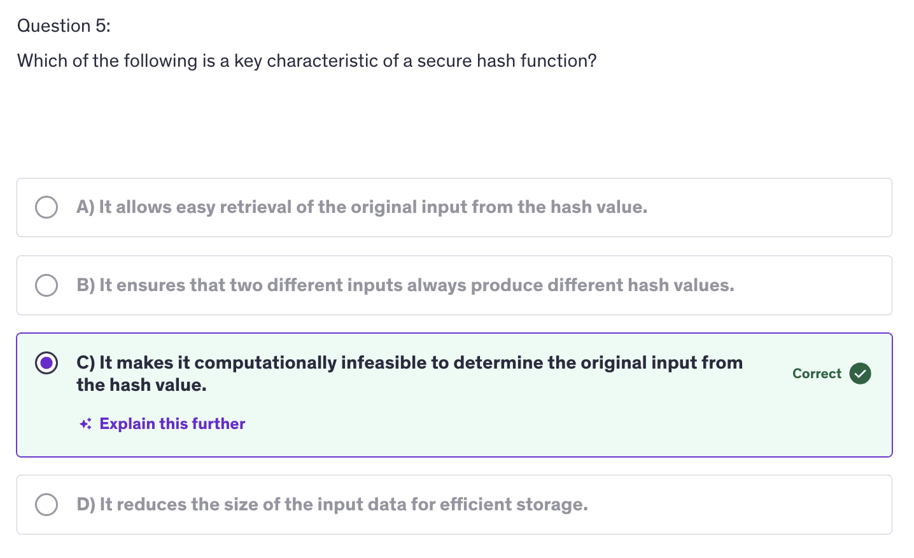
<br/>


## Command Line Arguments / Flags

- Command Line arguments are a common way to pass parameters to a program when it is executed from a terminal or command prompt. 

- In Go, handling command line arguments is straightforward, leveraging the OS package for accessing arguments and flags. In Go, the command line arguments are accessible via the `os.Args` slice, where `os.Args[0]` is the name of the command or the name of the program itself. After zero we have 1, 2, 3. So the subsequent numvers will contain the actual arguments passed to the program.

- While `os.Args` provides raw access to command line arguments, more complex argument parsing can be achieved using packages like `flag` or manually processing `os.Args`.

- The flag package provides a convenient way to define and parse command line flags in Go program. Flags are parameters preceded by a hyphen, a single hyphen or a double hyphen that modify the behaviour of the program.

- use `equal to` sign(=) for entering values for the subcommand.

- `--help` will only list the commands and not the subcommands. This is the default nature of --help.


- Key Concepts:
    - `os.Args` slice
    - Parsing Arguments
    - `flag` package
    - Default Values and Usage

- Considerations
    - Order of Arguments
    - Flag Reuse
    - Order of Flags
    - Default Values
    - Help Output

- Best Practices
    - Clear Documentation
    - Consistent Naming
    - Validation

- Whenever we are accepting user input, always anitize the user input before using it in your program.


## Command Line Sub Commands


## Environment Variables

- Environment vairables are key value pairs that are part of the environment in which a process runs. They provide a convenient way to pass configuration information, credentials and other runtime parameters to applications without hard coding those values into the application itself.

- In Go, environment variables are accessed through the `os` package.


- Best Practices
    - Security
    - Consistency : Use All Caps for configuring the key for any environment variable.
    - Documentation

- Considerations
    - Cross Platform Compatibility
    - Default Values

- Overall environment variables in Go provide a flexible and secure way to configure applications without hardcoding sensitive information.


## Logging

- Logging is a critical aspect of software development and operations as it allows developers and system administrators to monitor and debug applications.

- In Go, logging is straightforward and the standard library provides robust support through the log package. The standard log package doesn't have built in support for logging levels like debug, info, warn, error. However, we can create custom logging functions to handle different levels.


- JSON is a widely used format for data interchange, making it easy to integrate with other systems and services that expect log data in JSON format.

- JSONFormatter improves readability for developers and operators who prefer structured data. JSON logs can be more readable and easier to understand than plain text logs, especially when logs contain complex data.

- Adding context to logs can be very useful for tracking the flow of requests and debugging.

- Best Practices
    - Always use Log Levels
    - Structured Logging
    - Contextual Information
    - Implement Log Rotation : to manage log file sizes and prevent disk space issues.
    - External Services

- Log Rotation is a technique used to manage the size of log files by periodically rotating them out and starting new ones. This helps prevent log files from growing indefinitely and consuming all available disk space. Implementing log rotation ensures that old log data is archived, deleted or compressed making it easier to manage logs and maintain system performance.


## JSON

- JSON which stands for Javascript Object Notation, is a lightweight data interchange format that is easy for humans to read and write, and easy for machines to parse and generate. It is commonly used for transmitting data in web applications.

- In Go, the `encoding/json` package provides functions to encode which is called Marshall and decode, which is unmarshal json data.

- `json.Marshal()` -> convert Go data structures into JSON (encoding)

- `json.Unmarshal()` -> convert JSON into Go data structures (decoding)

- Backticks in structs are primarily used for struct field tags which provide metadata about the fields. These tags are especially useful when you need to convert a struct to JSON or interact with databases.

- In Go structs, each field has a tag specifying the JSON key to use when the struct is marshalled to JSON. So what we are doing is we are mentioning the field that needs to be there when this struct is changed into a JSON.

- Struct tags can be used for tags that can specify column names or primary keys, etc., when using database ORM (Object Relation Management). Tags can also provide validation rules for example in making APIs. We can use `db` instead `json` tags when working with databases and in that case the tags will represent the column names in the database.

- Similar to structs, JSON objects can also be nested inside each other.

- `encoding/json` package handles the encoding and decoding of arrays and slices as well.

- Best Practices
    - Use JSON Tags
        - Mapping Struct Fields to JSON keys
        - Omitting Fields - if empty (`omitkey`) or always (`-`)
        - Renaming Fields
        - Controlling JSON encoding / decoding behaviour.
    - Validate JSON
    - Use `omitempty`
    - Handle Error
    - Custom Marshalling / Unmarshalling


## Struct Tags

-  Struct tags play a crucial role in controlling how data is encoded and decoded in Go, especially when working with JSON. They allow us to specify details about how struct fields should be represented in JSON, providing more flexibility and control.

- Struct tags can be used to map struct field names to specific JSON keys, which might not match the Go field names, and this is useful when working with APIs pr data sources where the JSON keys hace different naming conventions.

- Struct tags can also indicate that certain fields should be omitted from the JSON output either when they have zero values, or always omitting zero values, we use `omitempty` and for always omitting that field we use `-`.

- We can also rename struct fields in the JSON output using struct tags. This is useful for ensuring the JSON output meets specific schema requirements, and schema is very important when we are storing data into a database or accessing data from a database.

- Struct tags allow you to control the behavior of the encoding JSON package, such as specifying is a field should be ignored or how it should be serialized.

- Having no value is equivalent to having zero value of that type. And having zero value is equivalent to having no value.

- Struct tags in Go provide a powerful way to control how JSON data is encoded and decoded. They allow you to map struct fields to specific JSON keys and they also allow you to omit fields with zero values or omit fields entirely. 

- By using struct tags effectively we can ensure that our Go applications produce and consume JSON data that meets our requirements and integrates smoothly with external systems and APIs.


## XML

- XML stands for extensible markup lanaguage, is a markup language used for encoding documents in a format that is both human readable and machine readable. It is widely used for data interchange between systems and for configuration files.

- Best Practices
    - Use XML Tags
    - Validate XML
    - Handle Nested Structures
    - Handle Errors
    - Custom Mashalling/Unmarshalling
- Real World Scenarios
    - Web Services and APIs
        - Spring Framework
        - Microsoft .NET Applications
    - Data Interchange and Storage
        - RSS and Atom Feeds
        - Electronic Data Interchange(EDI)
    - Industry Standards
        - Health Care (HL7)
        - Finance (FIXML)


## Go Extension


## Type Conversions

- Type conversion is a fundamental concept that allows you to convert a value of one type into another. This is especially usefull when you need to ensure that values are in the correct format for various operations or functions.


## IO Package

- Why is the io package important ?
    - It facilitates interaction with various data sources (files, networks, in-memory buffers).
    - Provides a consistent interface for handling I/O operations.

- Core Interfaces:
    - io.Reader
    - io.Writer
    - io.Closer

- Common types and functions
    - io.Reader
    - io.Writer
    - io.Copy()
    - io.MultiReader()
    - io.Pipe()

- Working with Buffers
    - bytes.Buffer
    - bufio.Package

- `io.Pipe()` creates a pipe with a connected io.Reader and io.Writer. So essentially what it does is, it returns us two values. One value will be a reader and another value will be writer. It's not a common value of Reader and Writer, there are two different return values from io.Pipe and we can use these return values, the Reader and the Writer to read and write data. And these are both connected.

- Go routines are essentially any immediate function (Immediate functions are the functions that are executed immediately once they are defined). If we add `go` keyword before a function, it becomes go routine. And Go routines are functions that are immediately executed and they are anonymous.

- The `go` keyword -> It extracts this function out of the main thread and the execution will fall on to the next line. And this function, once it is completed, then it will come back to the main thread.

- A pipe is a way to connect two pieces of code so that data can flow from one to the other. It's like a tunnel through which information travels. In Go the io.Pipe() creates a pipe with two ends. The Reader end is the end from which data will be read and Writer is the end to which data will be written. Reading will be don from the reading end of the pipe.

- io vs bufio :
    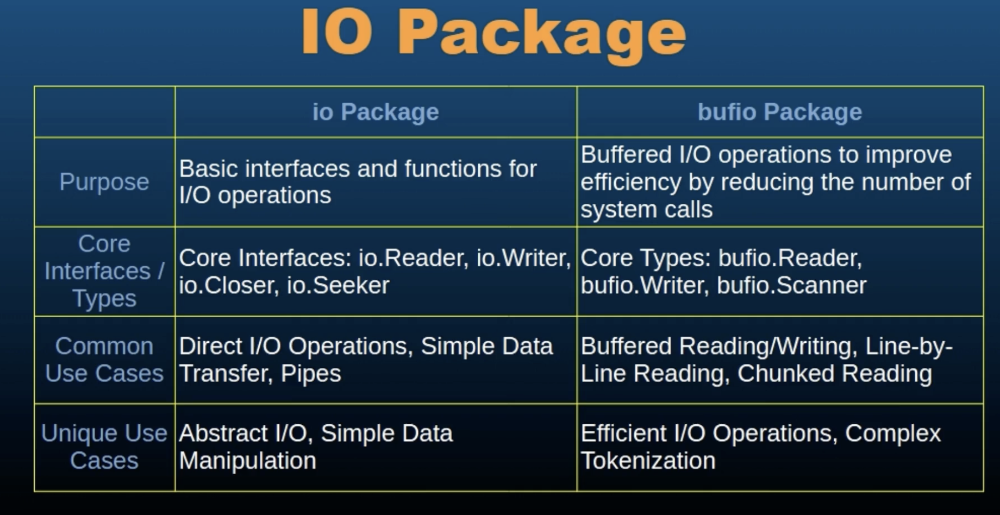


## Math Package

- math package in Go provides basic constants and mathematical functions for common tasks such as computing square roots, trignometric functions, logarithms and more.

- This package is essential for many applications, ranging from simple arithmetic operations to complex scientific computation.

- **Constants:**
    ```go
        p := math.Pi

    e := math.E

    ph := math.Phi

    sqrt2 := math.Sqrt2

    sqrtE := math.SqrtE

    sqrtPi := math.SqrtPi

    sqrtPhi := math.SqrtPhi

    ln2 := math.Ln2

    ln10 := math.Ln10

    log2E := math.Log2E

    log10E := math.Log10E
    ```

- #### Basic Mathematical Functions

    - **Absolute Value**
    func Abs(x float64) float64
    fmt.Println(math.Abs(-3.14)) // Output: 3.14

    - **Square Root**
    func Sqrt(x float64) float64
    fmt.Println(math.Sqrt(16)) // Output: 4

    - **Power**
    func Pow(x, y float64) float64
    fmt.Println(math.Pow(2, 3)) // Output: 8

    - **Exponential**
    func Exp(x float64) float64
    fmt.Println(math.Exp(1)) // Output: 2.718281828459045

    - **Logarithms**
    func Log(x float64) float64 // Natural logarithm
    func Log10(x float64) float64 // Base-10 logarithm
    fmt.Println(math.Log(math.E)) // Output: 1
    fmt.Println(math.Log10(100)) // Output: 2


- #### Trigonometric Functions

    func Sin(x float64) float64
    func Cos(x float64) float64
    func Tan(x float64) float64
    fmt.Println(math.Sin(math.Pi / 2)) // Output: 1
    fmt.Println(math.Cos(math.Pi)) // Output: -1
    fmt.Println(math.Tan(math.Pi / 4)) // Output: 1


- **Inverse Trigonometric Functions**
    func Asin(x float64) float64
    func Acos(x float64) float64
    func Atan(x float64) float64
    func Atan2(y, x float64) float64
    fmt.Println(math.Asin(1)) // Output: 1. 5707963267948966
    fmt.Println(math.Acos(0)) // Output: 1.5707963267948966
    fmt.Println(math.Atan(1)) // Output: 0.7853981633974483
    fmt.Println(math.Atan2(1, 1)) // Output: 0.7853981633974483


- **Hyperbolic Functions**

    func Sinh(x float64) float64
    func Cosh(x float64) float64
    func Tanh(x float64) float64
    fmt.Println(math.Sinh(1)) // Output: 1.1752011936438014
    fmt.Println(math.Cosh(1)) // Output: 1.5430806348152437
    fmt.Println(math.Tanh(1)) // Output: 0.7615941559557649

#### Special Functions

    func Gamma(x float64) float64
    fmt.Println(math.Gamma(0.5)) // Output: 1.772453850905516
    func Erf(x float64) float64
    func Erfc(x float64) float64
    fmt.Println(math.Erf(1)) // Output: 0.8427007929497149
    fmt.Println(math.Erfc(1)) // Output: 0.15729920705028513

#### Rounding Functions

    - **Ceiling**
    func Ceil(x float64) float64
    fmt.Println(math.Ceil(1.3)) // Output: 2

    - **Floor**
    func Floor(x float64) float64
    fmt.Println(math.Floor(1.7)) // Output: 1

    - **Round**
    func Round(x float64) float64
    fmt.Println(math.Round(1.5)) // Output: 2

#### Utility Functions

    - **Minimum and Maximum**
    func Min(x, y float64) float64
    func Max(x, y float64) float64
    Example:
    fmt.Println(math.Min(1, 2)) // Output: 1
    fmt.Println(math.Max(1, 2)) // Output: 2

    - **Hypotenuse**
    func Hypot(p, q float64) float64
    fmt.Println(math.Hypot(3, 4)) // Output: 5


## Intermediate Quiz 4

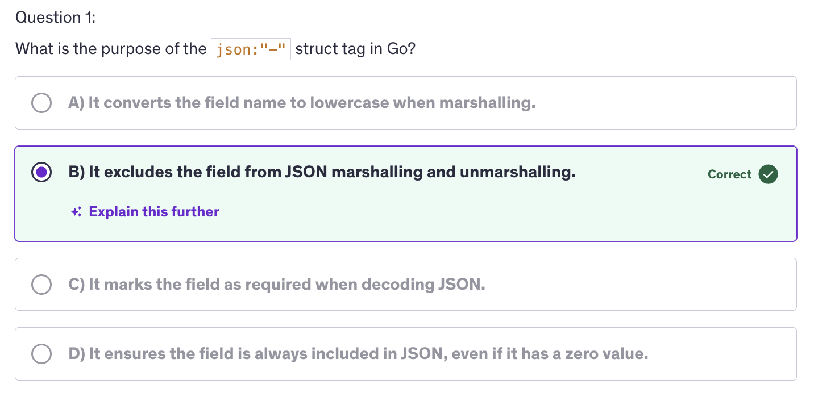
<br/>

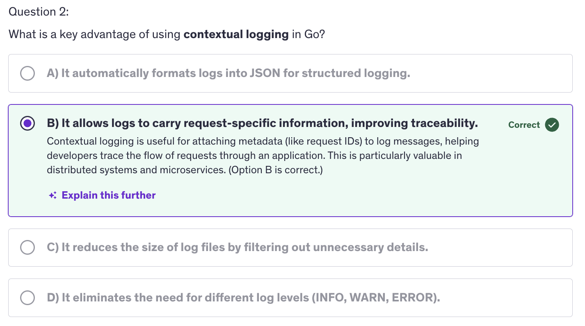
<br/>

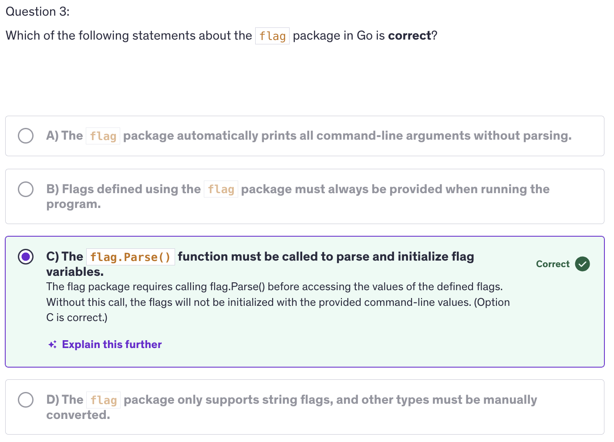
<br/>

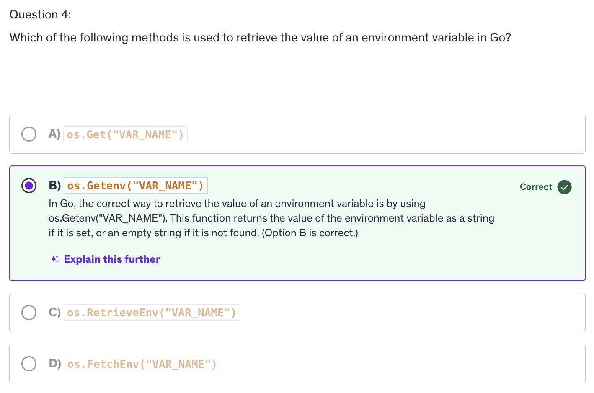
<br/>

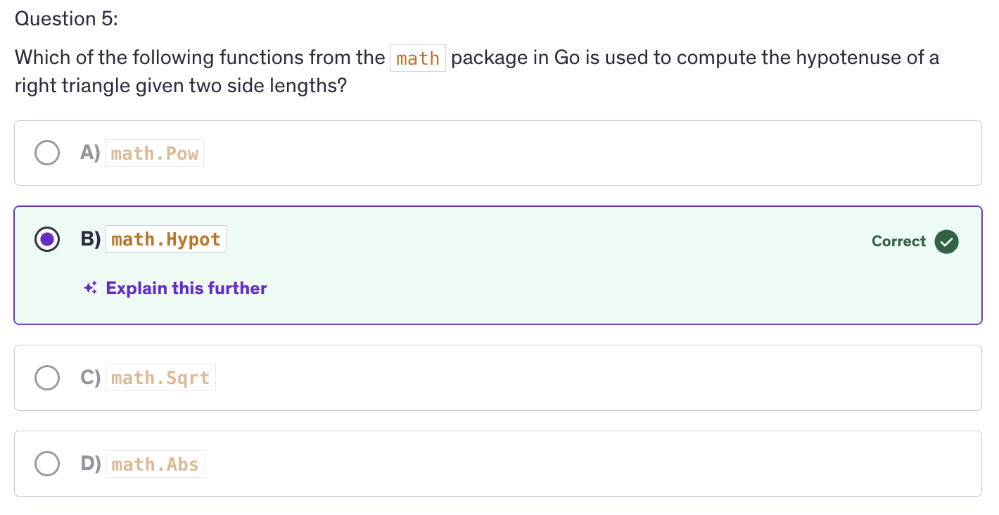
<br/>
