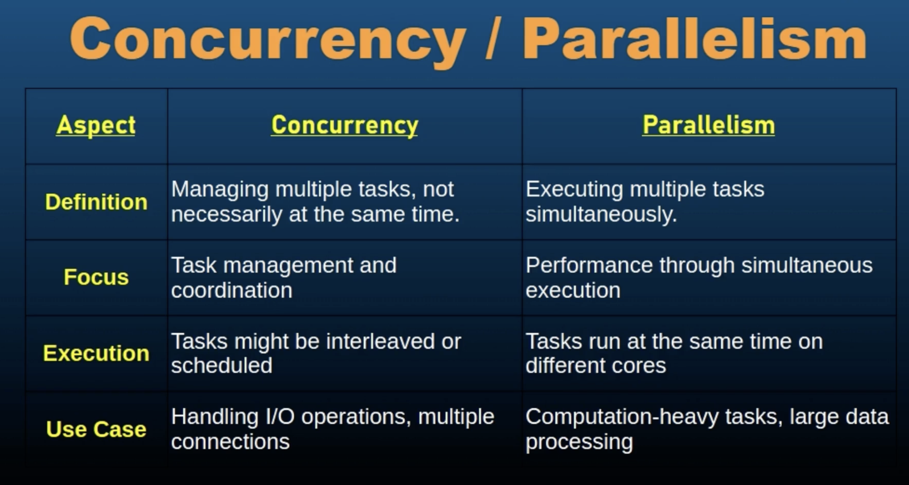

# Go Programming: More about Concurrency

## Concurrency vs Parallelism

- Concurrency: The ability of a system to handle multple tasks simultaneously. It involves managing multiple tasks that are in progress at the same time but not necessariliy executed at the same instant.

- Parallelism: The simultaneous execution of multiple tasks, typically using multiple processors or cores, to improve performance by running operations at the same time.

- Parallelism is all about executing multiple  tasks simultaneously, typically on multiple cores or processors and this is a subset of concurrency. 

    How parallelism is implemented in GO ?
    - It's the go runtime. Go's runtimes scheduler can execute Go routines in parallel, taking advantage of multiple core processors.

    

- We can have processes that are executed concurrently without being parallel. And that happens when we have a single core CPU with time slicing. The single core CPU will divide time using time slicing and work on those multiple tasks simultaneously by dividing time and giving time to different functions, different tasks in a shared way. eg: So maybe 200 milliseconds to a tasks and then next 200 ms to another tasks and next 50 ms to the first task that it left earlier, and so on.

- Practical Applications:
    - Concurrency Use cases:
        - I/O bound tasks
        - Server Applications
    - Parallelism Use Cases
        - CPU Bound tasks
        - Scientific Computing

- Challenges and Considerations :
    - Concurrency Challenges
        - Synchronization: managing shared resources to prevent race conditions.
        - Deadlocks: avoid situations where tasks are stuck waiting for each other.
    - Parallelism Challenges
        - Data Sharing
        - Overhead
    - Performance Tuning


## Race Conditions

- A race condition occurs when the outcome of a program depends on the relative timing of uncontrollable events such as thread or goroutine scheduling. It usually happens when multiple threads or goroutines access shared resources concurrently without proper synchronizatino, leading to unpredictable and incorrect behavior.

- Why does it matter ?
    - Race conditions can cause bugs that are difficult to reproduce and debug, leading to unreliable and inconsistent program behavior.

- To check if the program has a race condition, add the `-race` flag during running the program.
    ```go
    go run -race race_conditions.go
    ```
    - When we have multiple goroutines accessing the same value, trying to modify the same value or trying to do something at the same time with a same type/variable/object, then in that case, use this `-race` flag and find if you have a data race in your program.

- Go provides a builtin race detector tool that helps identify the race conditions in your programs. The race detector monitors accesses to shared variables and reports data races during execution. Finally in the output, the race detector shows where data races occur including the read and write operations.

- We use mutexes or stateful goroutines or atomic operations to avoid race conditions.

- Best Practices to Avoid Race Conditions :
    - Proper Synchronization: use synchronization primitives like mutexes or atomic operations to ensure exclusive access to shared resources.

    - Minimize Shared State: reduce the amount of shared state between concurrent operations to lower the risk of race conditions.

    - Encapsulate State: use encapsulation to manage state within structs or functions limiting exposure to shared data.

    - Code Reviews and Testing: regularly review code for potential race conditions and utilize tools like the race detector to identify issues during development.

- Practical Considerations
    - Complexity of Synchronization
    - Avoiding Deadlocks
    - Performance Impact


## Deadlocks

- A deadlock is a situation in concurrent computing when two or more processes or goroutines are unable to proceed because each is waiting for the other to release resources. This results in a state where none of the processes or goroutines can make progress.

- Deadlocks can cause programs to hand or freeze, leading to unresponsive systems and poor user experience. Understanding and preventing deadlocks is crucial for reliable and efficient concurrent systems.

- Causes of Deadlocks: Four Conditions for Deadlocks :

    - Mutual Exclusion: at least one resource is held in a non-shareable mode. Only one process or goroutine can use the resource at a time.

    - Hold and Wait: process or goroutine holding at least one resource is waiting to acquire additional resources held by other processes or goroutines.

    - No Preemption: resources cannot be forcibly taken away from processes or goroutines. They must be released voluntarily.

    - Circular Wait: a set or processes or goroutines are waiting for each other in a circular chain, with each holding a resource that the next one in the chain is waiting for.

- Detecting Deadlocks:
    - Deadlock Detection Strategies
        - Static Analysis
        - Dynamic Analysis
    - Deadlock Detection Tools

- A blank select statement waits indefinitely for the goroutines to finish.
    ```go
    select {}
    ```

- `mutex.Lock()` is blocking in nature.

- Deadlock happens when two locked mutexes try to access each other's values/ each other's mutex.

- Consitent lock order helps us avoid deadlocks. If we do not follow a consistent lock order then we might have a deadlock. So by acquiring locks in a consistent order accross all goroutines, we can avoid the deadlock scenario and ensure that the program runs smoothly.

- Best Practices for avoiding deadlocks:
    - Lock Ordering
    - Timeouts and Deadlock Detection
    - Resource Allocation Strategies

- Best Practices and Patterns :
    - Avoid nested locks
    - Use lock-free data structures
    - Keep critical sections short

- Practical Consierations:
    - Complex Systems
    - Testing for Deadlocks
    - Code Reviews


## RWMutex

RWMutex stands for read-write mutex, is a synchronization primitive in Go that allows multiple readers to hold the lock simultaneously while ensuring exclusive access for a single writer. It provides an efficient way to handle concurrent read and write operations, particularly when read operations are frequent and writes are infrequent.

RWMutex is designed to optimize scenarios where multiple goroutines need to read shared data concurrently. But write operations are less frequent.

So RWMutex helps to improve performance by reducing contention during read operations while still maintaining exclusive access for write operations.

- Key Concepts of sync.RWMutex
    
    - Read Lock (RLock): allows multiple goroutine to acquire RLock simultaneously. It is used when a goroutine needs to read shared data without modifying it. 
    
    - Write Lock (Lock): ensures exclusive access to the shared resources and only one goroutine can hold the write lock at a time. Moreover all readers and writers are blocked until the write block is released.

    - Unlock (Unlock and RUnlock)

- When to use RWMutex
    - Read Heavy Workloads
    - Shared Data Structures

- How RWMutex Works
    - Read Lock Behavior
    - Write Lock Behavior
    - Lock Contention and Starvation


- When a write lock is requested, may block readers if a write lock is pending. Conversely long held read locks can delay the acquisition of a write lock. Only one goroutine can acquire the write lock at a time. 

- While a goroutine holds the write lock, no other goroutine can acquire either a read or write lock. However for the read lock behavior, multiple goroutines can acquire the read lock simultaneously, provided no go routine holds the write.

- Read Locks are shared and do not block other readers.

- Starvatinos means that your write operation (or any other operation) needs to acquire the lock but it is being held in a limbo, waiting for the lock to be released.

- Best Practices for Using RWMutex
    - Minimize Lock Duration: to avoid blocking other goroutines unnecessarily.

    - Avoid Lock Starvation: Be mindful of long held read locks potentially causing write lock starvation. If write operations are critical, ensure that read operations are not indefinitely blocking writes because then your write operation will be starving.

    - Avoid Deadlocks
    - Balance Read and Write Operations

- Advanced Use Cases:
    - Caching with RWMutex
    - Concurrent Data Structures

## `sync.NewCond`

- The `Cond()` object is always associated with a mutex. The mutex is used to protect data that the condition variable depends on. GoRoutines must acquire the mutex before waiting on or signaling the condition variable.


## `sync.Pool`


## `for select` statement


## Advanced Concurrency Quiz