# Go Programming Advanced

## Goroutines

- Goroutines are lightweight threads managed by the Go runtime. They enable concurrent execution of functions, allowing you to perform multiple tasks concurrently within a single Go program.

- Goroutines are one of the key features of GO making it easy to write concurrent and parallel programs. We use Go routines to efficiently handle parallel tasks such as input output operations, calculations and more.

- Goroutines provide us a way to perform taks concurrently without manually managing threads. To create a new goroutine, we use `go` keyword preceding the function and execute that function immediately in the main function.

- Why use Goroutine:
    - Simplify concurrent Programming
    - Efficiently handle parallel tasks such as i/o operations, calculations and more.
    - Provide a way to perform tasks concurrently without manually managing the threads.

- Basics of Goroutines:
    - Creating Goroutines (use the `go` keyword to start a new Goroutine)
    - Goroutine Lifecycle
    - Goroutine Scheduling

- Goroutines are just functions that leave the main thread and run in the background and come background and come back to join the main thread once the functions are finished/ready to return any value.

- Goroutines do not stop the program flow and are non-blocking in nature. Similary to async await and promises in Javascript. Goruntime handles the goroutines. It immediately extracts the function preceding with `go` keyword out of the main thread.

- Goroutine Life cycle: 
    - A goroutine starts when created and runs concurrently with other goroutines. 
    - A goroutine exits when the function it is running completes. So goroutine contains a function and if the function completes, then it exits.

    - It's the GoRuntime that manages goroutine scheduling and execution.

- What is Goroutine Scheduling ?
    - Goroutine scheduling is managed by the Goruntime scheduler. It uses M:N scheduling model. M goroutines run on N os threads.
    - Another thing that the goroutine scheduling does is that it efficiently multiplexex goroutines onto available threads.

- Go uses M:N scheduling model where, M goroutines are mapped onto N operating system threads. Your processor have cores and threads and your goroutines are mapped onto those limited number of cores and threads. This model allows goruntime to manage many Go routines with fewer operating system threads, improving efficiency and scalability. The goroutine scheduler efficiently multiplexex Go routine onto available threads.

- Multiplexing is like switching. Goroutine scheduler multiplexes or switches goroutines onto available OS threads. The scheduler is switching goroutines onto the available operating system threads. It means, it can run many goroutines on a limited number of threads by dynamically scheduling and rescheduling goroutines as needed. And this efficient use of resources ensures high concurrency and performance.

- Goroutine Scheduling in Go :
    - Managed by the Go runtime scheduler
    - Uses M:N scheduling model
    - Efficient Multiplexing

- Common pitfalls and best practices
    - Avoiding Goroutine leaks
    - Limiting Goroutine creation
    - Proper error handling
    - Synchronization


- Goroutine execution is concurrent in nature. And Goroutines run independently and concurrently.

- Concurrency vs Parallelism overview :
    
    - Concurrency means multiple tasks progress simultaneously and not necessarily at the same time. But parallelism states that tasks are executed literally at the same time on multiple processors. So goroutines facilitate concurrency and the goruntime scehdules them accross available CPUs for parallelism when possible.

    - So goroutines are a tools that Go has provided us to make use of concurrency in Go programs and Goruntime schedules thos go routines accross the available CPU threads, CPU cores for parallelism if it is possible.

- Associated topics:
    - Wait groups
    - Worker pools
    - Channels

- Handling Errors in Goroutine through a concept called error propagation. So goroutines execute functions concurrently and in that case errors need to be communicated back to the main thread, so use return values or shared error variables if not using channels. So if we are not using channels we can use shared error variable.


## Channels - Introductions

- Channels and Goroutines go hand in hand.
- Channels are a ways for goroutines to communicate with each other and synchronize their execution. They provide a means to send and receive values between Goroutines, facilitating data exchange and coordination.

- We use channels to enable safe and efficient communication between concurrent goroutines. Using channels hels synchronize and manage the flow of data in concurrent programs.

- Why use channels ?
    - Enable safea and efficient communication between concurrent Goroutines.
    - Help synchronize and manage the flow of data in concurrent programs.

- Basics of Channels
    - Creaing channels : `make(chan Type)`
    - Sending and Receiving Data `<-`
    - Channels Directions
        - Send-only: `ch <- value`
        - Receive-only: `value := <- ch`

- Common Pitfalls and Best Practices
    - Avoid Deadlocks
    - Avoiding Unnecessary Buffering
    - Channel Direction
    - Graceful Shutdown
    - Use `defer` for unlocking

- Concept:
    ```go
    // variable = make(chan Type)
	greeting := make(chan string)
	greetString := "Hello Go"

	greeting <- greetString

	receiver := <- greeting
	fmt.Println(receiver)
    ```

    - Issue with this code is that it tries to send a value to a channel without having a Goroutine ready. A goroutine should be there to receive from that channel and without a goroutine to receive from the channel, it cause deadlock because channels in Go are blocking. 

    - Goroutines are non-blocking. They are extracted away from the main thread, the main execution thread of our application where the main function is running and will continue to run seamlessly in a non-blocking way if we have goroutine.

    - If we have a function here, then that function , if it is not declared with a Go keyword, it will block the execution of the rest of the statements after that function until the time that function is complete. But if we use a go keyword that function is extracted out of main thread, and then the next statements will continue to run before that function is even processed.

    - Similarly, like a function that blocks the execution flow of our main function, a channel will also block the execution of our main function of our main thread.

    - So that's why we need to receive values into a channel inside a goroutine so that it doesn't block the main execution thread. 

    - Correct Code:
        ```go
        // variable = make(chan Type)
        greeting := make(chan string)
        greetString := "Hello Go"
        go func(){
            greeting <- greetString
        }()
        receiver := <- greeting
        fmt.Println(receiver)
        ```

    - Here `receiver` is receiving outside of the goroutine in the main funciton, so why is it not blocking the execution ? 
        - Because `receiver` is part of the main goroutine. The main execution thread is a goroutine because it is running continuosly and it is the main funcition of our application.
        - So receiver is also a part of a go routine and that's how this channel is communicating the goroutine and the main goroutine. So receiver is not just an independent receiver, it is a receiver inside another go routine. And that makes the `greeting` communicate between two go routines.

    - Receiving from a channel is also blocking and if there is no value to receive, then it will wait for a value to be received and next line will not be executed until the time it receives a value.


## Unbuffered Channels and Runtime Mechanism

- By default when we make a channel with the above syntax, it is an unbuffered channel.

- Buffered channel means a channel with storage. A buffer is a storage. So a channel with associated storage. Channel buffering allows channels to hold a limited number of values before blocking the sender.Buffered channels are useful for managing data flow and controlling concurrency.

- Why should we use buffered channels over unbuffered channels ?
    - Buffered channels allow asynchronous communication, which means that buffered channels allow senders to continue working without blocking until the buffer is full. Buffer channels will only block when the buffer is full.

    - Buffer channels also help us in load balancing, handling bursts of data without immediate synchronization and hence buffer channels also allow for a better flow control, meaning that we can manage the rate of data transfer between the producers and consumers.

- Unbuffered channels always needs an immediate receiver and that is why we cannot use a send inside the main function. We cannot send data into an unbuffered channel inside the main function because as soon as we do that, it will immediately look for a receiver and it will not find the receiver. The receiver will be in next line, however the unbuffered channels require an immediate receiver as soon as they are receiving a value inside them. They need someone to receive those values into. They need a variable to which they can pass their value to.

- 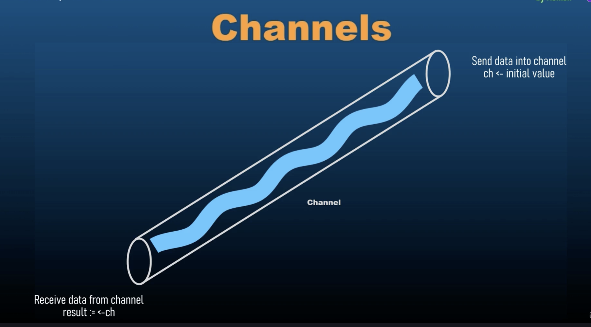

- As soon as we receive the value inside a channel, it will try to find a channel that is going to emit this value to another variable. The main thread works faster than the goroutine because goroutine takes time to get out of the main thread and then it goes on to the next line. As soon as a channel receives a value, it needs to pass that value to a receiving end, it cannot hold those values.

- Channels and goroutines, they go hand in hand.

- Receiver will wait for all the goroutine to finish and then it ill throw an error.   

- Unbuffered channels block on receive if there is no corresponding send operation ready and as soon as there is a send operation ready, then it doesn't block. Then it receives the value from that send operation and uses that value as per our instructions.

- Another property of unbuffered channels is that, unbuffered channels block on send if there is no corresponding receive operation ready but if there is a goroutine, they wait for the goroutine to finish.

- The basic property of channel is to wait for a goroutine to finish and as soon as it receives its value then it will let the execution flow to move on to the next line. Until then it will keep the execution at halt and it won't let it move forward.

- The default behavior for channels is that they allow for goroutines to finish, even if those go routines are not relevant to those channels.


## Buffered Channels

-  Buffered channels allow channels to hold a limited number of values before blocking the sender. Buffered channels are useful for managing data flow and controlling concurrency. 

- So buffer essentially means storage. We are allowing channels to store values. In unbuffered channels, channels cannot store values. They need an immediate outflow of the value that they receive. As soon as they have an incoming value, they need a receiver a receive the value because they cannot hold a value. However, buffered channels can hold values inside them. They do not require an immediate receiver. Due to this buffered our main function is not blocked and hence buffered channels offer us an asynchronous communication. 

- Buffered channels allow senders to continue working without blocking until the buffer is full and they do not require an immediate receiver. They will only block when the buffer is full and they will only blocj when we are trying to insert more value, when we are trying to send more value inside the channel when it is already full. So the channel will not return an error or will not block as soon as it gets full. It will only block or return an error when we try to send more value.

- Other than that, we also use buffered channels when we are handling burst of data without immediate synchronization. Immediate synchronization means that we are receiving values and sending values to a receiver immediately. But we don't need immediate synchronization because we are storing values inside a buffer.

- If the buffer is empty we cannot receive data. So if we try to receive when the buffer is empty, then it should block our code instead of giving an error.

- While sending data to a channel, it will implement a blocking mechanism when the buffer is full. That's for sending data into a buffered channel. 

- And when we are receiving data into a buffered channel, we will encounter a blocking mechanism when the buffer is empty, when we are trying to receive values from a buffer which is empty.

- Other than these two, buffer channels have non-blocking operations. They allow non-blocking sends and receives as long as the buffer is not full or empty.

- Impact on Performance :
    - Buffered channels can improve performance by reducing synchronization overhead and when it comes to unbuffered channels, they typically use strict synchronization where sender and receiver must be synchronized, they must be ready at the same time to send and receive values.

- We should chose buffer size based on the expected volumes of data and concurrency requirements and that is because large buffers reduce the likelihood of blocking but increase memory usage, and smaller buffers increase the likelihood of blocking, but use less memory. 

- Why use buffered channels ?
    - Asynchronous Communication
    - Load Balancing
    - Flow Control

- Creating Buffered Channels:
    - `make(chan Type, capacity)`
    - Buffer capacity

- Key Concepts of Channel Buffering
    - Blocking Behaviour
    - Non-Blocking Operations
    - Impact on Performance

- Best Practices for using Buffered Channels
    - Avoid over-buffering
    - Graceful shutdown
    - Monitoring buffer usage


## Channel Synchronization

- Why is Channel Synchronization important ?
    - Ensures that data is properly exchanges between Goroutines.
    - Coordinates the execution flow to avoid race conditions and ensure predictable behavior.
    - Helps manage the lifecycle of Goroutines and the completion of tasks.

- Common pitfalls and best practices
    - Avoid Deadlocks
    - Avoid unnecessary blocking
    - Close channels

- Channel synchronization refers to the coordination of go routines using channels to ensure orderly execution and data exchange. 

- Channels help synchronize goroutines by providing a mechanism to block and unblock goroutines based on the channel's state.

- Channel synchronization is important because this is going to be used in real world scenarios. These are the concepts that will be used in a chat application or a real-time stock market application or a news channel application where news feed comes in through a stream and it needs to be regularly and differe news to be shown continuously to the users .

- If we have a channel and it is continuously sending data, we can loop over that channel and that will create receiver and it will keep on receiving the value. So here's a new concept that we can range over the channel.

- Channel Synchronization aims to provide a thorough understanding of how channels can be used to coordinate and manage concurrent execution in Go programs.


## Advanced: Quiz-1

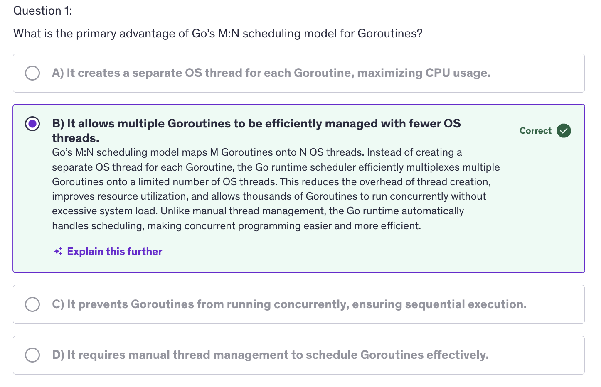
<br/>


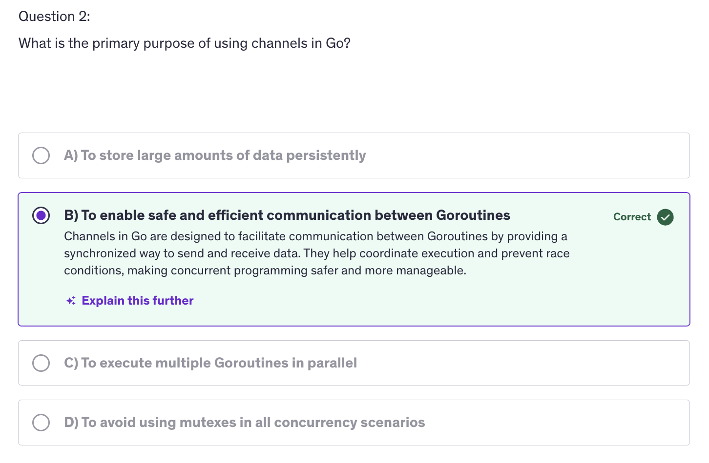
<br/>


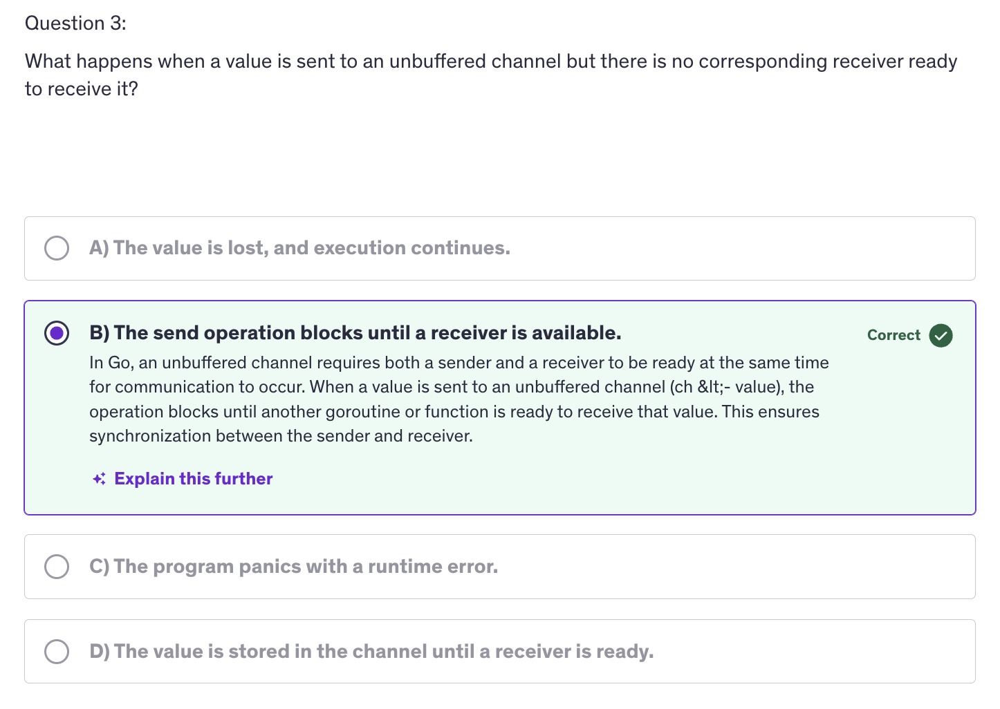
<br/>


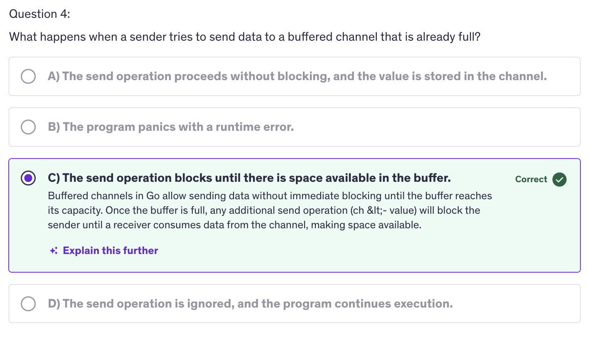
<br/>


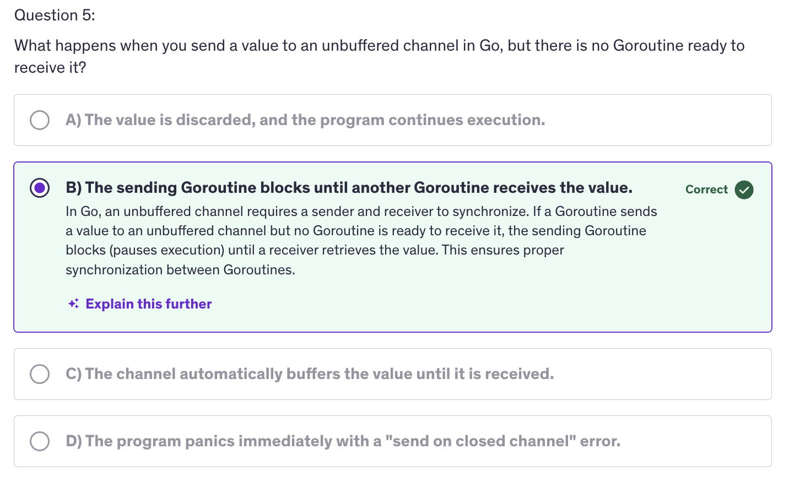
<br/>


## Channel Directions

- Channel directions specify the allowable operations on a channel, either sending or receiving. They are used to enfore and document the intended use of channels in functions and goroutines.

NOTE: Channel directions are intended for use in functions and goroutines, not as an independent variables that we declare.

- Why are channel directions important ?
    - Improve code clarity and maintainability
    - Prevent unintended operations on channels
    - Enhance type safety by clearly defining the channel's purpose.

- Basic Concepts of Channel Directions :
    - Unidirectional Channels
    - Send-Only channels
    - Receive-Only channels
    - Testing and Debugging

- Defining Channel Directions in Function Signatures
    - Send Only Parameters `func produceData(ch chan <- int)`
    - Receiving Only Parameters `func consumeData(ch <- chan int)`
    - Bidirectional Channels `func bidirectional(ch chan int)`

- Send-Only channel means that we can send value into the channel. Receive-Only channel means a channel from which we can only receive data.

- Unidirectional channels are used in function signatures to specify whether a function can send or receive data. This helps to avoid misuse and clarify the role of each functino in a concurrent program.

- And during channel creation, make channel with type creates a bidirectional channel. The unidirectional channels make sense when they are only declared in function signatures, but they don't make any sense when created directly with make function.

- By using unidirectional channels in function signatures, you can design your concurrent code to be more robust and explicit about how channels are used.


## Multiplexing using Select

- Multiplexing is the process of handling multiple channel operations simultaneously, allowing a go routine to wait on multiple channel operations and react to whenever operation is ready first.

- The select statement in Go facilitates multiplexing by allowing a goroutine to wait on multiple channel. Multiplexing is like a switch. So `select` statement that we have used before.

- Multiplexing manages multiple concurrent operations within a single goroutine and it manages those concurrent operations seamlessly with improved readability.

- Multiplexing efficiently handles operations that might block without looking up resources so it handles the blocking operations pretty efficiently.

- More importantly we get to implement timeouts and cancellation mechanism. We can cancel channels using multiplexing. So the basic syntax of `select` is very simple: `select case default`. `Select-case` is only for handling channels to be precise for handling multiple channel operations simultaneously.

- We can use select with `timeouts` and it makes our job easier to implement cancellation of channels. We use `time.After()` function to implement timeouts, providing us a way to handle operations that take too long.

- When we are done sending the values to the channel, we should close the channel. It's a good practice to close the channel we are using oonce we are done with the channels. If you are continuously receiving a stream of data, then don't close it, then defer the close until the time the channel gets closed from the source or close it when we shut down our application.

- When the channel is closed, the select statement will receive the zero value from that channel, zero value of the string, int or zero value of a struct, whatever types that channel is.

- The select statement in Go is used for implementing multiplexed communication with channels. It allows you to wait on multiple channel operations simultaneously and perform a corresponding action when one of them becomes ready. Some key use cases and features of the `select` statement are multiplexing channel operations, which means that the primary use of Select is to wait for multiple channel operations to become ready and then execute the corresponding case block. This enables concurrent handling of multiple communication channels without needing separate goroutines for each channel.

- Another feature of the select statement is non-blocking communication. The `select` statement enables non-blocking communication with channels. If none of the channel operations are ready, select does not block the execution of the program, this allows you to perform other tasks or take alternative actions if all channel operations are blocked. And we use a `default` case for that.

- By using `select`, we can prevent potential deadlocks that may occur when sending or receiving from channels. For example we can combine, channel sends and receives with timeouts or default cases to handle scenarios where communication may block indefinitely.

- Next important feature is synchronization and coordination. `Select` can be used for synchronization and coordinatino between Goroutines by coordinating multiple Goroutines through shared channels and using `select` to wait for specific events, you can design concurrent programs with precise control over their execution flow.

- Why use Multiplexing :
    - Concurrency
    - Non-Blocking
    - Timeouts and Cancellations

- Best Practices for using `select`:
    - Avoiding busy waiting
    - Handling deadlocks
    - Readability and maintainability
    - Testing and debugging


## Non-Blocking channel operations

- Why use Non-Blocking Operations:
    - Avoid Deadlocks
    - Improve Efficiency
    - Enhance Concurrency

- Best practices for Non-Blocking operations
    - Avoid Busy waiting
    - Handle channel closure properly
    - Combine with contexts for cancellations
    - Ensure channel capacity management

- Non-Blocking operations on channels allow a goroutine to perform a channel operation like send or receive without getting stuck, if the channel is not ready. They help maintain responsiveness and prevent goroutines from getting blocked indefinitely.

- Why do we need to use non-blocking operations ?
    - To avoid deadlocks, prevent goroutines from waiting indefinitely on channel operations and a
    - To improve efficiency i.e allow goroutines to continue processing or handle other tasks if channels are not immediately ready.
    - Most importantly, to enhance concurrency. Manage multiple concurrent operations more effectively by not blocking on individual channel operations.

- The select statement with a default case allows for non-blocking receives by immediately executing the default case if no other channels are ready.

- We use non-blocking operations to handle real-time data processing where timely responses are critical.

- Another non-blocking operation is handling channel closures. Channels do send out an `ok` a boolean value to let us know if the channel is open or closed.


## Closing Channels

- Why close channels ?
    - Signal Completion 
    - Prevent Resource Leaks

- Best Practices for Closing channels:
    - Close channels only from the sender
    - avoid closing channels more than once
    - avoid closing channels from multiple goroutines

- Common patterns for closing channels
    - Pipeline pattern
    - Worker Pool pattern

- Debugging and Troubleshooting Channel Closures
    - Identify Closing channels errors
    - USe `sync.WaitGroup` for coordination

- Signal Completion: : It indicates that no more data will be sent on the channel, which helps goroutines that are receiving data know when to stop waiting.

- Prevents Resource Leaks: Closing channels ensures that resources assosciated with the channel are properly cleaned up. 

- For closing a channel we use the close function and after a channel is closed, no more values can be sent to it. However, we can receive values from a closed channel if it is a buffered channel. A buffered channel may have some values stored in it, and those values can be received even if the channel is closed because closing a channel means that the channel is closed for sending data into the channel, not for receiving values from a channel. We can always receive values from a channel if it has some values, if it is not empty.

- Basic Principles / Guidelines rules :
    - Close channels only from the sender. Do not close channel from the receiving end. Only the goroutine that is sending data should close the channel. Other goroutines that are receiving should only read from the channel.

    - Sometimes we close a channel more than once and that results in a runtime panic. So always ensure that channels are closed exactly once.

    - Similarly, we need to ensure to that only one goroutine is responsible for closing the channel to avoid race conditions and panics. We should not close a channel twice and we should not close channels from multiple goroutines because one goroutine might be sending data to the channel while the other goroutine closes the channel and if the channel is closed in between, and then the other goroutine is still trying to send data into the channel then that will again cause an error.

- There are certain patterns for closing the channels like :
    - Pipeline Pattern: Channels are used to pass data through a series of stages which are pipelines. Each stage closes the channel when it is done processing, so we are going to have a producer and a filter and these functions, which are producer and filter are going to close the channels respectively which they should.

    - Worker Pool Pattern: dicussed in later lectures

- SO now we need to know that whether it's a buffered channel or an unbuffered channel, every channel needs to be closed manually by us and a channel is closed by using the close function, and once a channel we cannot send any more values to that channel. And once a channel is closed, it sends out a value, a boolean value to the receiver and we can receive that value and check if the channel is open or closed and if the channel is closed, we can handle the closing channel gracefully in our program.


## Advanced: Quiz-2

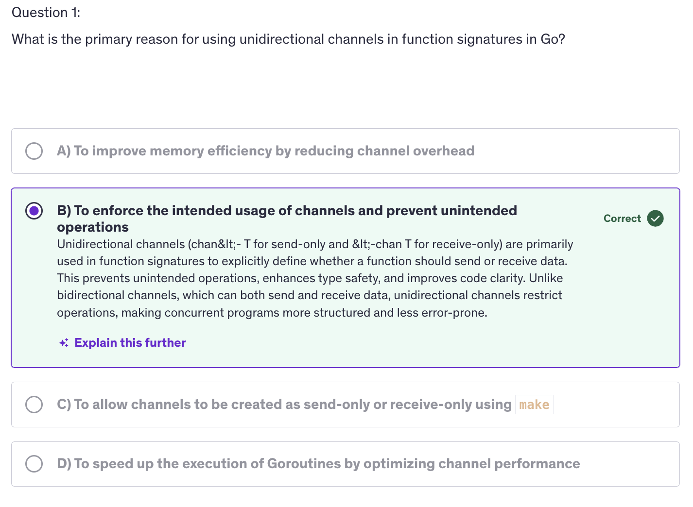
<br/>

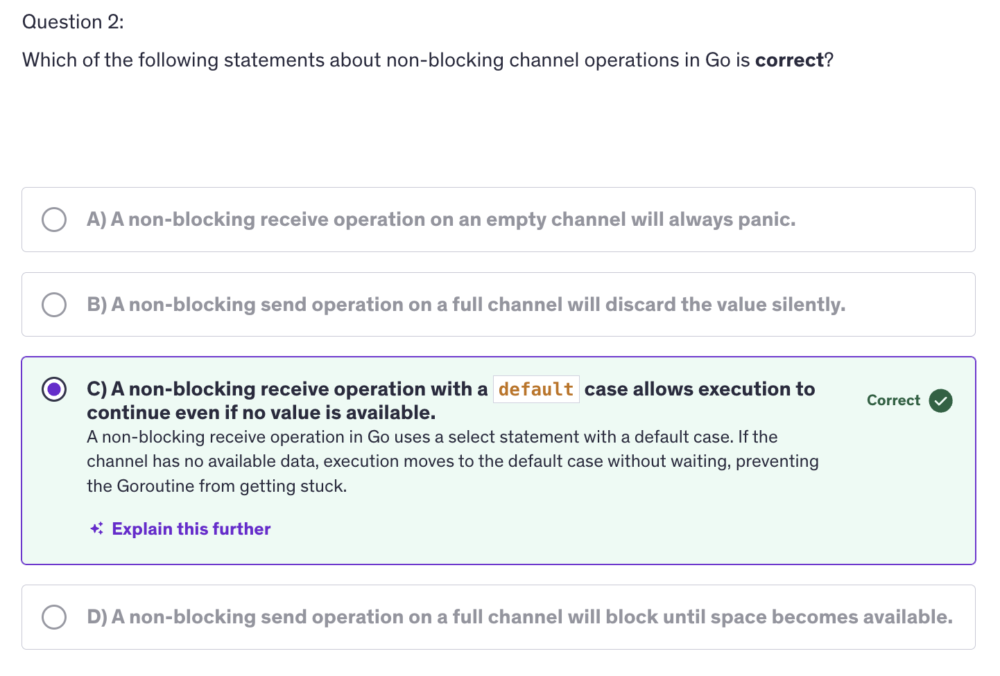
<br/>

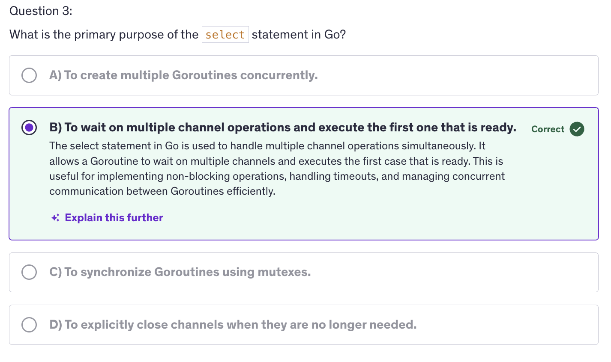
<br/>

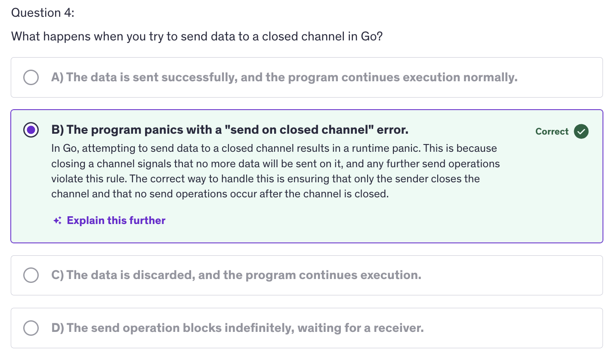
<br/>

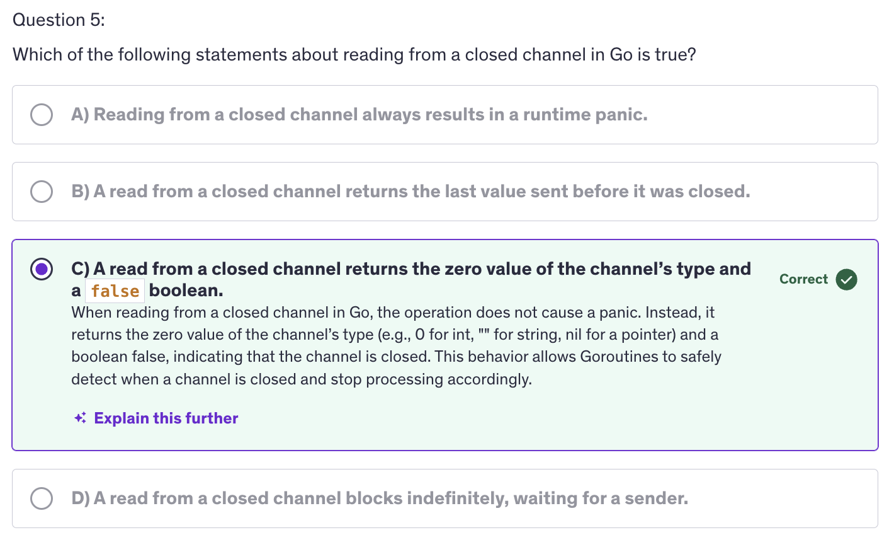
<br/>


## Context

- Context is a type from the `context` package.
- COntexts are used to carry deadlines, cancellation signals and request scoped values.
- Contexts are closely associated with APIs. When we are creating any kind of APIs be it gRPC API or a Rest API, contexts are frequently used and by default assosciated with creating APIs.

- In the definition of context, we have a mention of request scoped values. It means that we are passing request scoped data accross API boundaries. And apart from passing request scoped data, we are also managing timeouts and deadlines for operations and we are handling cancellation of operations using context. But apart from that we are also carrying values in key-value pairs.

- We create a context using `context.Background()` or `context.TODO()`.

- A context in Go is an object that carries information about deadlines, cancellation signals and other request scoped values accross API boundaries and goroutines. Contexts are also used in goroutines to carry values, cancellation signals and many other things. It is used to manage the lifecycle of processes and to signal when the operations should be aborted. Some key features of contexts include cancellation signals, deadlines and timeouts and values. SO, In a very broader way, contexts are variables that store values in key value pairs.

- `context.TODO()` is used when you are unsure about which context to use, or if you plan to use a proper context later. It just acts as a placeholder and it doesn't carry any deadlines, cancellations.

- Code Explanation : 

    ```go
    ctx = context.Background()
	ctx, cancel := context.WithTimeout(ctx, 2*time.Second)
    defer cancel()
    ```

    - We create a context and then we give it a deadline using `WithTimeout` by giving a timeout value of 2 second. That means that this context will cancel after 1 second.
    
    - Context cancellation does not mean context will delete or context will cease to exist. Context cancellation means that it will send a cancellation signal. (that's it). After cancellation signal, it will retain all the data that it contains, but it will send a cancellation signal when we run cancel.

    - Once the cancellation signal has been sent, `context.Done()` receives a channel struct which indicates a cancellation signal.

- `context.Background()` is a way to signify a base or a root context from which other contexts can be derived. It does mean it's running in background nor it's a goroutine. It's simply a kind of variable but with more functionalities. `context.Background()` is intended to be the top level context. Usually it is created in the main function initialization or a top level request handlers. 

- `context.Background()` has no deadlines, no cancellation and carries no values. context.Background and context.TODO, they don't carry values themselves. We can use these root context to then pass to `context.WithValue()`, `context.WithBackground()`, and then those functions are going to modify or are going to add some more features to the root context. But the root context itself cannot store values or have any deadline or cancellations. context.Background() is neutral and unintialized, making it a clean slate for creating contexts. The term background was chosen to imply that it's always available in the background of your application. It is ready to be used a foundation for other contexts. It's a context that doesn't do anything by itself, but it provides a baseline or backdrop for deriving more secific contexts.

- Why use context ?
    - Cancellation
    - Timeouts
    - Values

- Basic Concepts
    - Context Creation
        - `context.Background()`
        - `context.TODO()`
    - Context hierarchy (How contexts are created and derived)
        - `context.WithCancel()`
        - `context.WithDeadline()`
        - `context.WithTimeout()`
        - `context.WithValue()`


- Practical Uage
    - Context Cancellation
    - Timeouts and Dealines
    - Context Values

- Best Practices
    - Avoid storing contexts in structs
    - Propagating context correctly
    - Handling context values
    - Handling context cancellation
    - Avoid creating contexts in Loops

- Common Pitfalls:
    - Ignoring Context Cancellations
    - Misusing context values.


## TImers

- A timer in Go allows you to schedule an event to occur after a specified duration. It is useful for implementing timeouts, scheduling periodic tasks and delaying operations. 

- One of the key reasons for using timers is timeouts. We can implement timeout functionality to limit how long a particular operation should wait.

- Another reason would be to use delays in schedule operations to occur after a certain delay.

- Other than that, we can define periodic tasks using timers. These tasks execute recurringly at regular intervals.

- timer will send the current time on its channel after a specified duration. It sends the current time after a time duration.

- `time.NewTimer()` is non-blocking in nature. `time.Sleep()` is blocking in nature.

- Why use Timers :
    - Timeouts
    - Delays
    - Periodic Tasks

- The `time.Timer` type:
    - Creating a Timer
    - Timer Channel
    - Stopping a Timer

- Practical Use Cases for Timers:
    - Implementing Timeouts
    - Scheduling Delayed Operations
    - Periodic Tasks
    - Handle Large Numbers of Goroutines
    - Use `defer` for Unlocking

- Best Practices
    - Avoid Resource Leaks
    - Combine with channels
    - Use  `time.After` for simple timeouts

- Best Practices:
    - Always remember to stop timers when they are no longer needed to avoid resource leaks and we should use `defer` to ensure proper cleanup. So we shall use defer `timer.Stop()` even if the timer has expired, we still need to stop the timer.

    - It's important because we need to manage the lifecycle of a timer properly to ensure efficient resource usage. Stopping a timer helps in freeing up resources and avoiding unexpected behaviour. If you do not stop a timer and it is no longer needed, it will still consume resources. Although the timers channel will eventually be garbage collected, the timer itself will remain until it either fires or is stopped.


## Tickers

- Ticker in Go is a mechanism for producing ticks at regular intervals. Tickers are useful for performing periodic tasks or operations on a consistent schedule. Tickers are often used in scenarios where the tasks need to be repeated at fixed intervals such as polling, periodic logging or regular updates.

- Using tickers ensures operations at regularion intervals maintaining a consistent schedule. Using tickers also simplifies the implementation of recurring tasks without manually handling timing logic.

- Ticker is created using `time.NewTicker()`, so we are using time package and with that we use NewTicker() with a specific time interval.

- Similar to timers, tickers also have a channel associated. So when we create an instance of a ticker, it will have a `C` field of the ticker type, which is a channel that receives ticks at regular intervals.

- Why use Tickers ?
    - Consistency
    - Simplicity

- Best Practices for Using Tickers ?
    - Stop Tickers when no longer needed
    - Avoid Blocking Operations
    - Handle Ticker Stopping Gracefully

- Similar to timers, we have a `Stop()` method to stop a ticker. It is important to stop a ticker to release resources and prevent it from producing further ticks because ticker does not expire. Timers have an expiry but tickers don't.

- A very common use for ticker is periodic task execution. We can use a ticker to execute tasks at regular intervals, such as polling data, updating status or performing routine maintenance.

- There are many scenarios where we combine tickers with timers to create complex timing logic where certain tasks need to be performed periodically with timeouts or delays. Similarly we can handle multiple tickers as well.


## Worker Pools

- A worker pool is a design pattern used to manage a group of workers (goroutines). Multiple goroutines are working like a group of workers. These goroutines which are working like group of workers process a queue of tasks. This pattern helps in controlling the number of concurrent Goroutines and efficiently handling tasks.

- The reason why we use worker pools is for resource management. It limits the number of concurrent goroutines to avoid overwhelming system resources, and we can limit the number of concurrent goroutines according to our will. It doesn't depend on the number of threads number of cores on the machine. It depends on us, how many concurrent goroutines we want to run, we can limit the number even much lesser than the number of cores or threads available.

- Next reason is task distribution because using working pools, we efficiently distribute tasks among a fixed number of worker.

- And obviously, the first two points result in the last point, which is scalability. We can now scale the processing of tasks without creating an excessive number of goroutines.

- Building a basic worker pool requires using the building blocks of basic worker pool, and the building blocks are tasks, the units of work that need to be processed. Next building blocking is workers. Workers are goroutines that perform the tasks, the jobs. Next we have a task queue or the job queue, and that is the channel or data structure to hold tasks waiting to be processed.

- How do we implement worker pool ?
    
     We create a task channel. This channel holds tasks that workers will process. Next we create worker goroutines. These workers listen on the task channel and process tasks as they arrive. Next we distribute those tasks. We send tasks to the tasks channel and they will get processed by the workers. And finally, we implement graceful shutdown. We ensure that all workers complete their tasks and exit properly.

- This is a design pattern for handling more number of tasks with a small number of workers.

- Advanced Worker Pool Patterns
    - Dynamic Worker Pools
    - Task Prioritization
    - Error Handling
    - Worker Pool with Task Prioritization

- Best Practices for Worker Pools
    - Limit the Number of Workers
    - Handle Worker Lifecycle
    - Implement Timeouts
    - Monitor and Log

- We need to Limit the number of workers. Avoid creating too many workers. Use a reasonable number based on available system resources. Do not stress out your system because otherwise the efficiency will decrease. 
- And when working with worker, properly start, stop and clean up workers to prevent resource leaks and ensure graceful shutdowns. And in order to do that, also implement timeouts. Use timeouts to avoid indefinite blocking or hanging operations. 

- And worker pools can get complex in real world scenarios, so monitor the performance of the worker pool and log relevant information to diagnose issues or optimize performance.

- Overall, worker pools in Go are a powerful tool for managing concurrent tasks processing, improving efficiency and optimizing resource utilization by understanding the key concepts, best practices and advanced patterns of worker pools, you can effectively implement and manage them in your go applications to handle large volumes of tasks concurrently.


## Wait Groups

- Wait group is a synchronization primitive provided by the sync package in Go. It is used to wait for a collection of goroutines to complete their execution.

- It means, we have another mechanism to wait for goroutines to finish other than using channels. The reason we use wait groups is for synchronization. We wait for multiple gorountines to finish before proceeding.

- Wait groups also help us in coordination. Wait groups coordinate the completion of concurrent tasks, ensuring that all tasks are completed before moving on.

- Wait groups also helps us with resource management. Wait groups manage resources and cleanup after concurrent operations. 

- To create an instance of a wait group we use sync package and the actual function is `sync.WaitGroup()`.

- `Add()` increments the wait group counter by the argument that we pass it. Typically it is used to indicate the number of goroutines to wait for. `Done()` decrements the counter by one. This method should be called inside each goroutine when it finished it's tasks. The `Wait()` blocks until the counter inside the wait group is decremented to zero.

- Why use Wait Groups ?
    - Synchronization
    - Coordination
    - Resource Management

- Basic Operations
    - Add(delta int)
    - Done()
    - Wait()

- Quiet frequently in our daily work, we will combine `WaitGroups` with channels.

- Best Practices:
    - Avoid Blocking Calls inside goroutines
    - Use `defer` to call `Done`
    - Ensure Proper use of `Add`
    - Handle Large Number of Goroutines
    - Use `defer` for Unlocking

- Common Pitfalls:
    - Mismatch between `Add` and `Done`
    - Avoid Creating deadlocks


## Advanced: Quiz-3

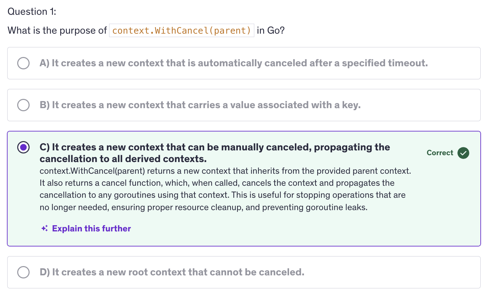
<br/>


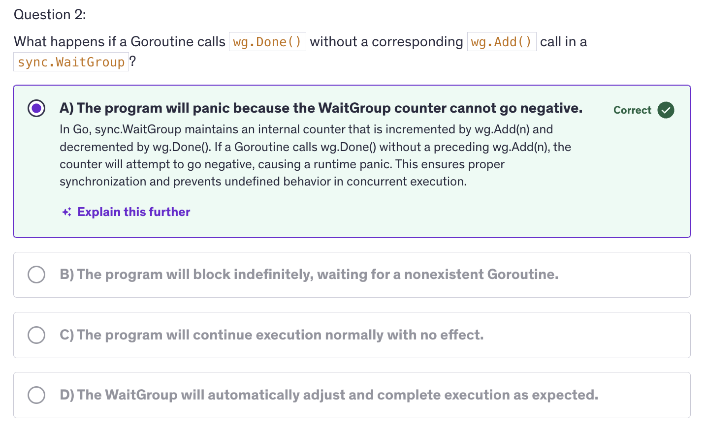
<br/>

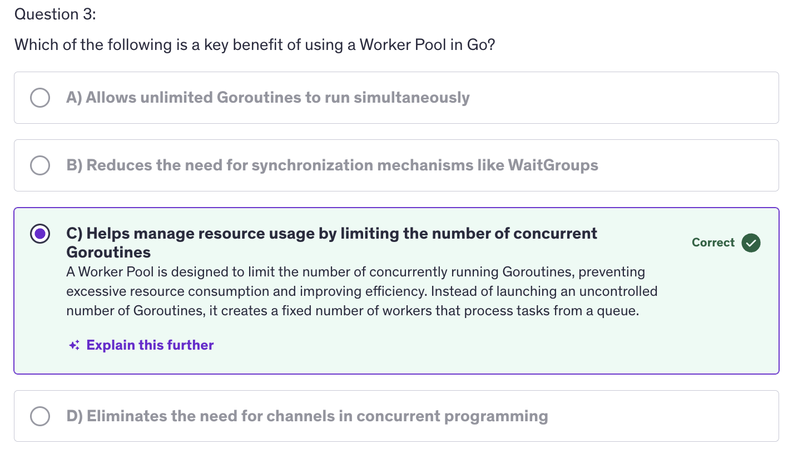
<br/>

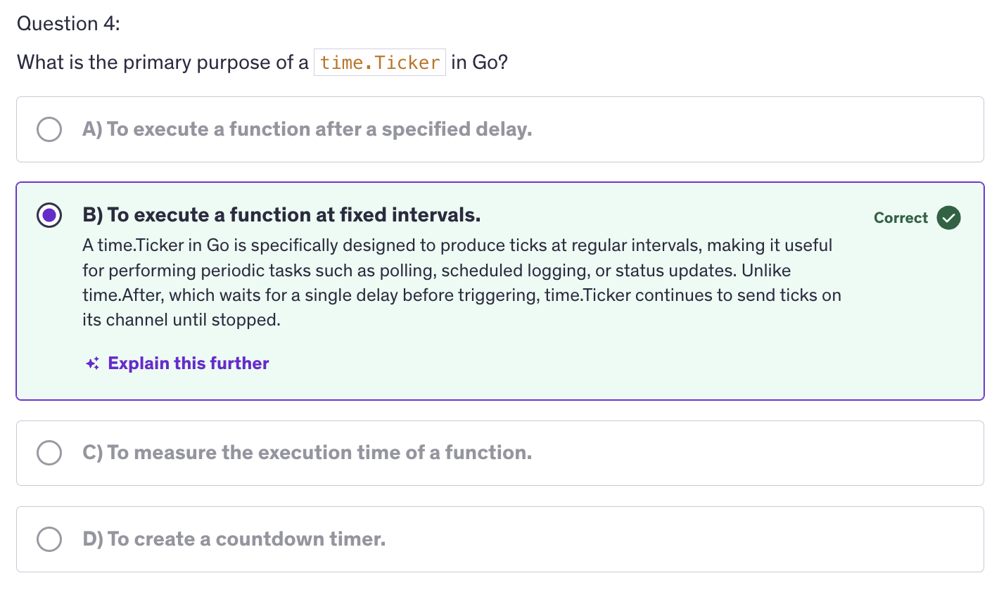
<br/>

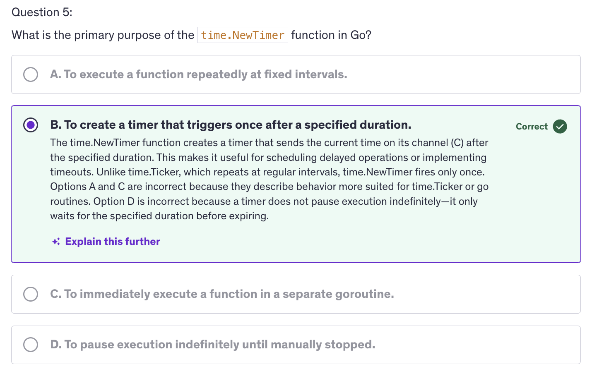
<br/>


## Mutexex

- Why use Mutexes ?
    - Data Integrity
    - Synchronization
    - Avoid Race Conditions

- Basic Operations
    - Lock()
    - Unlock()
    - TryLock()

- Mutex and Performance
    - Contention
    - Granularity

- A mutex which is short for mutual exclusion, is a synchronization primitive used to prevent multiple goroutines from simultaneously accessing shared resources or executing critical sections of code. It ensures that only one goroutine can hold the mutex at a time, thus avoiding race conditions and data corruption.

- Mutual exclusion is a principle used in concurrent programming to prevent multiple threads or processes from accessing a shared resource, simultaneously, ensuring data integrity and avoiding race conditions.

- Why Mutual Exclusion is important ?
    - Data Integrity
    - Consistency
    - Safety

- How Mutual Exclusion is Achieved ?
    - Locks (Mutexes)
    - Semaphores
    - Monitors
    - Critical Sections

- Why they are often used in structs ?
    - Encapsulation
    - Convenience
    - Readability

- How do mutexes work ?
    - Mutexes are basically locking and unlocking mechanism. Mutexes have a marking mechanism. They mark the begining and ending of a critical section. `mu.Lock()` marks the begining of a critical section. `mu.Unlock()` marks the end of the critical section. And anything in between lock and unlock will be marked as the critical section, the section that the mutexes will protect.

    - Mutex itself doesn't know what code to lock. It merely prevents other goroutines from acquiring the lock until it's unlocked and it protects the critical section, which is defined by the code between mu.Lock and mu.Unlock. This code must be written carefully to ensure that the critical section only includes operations on shared resources that need protection.

- Best Practices for using Mutexes
    - Minimize Lock Duration: Keep the critical section as short as possible to reduce the time the mutex is held, thereby minimizing contention and improving performance.

    - Avoid Nested Locks: Avoid acquiring multiple locks simultaneously to prevent deadlocks. And if nested locking is necessary, ensure a consistent lock order. 

    - Prefer sync.RWMutex for Read-Heavy Workloads
    - Check for Deadlocks: Regularly review you code to identify potential deadlock situations and always use defer for unlocking.

    - Use `defer` for Unlocking: to ensure that the mutex is released, even if an error occurs or the function exits prematurely.

- Common Pitfalls
    - Deadlocks
    - Performance: execessive locking or holding locks for too long can degrade your application performance. Optimize by using lock contention and minimize critical section length.

    - Starvation: Concept where on or more goroutines are perpetually denied access to a resource due to frequent acquisition by others. Ensure fair access and consider using additional synchronization techniques if necessary.

- Contention in computing refers to the situation where multiple processes or threads compete for the same resource such as a mutex, CPU, or memory at the same time. In terms of mutexes and concurrency, contention specifically describes the competition among goroutines or threads to access to a shared resource that is produced by a mutex.


## Atomic Counters

- Why use Atomic Counters ?
    - Performance
    - Simplicity
    - Concurrency

- Atomic Operations in Go
    - Window Duration
    - Request Counting
    - Reset Mechanism

- `sync/atomic` package :
    - `atomic.AddInt32` / `atomic.AddInt64` 
    - `atomic.LoadInt32` / `atomic.LoadInt64`
    - `atomic.StoreInt32` / `atomic.StoreInt64`
    - `atomic.CompareAndSwapInt32` / `atomic.CompareAndSwapInt64`

- An atomic counter is a type of counter used in concurrent programming to manage and track counts or values in a thread safe manner, without the need for explicit locking. It leverages atomic operations to ensure consistency and prevent race conditions.

- Atomic Operations are often faster than using Mutexes due to lower overhead. Atomic Counters ensures that the counter updates are sade and consistent accross multiple goroutines.

- Atomic counters are offered by the `sync/atomic` package in Go, which provides low level atomic operations for synchronizing access to shared variables. It offers functions to performing atomic operations on integers and pointers.

- Atomic operations refers to operations that are indivisible and uninterruptible. This concept is crucial for ensuring safe, concurrent access to shared resources in a multithreaded environment.

- Indivisible: atomic operation is one that completes in a single step relative to other threads or processes. It means that once the operation starts, it runs to completion without being interrupted or observed in an intermediate state by other threads. 

- Uninterruptible: operation is performed without any possibility of interruption. Once being, it runs to completion without any other thread being able to observe or interfere with its intermediate state.

- Goal is to increment counter many times from different goroutines without causing issues like data races.

- Atomic Operations are special operations that are performed as a single indivisible step. They are crucial for safely handling shared data in concurrent programming. 

- In Go, we are using `sync/atomic` package which provides functions to perform atomic operations.

- Mechanism fo atomic counters is pretty much similar to mutexes. Mutexes had a locking and unlocking mechanism, and here we are free from locking and unlocking manually. Behind the scenes, atomic operations implement the same locking and unlocking mechanism at a lower level.

- What does `Atomic` mean ?
    - Indivisible
    - Uninterruptible

- Why use Atomic Operations ?
    - Lost Updates
    - Inconsistent Reads

- How Atomic Operations Work ?
    - Lock-Free 
    - Memory Visibility

- Issues without Atomic Operations :
    - Data Race
    - Inconsistent Results

- A data race occurs when two or more goroutines access the same variable concurrently and at least one of those accesses is a write. Since there is no synchronization mechanism in place, the result of these concurrent operations is unpredictable. This unpredictability results in data risks and inconsistent results.

 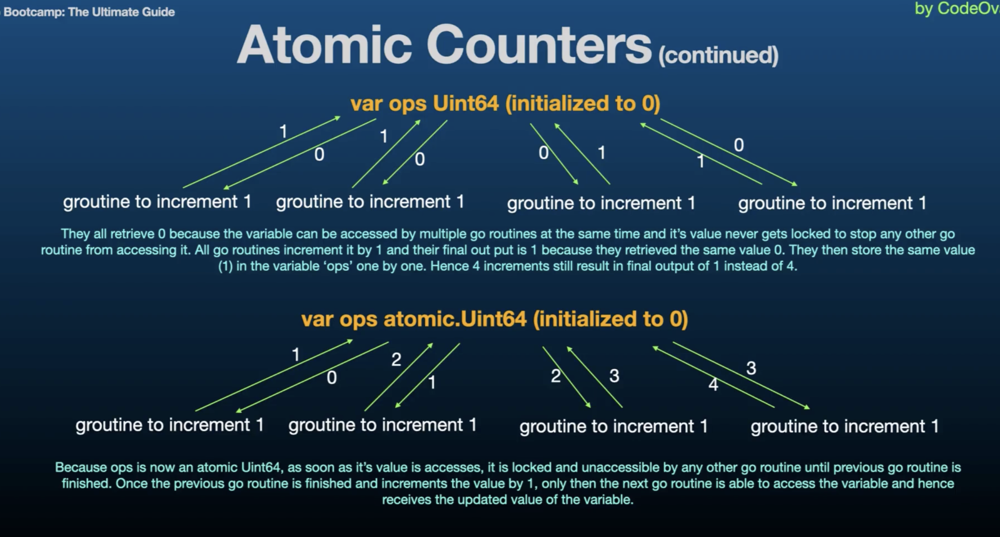
 <br/>

- What might go wrong (without atomic counters):
    - Incorrect Final Count
    - Unpredictable Behaviour
    - Possible Crashes or Corruption

- Best Practices
    - Use Atomic Operations for simple counters
    - Avoid complex operations
    - Ensure Memory visibility
    - Monitor performance

- Common Pitfalls
    - Incorrect Use of Atomic Operations
    - Overuse of Atomic Counters
    - Race conditions


## Rate Limiting

- Rate limiting is a technique used to control the amount of incoming or outgoing traffic to or from a system. It ensures that resources are not overwhelmed and that usage remains withing predefined limits. It is commonly used in web-servers, APIs and applications to prevent abuse, manage load and ensure fair usage.

- Rate limiting is used to prevent overload, to protect our systems from being overwhelmed by too many requests or operations. Rate limiting ensures equitable distribution of resources among users or clients. It mitigate the risk of abuse or misuse of resources.

- Why use rate limiting ?
    - Prevent Overload
    - Fairness
    - Abuse Prevention
    - Cost Management

- Common Rate Limiting Algorithms:
    - Token Bucket Algorithm: It uses a bucket to hold tokens that represent the ability to perform operations. These tokens are added at a fixed rate and operations can only be performed if tokens are available. It allows burst of traffic while maintaining a steady rate over time.

    - Leaky Bucket Algorithm: Similar to the token bucket but with a fixed leak rate. Requests are added to the bucket and the bucket leaks at a constant rate. 
        Key property - It smooths out burst of traffic to ensure a constant output rate.

    - Fixed Window Counter: It counts requests within a fixed time window (example per minute, 15 sec, etc). If the count exceeds the limit, further requests are denied until the window resets. 
        Key property - simple to implement but may allow for bursts at the window boundaries.

    - Sliding Window Log: Keeps a log of request timestamps and enforces limits based on the number of requests in a sliding window of time.
        Key property - It provides more precise rate limiting compared to fixed windows but it requires more memory.

    - Sliding Window Counter: Combines fixed window and sliding window approaches. It maintains a counter for recent requests and adjusts the count based on sliding time windows.
        Key property: It balances precision and memory usage.


## Rate Limiting - Token Bucket Algorithms

- using empty struct in channel is a common patter in Go when you want to signal or count something without needing to store any actual data. So why chose struct ?

    - The best answer and the most important aspect of using struct is zero memory overhead. Empty structs in Go take up zero bytes of memory. This is because they don't contain any data and when you use struct as the type for your tokens, you are effectively creating a token that has no associated data, which minimizes memory usage.

    - Signaling without data: In cases where the presence of a token rather than the value of the token is what matters, an empty struct us a perfect fit. 
    
    - In context of a rate limiter, you only care whether there is a token available or not, not what the token contains. 
    
    - And using structs makes it clear that the values in the channel are only for signaling purposes and do not carry any data. This can improve the readability of your code by making it clear that the channel's purpose is simply to count or send signals or receive signals.

    - Key Points:
        - Memory Efficiency: using structs avoids unnecessary memory allocation since it occupies zero bytes.
        - Signalling intent: it clearly signals the intent that the channel is used for signaling or counting.
        - Makes our code simpler: simplifies the code by avoiding the need to create and manage more complex types when the simple signaling is sufficient.
    
    - Using empty structs in channels is a Go idiom that leverages the language's zero byte storage optimization for empty structs, providing a clear and efficient way to implement signaling and counting mechanism.

- The token bucket algorithm is used in networking and rate limiting scenarios to control the rate of events and ensure fair usafe of resources.

## Rate Limiting - Fixed Window Counter

- **Fixed Window Counter**
    - How it works:
        - Each window has a counter that tracks the number of requests.
        - If the number of requests in the current window is below the limit, the request is allowed, and the counter is incremented.
        - If the number of requests reaches the limit, subsequent requests in the same window are denied.
        - At the start of a new window, the counter is reset.

    - Key Points of Fixed Window Algorithms :
        - Window Duration
        - Request Counting
        - Reset Mechanism

- **Token Bucket Algorithm**
    - How it works ?
        - Tokens are added to the bucket at a fixed rate (refill rate).
        - Each request consumes one token from the bucket.
        - If the bucker has tokens, the request is allowed and a token is removed.
        - If the bucket is empty, the request is denied.
        - The bucket has a maximum capacity to limit the number of accumulated tokens.


- Practical use cases for rate limiting:
    - API Rate Limiting
    - Traffic Shaping
    - Preventing Abuse
    - Load Management

- Best Practices
    - Choose the right algorithm
    - Handle the edge cases
    - Monitor and adjust
    - Graceful handling of rate limits

## Rate Limiting - Leaky Bucket Algorithm

- Token Bucket vs Fixed Window vs Leaky Bucket Algorithms for Rate Limiting

    
    <br/>

- How Leaky Bucket Algorithm Works:
    - Requests arrive and are added to the bucket (queue).
    - The bucket processes (leaks) requests at a fixed rate.
    - If the bucket is full (the queue is at capacity), incoming requests are discarded.
    - Ensures that requests are handled at a steady, controlled rate.


## Stateful Goroutines

- A Stateful goroutine is a goroutine that maintains and updates its own internal state accross multiple invocations or interactions.

- Unlike stateless goroutines which perform operations without retaining any information between executions, Stateful goroutines keep track of state information that influences their behaviour and responses. 

- The reason we use stateful goroutines is for state management, which means that is essential for applications where the execution context or progress must be preserved between function calls.

- Another usecase is concurrency, because it allows multiple goroutines to manage their own state independently enabling complex concurrent behaviour.

- Stateful goroutines are useful in scenarios where tasks need to remember their progress or context, such as managing a queue of jobs or processing streams of data.

- Why use Stateful Goroutines ?
    - State Management
    - Concurrency
    - Task Execution

- Key Concepts of Stateful Goroutines:
    - State Preservations: stateful goroutines keep track of data or context that affects their execution over time. This data is stored in variables or fields within the goroutines scope.

    - Concurrency management: Proper management of concurrent access to state is crucial to avoid race conditions and ensure consistency. Techniques such as mutexes, channels, or atomic operations can be used to synchronize access.

    - Lifecycle Management: Stateful goroutines have a lifecycle that includes intialization execution, and termination. Managing this lifecycle effectively ensures that state is correctly handled throughout the goroutines execution.

- Handling Concurrency and Synchronization:
    - Mutexes and Locks :  to protect shared state and ensure that only one goroutine accesses it at a time.

    - Atomic Operations: for simple integer counters and flags.

    - Channels for Communication: we can use channels to communicate state changes and synchronize between goroutines, escpecially when the state needs to be shared or updated concurrently.

- Common Use cases :    
    - Task Processing
    - Stateful Services
    - Data Stream Processing

- Best Practices
    - Encapsulate State: we need to encapsulate state within the goroutine or struct to avoid exposing internal details and ensure proper management.

    - Synchronize Access: We have to ensure that access to state is properly synchronized to avoid race conditions and ensure data consistency.

    - Monitor Debug


## Sorting

- Sorting is a fundamental operation on computer science used to organize data, making it easier to search, analyze and manipulate.

- the `sort` package in Go provides builtin functions for sorting slices and user defined collections.   

- Why is Sorting important?
    - Efficiency
    - Readability
    - Algorithms

- Built-in Functions
    - sort.Ints([]int)
    - sort.Sort(sort.Interface)
    - sort.Strings

- `sort.Interface` consist of three methods:
    - `Len() int`: returns the number of elements in the collection.
    - `Less(i,j int) bool`: it compares the elements at indices i and j and returns `true` if the element at i should be sorted before the element at j.
    - `Swap(i, j int)`: swaps the elements at indices i and j.

- the `sort` package in Go requires us to implement sort.Interface to sort custom data types.
    

- A `type` can have it's own method. structs do not have methods, `type` have methods.
    ```go
    type By func(p1, p2 *Person) bool
    ```

- Best Practices:
    - Reuse Sorting Functions
    - Optimize Comparison Logic
    - Test for Edge Cases

- Performance Considerations:   
    - Complexity
    - Stability
    - Memory Usage


## Advanced: Quiz-4

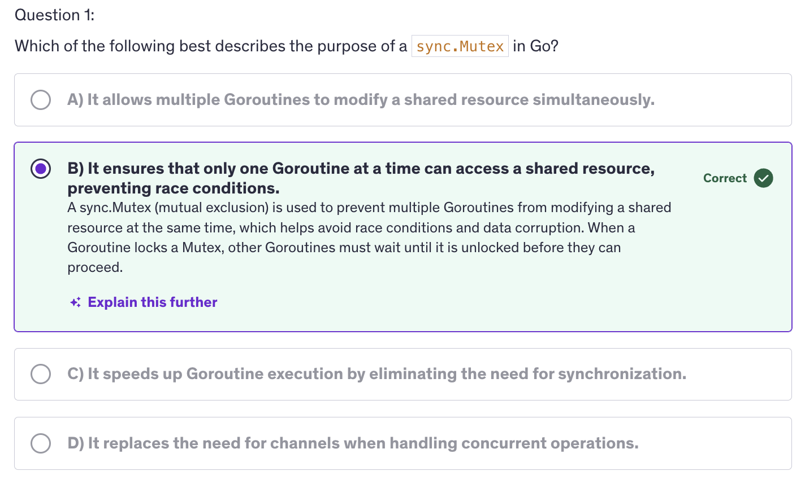
<br/>


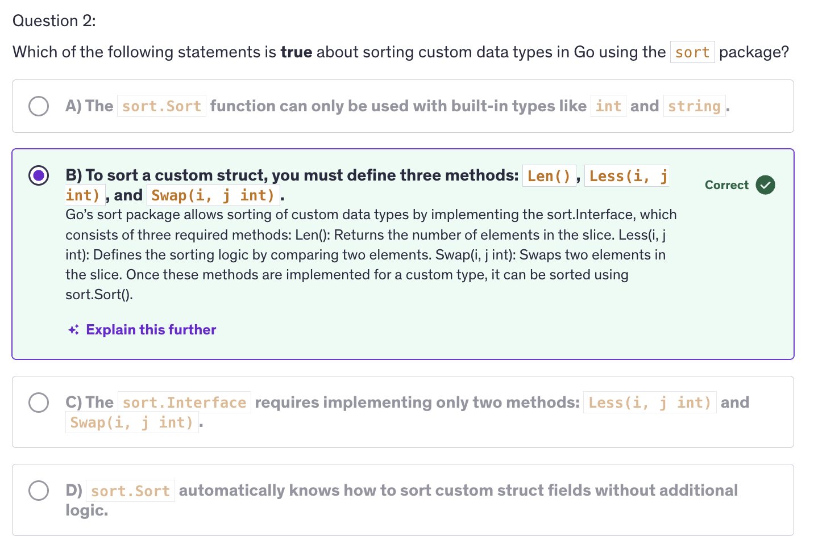
<br/>

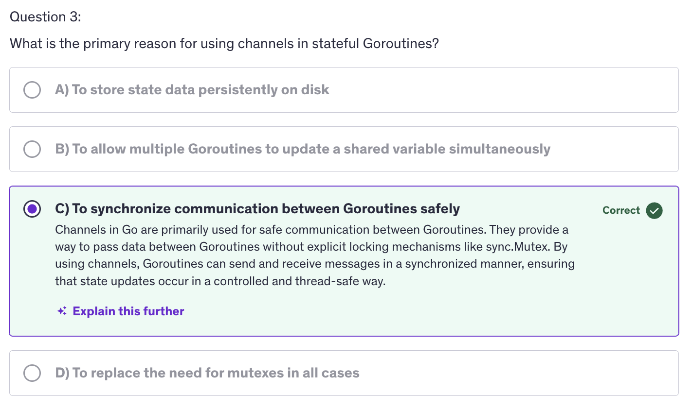
<br/>

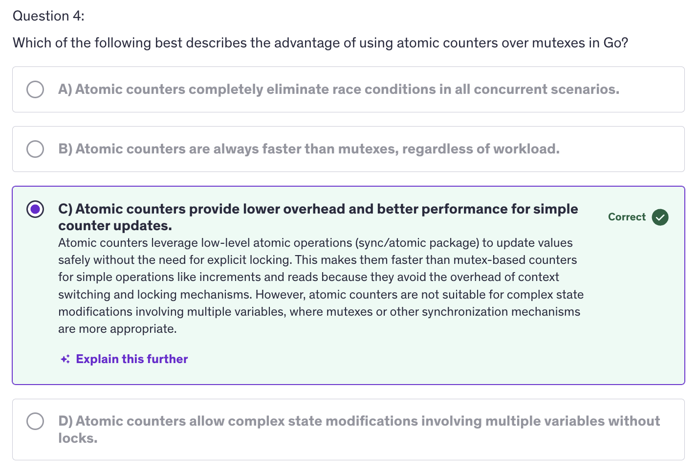
<br/>

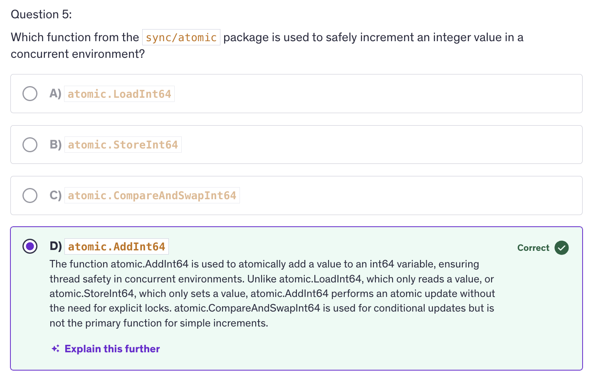
<br/>


## Testing / Benchmarking

- Testing is the process of verifying that a program behanves as expected and meets the requirements set for it. It involves writing and executing test cases to identify and fix bugs, ensure code correctness and improve software quality.

- Why is Testing important ?

    - Reliability: It ensures that the code functions correctly and as intended.

    - Maintainability: Testing makes it easier to refactor and update code without introducing new bugs.
    
    - Documentation: testing provides a kind of documentation that demonstrates how code is expected to behave.

- Go provides a builtin testing package that simplifies writing and running tests.


- test files have a suffix: `_test.go`. eg: `FILENAME_test.go`. The file name should have this suffix so that the go compiler knows that it is a test file otherwise it may give an error.

- no main function needed inside the test file.
- to run the test files type : 
    ```go
    go test FILENAME_test.go
    ```

- Subtests allow grouping related tests and provides better test organization and reporting.

- Benchmarking measures the performance of code. Specifically, how long it takes to execute a function or operation. This helps identify performance bottlenecks and evaluate the impact of code changes on performance.

- For benchmarking, Go provides us a `benchmarking` package which is in the testing package. The testing package also supports benchmarking with functions that start with benchmark.      


- Start the benchmark functions with names staring with the keyword `Benchmark` eg: `BenchmarkAdd(b *testing.B)`
    - We should loop over `b.N` to perform the benchmarking.

- By resetting the timer, we ensure that the setup time is not included in the benchmark timing and this allows us to measure only the time taken by the operation we are interested in benchmarking and providing a more accurate performance measurement.

- Commands used:
    ```bash
    > go test testing_benchmarking_test.go
    > go test -bench=. testing_benchmark_test.go | grep -v 'cpu'
    > go test -bench=. -benchmem testing_benchmark_test.go | grep -v 'cpu'

    > go test -bench=. -memprofile mem.pprof testing_benchmarking_test.go | grep -v 'cpu'

    > go tool pprof mem.pprof
    ```

    - We use the pipe with `grep -v 'cpu'` to hide the details about the CPU.

    - `benchmem` flag tells Go to include memory allocation statistics along with the benchmarking results.

- Profiling:
    - Profiling provides detailed insights into the performance of your application, including CPU usage, memory allocation and goroutine activity.
    - Use `pprof` to collect and analyze CPU profile data.


- Best Practices
    - Write Comprehensive Tests
    - Maintain Test Coverage
    - Use Benchmarks Effectively
    - Profile Regularly

- Testing for quality assurance
- Benchmarking for performance optimization
- Profiling for Performance Analysis


## Executing Processes / OS Processes / Other Processes | SPAWNING PROCESSES

- Process Spawning refers to creating and managing separate operating system processes from within a Go program. This involves starting new processes to run tasks concurrently or in isolation from the main program. We use process spawning for concurrency, isolation and resource management.

- Why use Process Spawning ?
    - Concurrency: runs tasks in pararllel to utilize multiple CPU cores for isolation.
    - Isolation: executes tasks in separate environments to avoid interference and improve stability.
    - Resource Management: Process Spawning offloads resource intensive tasks to separate proceses to manage system resources more effectively.

- `os/exec` package:
    - `exec.Command`
    - `cmd.Stdin` / `cmd.Stdout`
    - `cmd.Start` / `cmd.Wait`
    - `cmd.Output`

- `grep` is a linux terminal command. It searches for a line that contains the word, the argument that is passed to it.

- Use Cases and Considerations
    - When to use Process Spawning
        - Resource-Intensive Tasks
        - Isolation
        - Concurrency
    - Performance and Resource Management
        - Overhead
        - System Limits

- Spawning processes in Go is a powerful technique for executing external commands and integrating them into your Go applications. The `os/exec` package provides robust and flexible ways to start and manage external processes, handle their input and output and capture their results.


## Signals

- Signals are a form of inter-process communication used to notify processes of certain events or states. They are commonly used to handle asynchronous events such as interruptions or terminations.

- Why use signals ?
    - Graceful shutdown: to allow programs to handle interruptions and shutdown gracefully.

    - Resource Cleanup: ensure proper release of resources before exiting.

    - Interprocess Communication: we need to notify or communicate between different processes.

- Go provides a way to handle signals using the `os/signal` package which allows programs to listen to and respond to signals.

- Signals in Unix like OS:
    - SIGINT (Interrupt Signal)
    - SIGTERM (Terminate Signal)
    - SIGHUP (Hang Up Signal)
    - SIGKILL (kill)

- Using the `kill` command:
    - Find the Process ID (PID)
    - Send the signal
    - Some examples: 
        ```bash
        kill -s SIGINT 8078
        kill -s SIGTERM 8992
        kill -s SIGHUP 10537
        ```

- Signal Types and Usage:
    - Interrupts: SIGINT
    - Terminations: SIGTERM
    - Stop/Continue: SIGCONT, SIGSTOP


- Debugging and Troubleshooting
    - Debugging Signal Handling
    - Common issues
        - Signal lost
        - Deadlocks

- As we use signal, if that signal has a specific functionality associated with it, we actually override that functionality as soon as we use that signal in our program.

- Best Practices :
    - Graceful shutdowns: handle termination signals to allow your applications to clean up resources and exit gracefully.
    
    - Use signals to Handle Resource Cleanups: ensure that files, network connections or other resources are properly released before exiting.

    - When using signals, ensure that you use non-blocking methods to ensure that signal handling does not delay or block other operations.

- Using signals for graceful shutdowns and cleaning up resources is a common practice but aprat from that we can also use signals for inter-process communication. We can communicate state changes or events between processes using signals.

- Keep in mind some performance considerations like ensuring that signal handling is efficient and does not introduce performance bottlenecks.

- For security considerations: validate and handle signals securely to avoid potential security risks.

## Reflect

- Reflection is a mechanism that allows a program to inspect and manipulate its own structure and behavior at runtime. 

- In Go, reflection is provided by the `reflect` package. We use reflection for dynamic type inspections. Inspecting types and values dynamically.

- Reflection is also used for generic programming, where we implement functions and data structures that operate on any type.

- Apart from that we use reflection for serialization and deserialization as well. Using reflect package we can convert between data representations like JSON, XML and go types.

- The reflect package provides types and functions to inspect and manipulate objects at runtime. Key types include: Type, Value and struct fields.

- Why use Reflection ? 
    - Dynamic Type Inspection
    - Generic Programming
    - Serialization/Deserialization

- Few Methods
    - `reflect.TypeOf()`: represents the type of a value.
    - `reflect.Value()`: represents the value of a variable.
    - `reflect.ValueOf()`
    - `reflect.ValueOf().Elem()`

- In Go, whether a field can be accessed and modified via reflection depends on its visibility. 

    - The lowercase naming of variable / struct members, constricts the visibility of a struct and the fields of the struct to the package only.

    - If we are using Uppercase alphabet as the first alphabet of a struct field, then that field or that struct or that type, it can be any type, or anything, then it can be exported. 
    
    - And if it is a lowercase alphabet in the begining of the name, then it is a private type. It is only visible to the other types which are in the same package, but it is not exported.

    - Exported fields are fields with names starting with an uppercase letter and these fields are accessible outside of the package they are declared in and can be accessed and modified using reflection.

    - However fields with names starting with a lowercase letter are unexported. These fields are only accessible within the same package and are not accessible via reflection from outside the package.

    - Because of this, when using reflection, only exported fields can be accessed and modified and this is because the reflection API respects Go's visibility rules. During the runtime, relfect is accessing and modifying these values from outside. 

- `TypeOf()`: only contains the type and the number of methods but not an executable method. So for getting the tangible asset of any type and using those tangible assets of that type, we need to use the `ValueOf()` method.

- Reflect also helps us in dynamic function invocation, means we can implement frameworks or libraries that need to call functions dynamically.

- We can use Reflect to map database records to Go structs dynamically which is quite helpful when it comes to ORM libraries.

- Limitations and Considerations for `reflect`:
    
    - reflection can be slower compared to direct code access due to its dynamic nature.

    - Using reflection can make code harder to understand and maintain, so use it judiciously.
    
    - Reflection bypasses static type checks which may lead to runtime errors. So ensure type safety when using reflect package.


## Advanced: Quiz-6

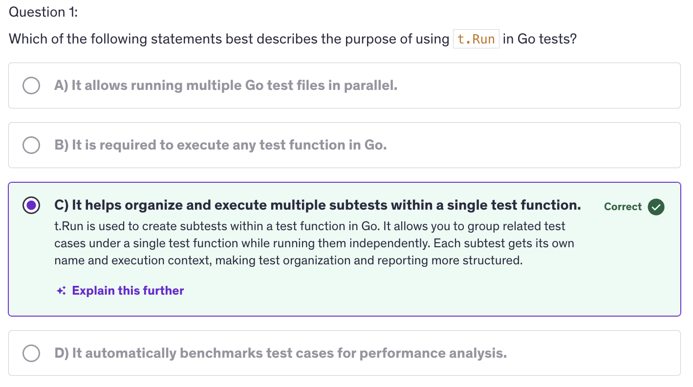
<br />

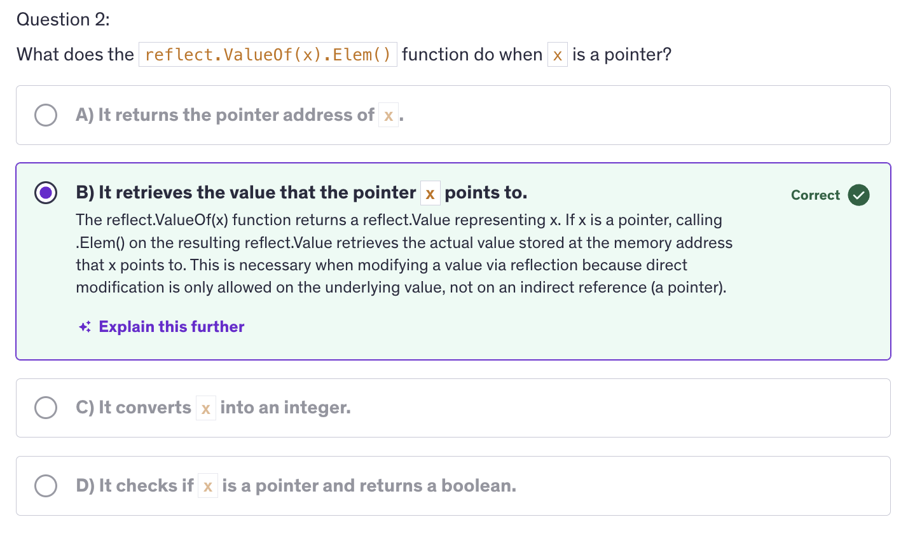
<br />

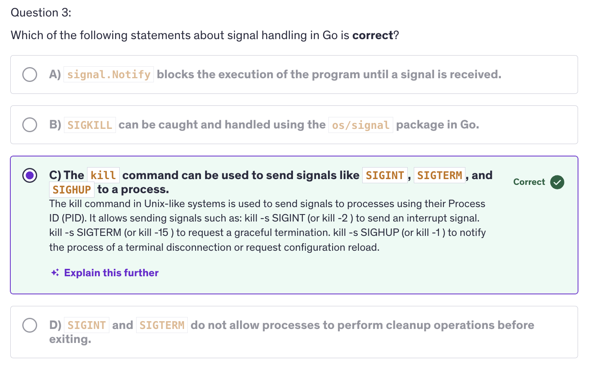
<br />

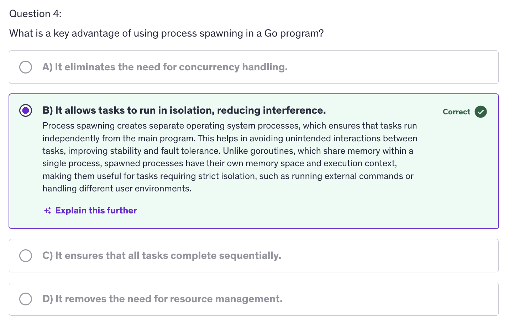
<br />

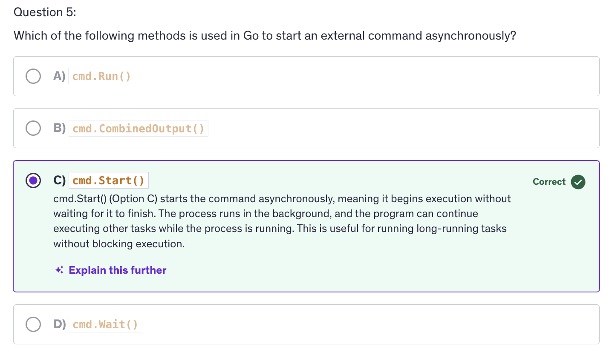
<br />


